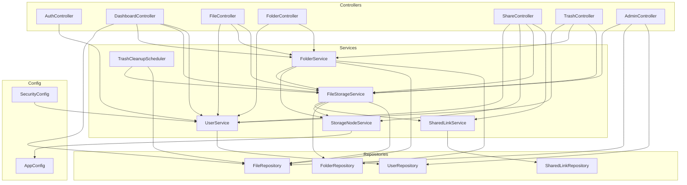
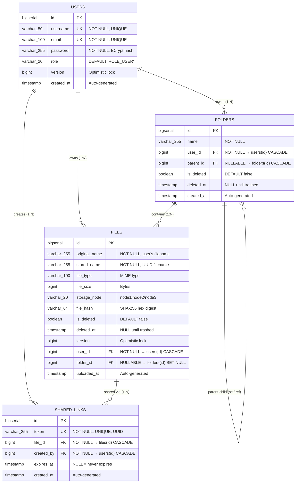
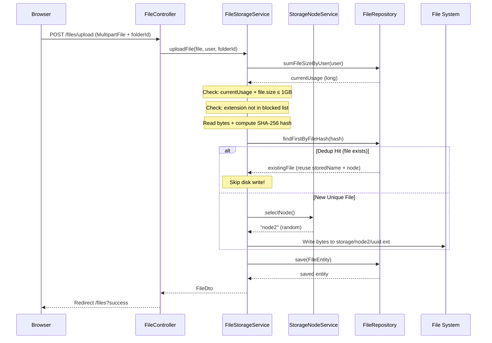
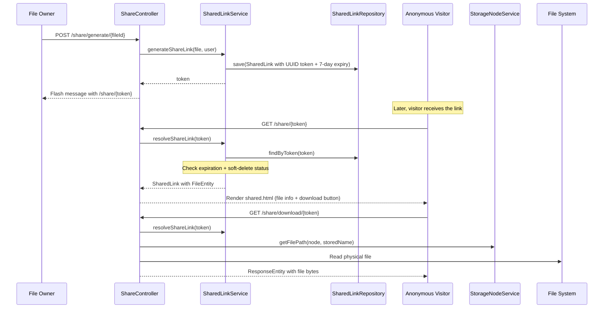
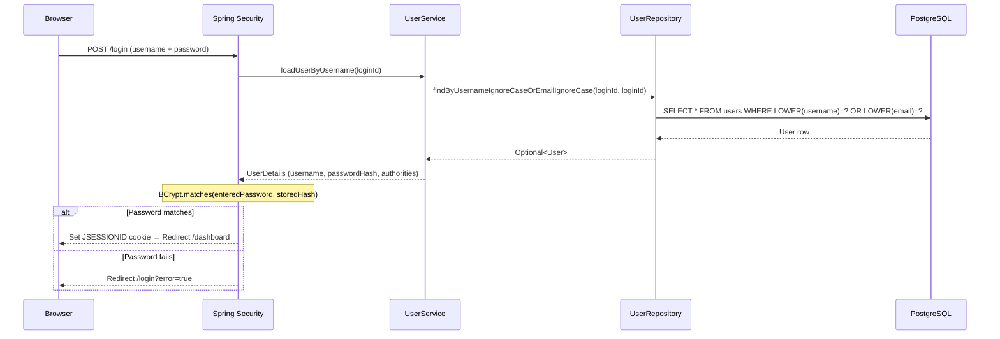

# Software Requirements Specification (SRS)

## Project: CloudNest — Enterprise Distributed Cloud Storage System

### Part 1 of 4: Introduction, Scope & Overall Description

| Field             | Value                                          |
| ----------------- | ---------------------------------------------- |
| **Document ID**   | CN-SRS-2026-v2.0                               |
| **Version**       | 2.0 (Comprehensive Edition)                    |
| **Date**          | June 01, 2026                                  |
| **Author**        | Anmol Raj                                      |
| **Project Name**  | CloudNest                                       |
| **Artifact ID**   | `com.cloudnest:cloudnest:1.0.0`                |
| **Java Version**  | 21 (LTS)                                       |
| **Spring Boot**   | 3.4.5                                          |

---

## 1. Introduction

### 1.1 Purpose

The purpose of this document is to provide a **complete and authoritative Software Requirements Specification (SRS)** for **CloudNest**, a distributed cloud storage web application developed as an academic capstone project. This document is organized into four parts:

| Part | Title                                       | Coverage                                              |
| ---- | ------------------------------------------- | ----------------------------------------------------- |
| 1    | Introduction, Scope & Overall Description   | Project context, stakeholders, environment             |
| 2    | Functional Requirements                     | Every user-facing and system feature, mapped to code   |
| 3    | System Architecture & Data Models           | Architecture layers, ER diagrams, API endpoint catalog |
| 4    | Non-Functional Requirements & Appendices    | Security, performance, testing, deployment, glossary   |

This SRS conforms to the structure recommended by **IEEE 830-1998** and serves as the definitive reference for development, academic evaluation, and future maintenance.

### 1.2 Scope

CloudNest is a **secure, enterprise-grade cloud storage platform** that simulates the core functionality of services like Google Drive and Dropbox. It allows registered users to:

- Upload, download, preview, search, and organize files within a hierarchical folder system.
- Share files via time-limited, publicly accessible UUID links.
- Benefit from server-side **SHA-256 data deduplication** that eliminates redundant physical storage.
- Experience **simulated distributed storage** across configurable virtual nodes.
- Manage a **soft-delete recycle bin** with automatic 30-day purge.
- Operate within an enforced **1 GB per-user storage quota**.
- (Admin users) Monitor system-wide health, manage users, and delete files globally.

The system is **not** designed for:
- End-to-end encryption of files at rest.
- Real multi-server clustering or cross-datacenter replication (the distributed storage is simulated on the local file system).
- Mobile-native applications (the UI is responsive but browser-based).

### 1.3 Definitions, Acronyms & Abbreviations

| Term / Acronym  | Definition                                                                                     |
| ---------------- | ---------------------------------------------------------------------------------------------- |
| **SRS**          | Software Requirements Specification                                                           |
| **JPA**          | Jakarta Persistence API — Java standard for ORM (Object-Relational Mapping)                   |
| **ORM**          | Object-Relational Mapping — automatic translation between Java objects and database rows       |
| **JPQL**         | Jakarta Persistence Query Language — SQL-like language that operates on entity objects          |
| **BCrypt**       | Adaptive password-hashing function based on the Blowfish cipher                                |
| **SHA-256**      | Secure Hash Algorithm producing a 256-bit (64 hex character) digest                           |
| **UUID**         | Universally Unique Identifier — 128-bit label used for collision-free naming                  |
| **CSRF**         | Cross-Site Request Forgery — an attack that tricks a user's browser into submitting requests   |
| **MIME Type**    | Multipurpose Internet Mail Extensions type — identifies file format (e.g., `application/pdf`) |
| **DTO**          | Data Transfer Object — lightweight POJO used to transfer data between layers                  |
| **CRUD**         | Create, Read, Update, Delete — fundamental database operations                                |
| **MVC**          | Model-View-Controller — architectural pattern separating concerns                              |
| **Soft Delete**  | Marking a record as "deleted" in the database without physically removing it                  |
| **Hard Delete**  | Physically removing both the database record and the file from disk                           |
| **Deduplication**| Eliminating duplicate copies of data by storing only one physical copy                        |
| **Storage Node** | A simulated physical storage partition (directory) representing a server in a cluster          |
| **Quota**        | Maximum storage capacity allocated to a single user (default: 1 GB = 1,073,741,824 bytes)    |
| **Thymeleaf**    | Server-side Java template engine that renders dynamic HTML from model data                    |
| **Lombok**       | Java library that auto-generates boilerplate code (getters, setters, builders) via annotations |
| **Actuator**     | Spring Boot module that exposes operational endpoints (health, info) for monitoring            |

### 1.4 References

| Ref # | Document / Resource                                                      |
| ----- | ------------------------------------------------------------------------ |
| R1    | IEEE Std 830-1998 — Recommended Practice for SRS                         |
| R2    | Spring Boot 3.4.5 Official Documentation                                 |
| R3    | Spring Security Reference Documentation                                  |
| R4    | Hibernate 6.x ORM User Guide                                            |
| R5    | PostgreSQL 12+ Official Documentation                                    |
| R6    | Maven POM Reference — `pom.xml` artifact `com.cloudnest:cloudnest:1.0.0`|
| R7    | OWASP Top 10 — Web Application Security Risks                            |

---

## 2. Overall Description

### 2.1 Product Perspective

CloudNest is a **standalone, self-hosted web application** built on a classic **Client-Server monolithic architecture**. It is not a microservice; all backend logic runs within a single deployable Spring Boot JAR file with an embedded Apache Tomcat servlet container.

```
┌─────────────────────────────────────────────────────────┐
│                  CLIENT (Web Browser)                    │
│  HTML5 + CSS3 + JavaScript (ES6)                        │
│  Three.js (WebGL) · Lucide Icons · Google Fonts (Inter) │
└──────────────────────┬──────────────────────────────────┘
                       │ HTTP / HTTPS (Port 8080)
┌──────────────────────▼──────────────────────────────────┐
│              SPRING BOOT APPLICATION                     │
│  ┌──────────┐  ┌──────────┐  ┌────────────┐            │
│  │Controller│→ │ Service  │→ │ Repository │            │
│  │  Layer   │  │  Layer   │  │   Layer    │            │
│  └──────────┘  └──────────┘  └─────┬──────┘            │
│                                     │ JPA / Hibernate   │
│  ┌──────────────────────────────────▼──────────────┐    │
│  │            PostgreSQL Database                   │    │
│  │   Tables: users, folders, files, shared_links   │    │
│  └─────────────────────────────────────────────────┘    │
│                                                          │
│  ┌──────────────────────────────────────────────────┐    │
│  │        Simulated Distributed File System          │    │
│  │   storage/node1/   storage/node2/   storage/node3/│   │
│  └──────────────────────────────────────────────────┘    │
└─────────────────────────────────────────────────────────┘
```

**Key architectural decisions:**

1. **Server-Side Rendering (SSR):** HTML is rendered on the server by Thymeleaf, not by a client-side framework (React/Angular). This simplifies deployment and is well-suited for session-based authentication.
2. **Session-Based Authentication:** Spring Security manages HTTP sessions with `JSESSIONID` cookies. This avoids the complexity of JWT token management for a traditional web app.
3. **Simulated Distribution:** Physical files are distributed across `storage/node1/`, `storage/node2/`, `storage/node3/` directories using random node selection via `ThreadLocalRandom`, demonstrating distributed storage concepts without actual multi-server infrastructure.
4. **Deduplication via Content Hashing:** SHA-256 hashes are computed in-memory before writing to disk (hash-before-write pattern), which avoids TOCTOU (Time-of-Check-Time-of-Use) race conditions.

### 2.2 Product Functions (High-Level Summary)

| # | Function Category                    | Description                                                                     |
|---|--------------------------------------|---------------------------------------------------------------------------------|
| 1 | User Authentication & Authorization  | Registration, login (username or email), role-based access (USER / ADMIN)       |
| 2 | File Management                      | Upload (multi-file, drag-and-drop), download, preview, search, move             |
| 3 | Folder Management                    | Create nested hierarchies, navigate via breadcrumbs, move, download as ZIP      |
| 4 | Data Deduplication                   | SHA-256 content-addressed storage; identical files share one physical copy       |
| 5 | Distributed Storage Simulation       | Random node assignment across 3 configurable virtual nodes                      |
| 6 | Storage Quota Enforcement            | 1 GB per-user limit checked on every upload; human-readable usage display       |
| 7 | File Sharing                         | UUID-based public links with 7-day auto-expiration                              |
| 8 | Recycle Bin (Soft Delete)            | Trash with restore capability; 30-day auto-purge via scheduled task             |
| 9 | Administrative Console               | Global user management, file oversight, role toggle, system statistics           |
| 10| Enterprise Visualization Pages       | Node topology, deduplication center, replication view, network activity, analytics, monitoring |
| 11| Custom Error Pages                   | Branded 404 and 500 error pages instead of raw stack traces                     |

### 2.3 User Classes and Characteristics

| User Class       | Role          | Capabilities                                                                                                        | Quota  |
|------------------|---------------|---------------------------------------------------------------------------------------------------------------------|--------|
| Standard User    | `ROLE_USER`   | Register, login, upload/download/preview files, create/navigate/move/delete folders, share files, manage recycle bin | 1 GB   |
| Administrator    | `ROLE_ADMIN`  | All Standard User capabilities **plus**: access admin dashboard, view all users, toggle user roles, delete any file  | 1 GB   |
| Anonymous Visitor| (none)        | Access shared file links (`/share/{token}`), download shared files, view login/register pages                       | N/A    |

**User role assignment rules:**
- All public registrations are assigned `ROLE_USER` by default. The code explicitly enforces `String finalRole = "ROLE_USER"` in `UserService.registerUser()` to prevent privilege escalation via form manipulation.
- Admin accounts can only be created by an existing admin toggling a user's role via `POST /admin/users/toggle-role/{id}`.
- An admin cannot demote their own account (self-demotion protection).

### 2.4 Operating Environment

#### 2.4.1 Server-Side Requirements

| Component          | Requirement                                        |
| ------------------- | -------------------------------------------------- |
| Operating System    | Windows 10/11 or Linux (Ubuntu 20.04+)             |
| Java Runtime        | JDK 21+ (LTS) — required by Spring Boot 3.4.5      |
| Build Tool          | Apache Maven 3.8.x or higher                       |
| Database Server     | PostgreSQL 12 or higher                            |
| Application Server  | Embedded Apache Tomcat (bundled with Spring Boot)   |
| Default Port        | `8080` (configurable via `server.port`)             |
| IDE (Development)   | IntelliJ IDEA (Community/Ultimate) or Eclipse IDE   |

#### 2.4.2 Client-Side Requirements

| Component           | Requirement                                                |
| -------------------- | ---------------------------------------------------------- |
| Web Browser          | Any modern HTML5-compliant browser (Chrome, Firefox, Edge, Safari) |
| JavaScript           | Must be enabled for interactive features and WebGL background      |
| Screen Resolution    | Responsive design — works on mobile (320px+) and desktop           |

#### 2.4.3 Frontend Dependencies (Loaded via CDN)

| Library        | Version  | Purpose                                         |
| -------------- | -------- | ----------------------------------------------- |
| Lucide Icons   | 0.325.0  | Modern SVG icon library used throughout the UI   |
| Three.js       | (latest) | WebGL 3D animated background on login/register   |
| GSAP           | (latest) | GreenSock Animation Platform for page transitions|
| Google Fonts   | —        | Inter typeface family for consistent typography  |

### 2.5 Design and Implementation Constraints

| Constraint                       | Description                                                                                                              |
| -------------------------------- | ------------------------------------------------------------------------------------------------------------------------ |
| **Language**                     | Java 21 only — leverages modern language features (pattern matching, records)                                             |
| **Framework Lock-in**            | Spring Boot 3.4.5 with Spring Security 6 — all authentication, authorization, and web handling are framework-managed     |
| **Database Dialect**             | PostgreSQL — the schema uses `BIGSERIAL`, PostgreSQL-specific syntax; H2 (PostgreSQL mode) is used for testing           |
| **ORM Constraint**               | Hibernate ORM via Spring Data JPA — no raw JDBC calls; all queries use either derived query methods or JPQL              |
| **File Size Limit**              | 50 MB per individual file upload (configured via `spring.servlet.multipart.max-file-size`)                               |
| **Blocked File Extensions**      | `.exe`, `.bat`, `.sh`, `.ps1`, `.cmd` — rejected at upload time for security                                             |
| **Storage Quota**                | 1 GB per user (1,073,741,824 bytes) — enforced at the service layer before writing to disk                               |
| **Session Management**           | Server-side HTTP sessions; `JSESSIONID` cookie; session invalidation on logout                                           |
| **Template Engine**              | Thymeleaf 3 — all HTML views are server-rendered; no SPA framework                                                       |
| **Password Encoding**            | BCrypt with strength factor 12 — `new BCryptPasswordEncoder(12)`                                                        |
| **Scheduling**                   | `@EnableScheduling` — cron-based trash cleanup runs daily at 02:00 AM (`0 0 2 * * *`)                                   |

### 2.6 Assumptions and Dependencies

| # | Assumption / Dependency                                                                                                       |
|---|-------------------------------------------------------------------------------------------------------------------------------|
| 1 | PostgreSQL server is installed, running, and a database named `cloudnest_db` has been created before application startup.     |
| 2 | The `DB_PASSWORD` environment variable is set (or defined in `.env`) with the correct PostgreSQL password.                    |
| 3 | The application has read/write permissions to the `storage/` directory at the project root for file persistence.              |
| 4 | The host machine has JDK 21 installed and available on the system `PATH`.                                                    |
| 5 | Hibernate's `ddl-auto=update` mode will create/update database tables automatically on startup in development mode.          |
| 6 | CDN-hosted libraries (Lucide, Three.js, Google Fonts) require internet connectivity on the client browser.                   |
| 7 | The `DatabaseMigrationConfig` startup migration (`UPDATE ... SET version = 0 WHERE version IS NULL`) runs safely on both fresh and existing databases. |
| 8 | File deduplication assumes SHA-256 is collision-free for practical purposes (probability of collision is ~2⁻¹²⁸).            |
| 9 | The simulated distributed storage (3 nodes) is for academic demonstration; no actual network partitioning or replication occurs.|
| 10| The application is accessed via HTTP in development; HTTPS/TLS termination would be handled by a reverse proxy in production.|

---

*End of Part 1. Continue to **Part 2: Functional Requirements** for the complete feature specification.*
# Software Requirements Specification (SRS)

## Project: CloudNest — Enterprise Distributed Cloud Storage System

### Part 2 of 4: Functional Requirements

---

## 3. Functional Requirements

> All functional requirements are identified with a unique ID in the format `FR-X.Y` and are traced to the specific source file(s) implementing them.

---

### 3.1 Authentication & User Management Module

**Source Files:**
- Controller: `AuthController.java`
- Service: `UserService.java`
- Security: `SecurityConfig.java`
- DTO: `UserRegistrationDto.java`
- Entity: `User.java`
- Repository: `UserRepository.java`

#### FR-1.1 — User Registration

| Attribute     | Detail                                                                                                                 |
| ------------- | ---------------------------------------------------------------------------------------------------------------------- |
| **ID**        | FR-1.1                                                                                                                 |
| **Priority**  | High                                                                                                                   |
| **Endpoint**  | `GET /register` (show form) · `POST /register` (submit form)                                                          |
| **Input**     | `username` (3–50 chars), `email` (valid format), `password` (6–100 chars), `confirmPassword`                           |
| **Validation**| `@NotBlank`, `@Email`, `@Size` via Bean Validation (JSR 380) on `UserRegistrationDto`                                  |
| **Processing**| 1. Validate passwords match (`password == confirmPassword`) <br> 2. Check username uniqueness (`existsByUsername()`) <br> 3. Check email uniqueness (`existsByEmail()`) <br> 4. Hash password with BCrypt (strength 12) <br> 5. Force role to `ROLE_USER` (never `ROLE_ADMIN` from registration) <br> 6. Save user entity to database |
| **Output**    | Redirect to `/login?success` with flash message "Registration successful! Please log in."                              |
| **Error**     | If validation fails → re-render form with field-level errors. If business rule fails → re-render with error message.   |

#### FR-1.2 — Password Security

| Attribute     | Detail                                                                                           |
| ------------- | ------------------------------------------------------------------------------------------------ |
| **ID**        | FR-1.2                                                                                           |
| **Priority**  | Critical                                                                                         |
| **Processing**| Passwords are **never stored in plain text**. `BCryptPasswordEncoder` with strength factor **12** is used (`new BCryptPasswordEncoder(12)`). BCrypt automatically generates a random salt per password, preventing rainbow table attacks. |
| **Source**    | `SecurityConfig.passwordEncoder()` · `UserService.registerUser()` → `passwordEncoder.encode(dto.getPassword())` |

#### FR-1.3 — User Login (Form-Based Authentication)

| Attribute       | Detail                                                                                               |
| --------------- | ---------------------------------------------------------------------------------------------------- |
| **ID**          | FR-1.3                                                                                               |
| **Priority**    | High                                                                                                 |
| **Endpoint**    | `GET /login` (show form) · `POST /login` (processed by Spring Security filter chain)                 |
| **Input**       | `username` field (accepts either username or email, case-insensitive), `password` field               |
| **Processing**  | 1. Spring Security calls `UserService.loadUserByUsername(loginId)` <br> 2. `UserRepository.findByUsernameIgnoreCaseOrEmailIgnoreCase(loginId, loginId)` resolves the user <br> 3. Spring Security compares entered password hash against stored BCrypt hash <br> 4. On success: HTTP session is created, `JSESSIONID` cookie is set, redirect to `/dashboard` <br> 5. On failure: redirect to `/login?error=true` |
| **Session**     | `request.getSession(true)` — early session creation for CSRF token availability                      |
| **Source**      | `SecurityConfig.filterChain()` · `AuthController.showLoginPage()` · `UserService.loadUserByUsername()`|

#### FR-1.4 — User Logout

| Attribute       | Detail                                                                              |
| --------------- | ------------------------------------------------------------------------------------ |
| **ID**          | FR-1.4                                                                               |
| **Priority**    | High                                                                                 |
| **Endpoint**    | `POST /logout` (handled by Spring Security)                                          |
| **Processing**  | 1. Invalidate HTTP session <br> 2. Delete `JSESSIONID` cookie <br> 3. Redirect to `/login?logout=true` |
| **Source**      | `SecurityConfig.filterChain()` → `.logout(...)` configuration                        |

#### FR-1.5 — Role-Based Access Control

| Attribute     | Detail                                                                                                                 |
| ------------- | ---------------------------------------------------------------------------------------------------------------------- |
| **ID**        | FR-1.5                                                                                                                 |
| **Priority**  | Critical                                                                                                               |
| **Roles**     | `ROLE_USER` (default) · `ROLE_ADMIN` (elevated)                                                                       |
| **Rules**     | • Public pages (no auth): `/login`, `/register`, `/share/**`, `/css/**`, `/js/**`, `/images/**`, `/error`, `/actuator/health`, `/actuator/info` <br> • Admin-only pages: `/admin/**` (requires `ROLE_ADMIN`) <br> • All other pages: require authentication (any role) |
| **Source**    | `SecurityConfig.filterChain()` → `.authorizeHttpRequests(...)` configuration                                           |

#### FR-1.6 — Root URL Redirect

| Attribute     | Detail                                                                  |
| ------------- | ----------------------------------------------------------------------- |
| **ID**        | FR-1.6                                                                  |
| **Endpoint**  | `GET /`                                                                  |
| **Processing**| Immediately redirects to `/dashboard`. If user is not authenticated, Spring Security intercepts and redirects to `/login`. |
| **Source**    | `AuthController.redirectToDashboard()`                                   |

---

### 3.2 File Management Module

**Source Files:**
- Controller: `FileController.java`
- Service: `FileStorageService.java`
- Entity: `FileEntity.java`
- Repository: `FileRepository.java`
- DTO: `FileDto.java`

#### FR-2.1 — Multi-File Upload with Drag-and-Drop

| Attribute     | Detail                                                                                                                 |
| ------------- | ---------------------------------------------------------------------------------------------------------------------- |
| **ID**        | FR-2.1                                                                                                                 |
| **Priority**  | High                                                                                                                   |
| **Endpoint**  | `POST /files/upload`                                                                                                   |
| **Input**     | `files` — `List<MultipartFile>` (one or more files), `folderId` — optional target folder ID                            |
| **Processing**| For each file in the batch: <br> 1. Reject if file is empty <br> 2. Check storage quota (`sumFileSizeByUser()` + new file ≤ 1 GB) <br> 3. Extract file extension; reject if in blocked list (`.exe`, `.bat`, `.sh`, `.ps1`, `.cmd`) <br> 4. Read entire file bytes into memory <br> 5. Compute SHA-256 hash of bytes <br> 6. **Deduplication check**: query `findFirstByFileHash(hash)` <br> &nbsp;&nbsp; — If match found: reuse existing `storedName` and `storageNode` (no disk write) <br> &nbsp;&nbsp; — If no match: generate UUID filename, select random node via `StorageNodeService.selectNode()`, write bytes to `storage/nodeX/<uuid>.<ext>` <br> 7. Resolve target folder (if `folderId` provided) <br> 8. Build `FileEntity` with all metadata and save to database |
| **Output**    | Redirect to `/files` (or `/files?folderId=X`) with success/error flash messages                                        |
| **Size Limit**| 50 MB per file (configured: `spring.servlet.multipart.max-file-size=50MB`)                                             |
| **Source**    | `FileController.uploadFiles()` · `FileStorageService.uploadFile()`                                                     |

#### FR-2.2 — File Listing and Navigation

| Attribute     | Detail                                                                                                                 |
| ------------- | ---------------------------------------------------------------------------------------------------------------------- |
| **ID**        | FR-2.2                                                                                                                 |
| **Priority**  | High                                                                                                                   |
| **Endpoint**  | `GET /files` · `GET /files?folderId={id}`                                                                              |
| **Processing**| • Root level: queries `findByUserAndFolderIsNullAndIsDeletedFalseOrderByUploadedAtDesc()` for files and `findByUserAndParentIsNullAndIsDeletedFalseOrderByNameAsc()` for folders <br> • Inside folder: queries `findByUserAndFolderIdAndIsDeletedFalseOrderByUploadedAtDesc()` for files and `findByUserAndParentIdAndIsDeletedFalseOrderByNameAsc()` for sub-folders <br> • Breadcrumb navigation is generated by walking up the `parent` chain from current folder to root |
| **Model Data**| `files` (List\<FileDto\>), `folders` (List\<FolderDto\>), `allFolders` (for move dropdown), `breadcrumbs`, `currentFolder`, `currentFolderId` |
| **Source**    | `FileController.listFiles()` · `FileStorageService.getUserFiles()` · `FileStorageService.getRootFiles()` · `FolderService.getBreadcrumbs()` |

#### FR-2.3 — File Download

| Attribute     | Detail                                                                                               |
| ------------- | ---------------------------------------------------------------------------------------------------- |
| **ID**        | FR-2.3                                                                                               |
| **Priority**  | High                                                                                                 |
| **Endpoint**  | `GET /files/download/{id}`                                                                           |
| **Processing**| 1. Fetch `FileEntity` by ID <br> 2. Verify file is not soft-deleted <br> 3. Verify ownership (user ID match) <br> 4. Resolve physical path via `StorageNodeService.getFilePath(node, storedName)` <br> 5. Verify physical file exists on disk <br> 6. Return as `ResponseEntity<Resource>` with `Content-Disposition: attachment` header |
| **MIME Type** | `application/octet-stream` (forces browser download dialog)                                          |
| **Source**    | `FileController.downloadFile()` · `FileStorageService.getFilePath()` · `FileStorageService.getFileEntity()` |

#### FR-2.4 — In-Browser File Preview

| Attribute     | Detail                                                                                               |
| ------------- | ---------------------------------------------------------------------------------------------------- |
| **ID**        | FR-2.4                                                                                               |
| **Priority**  | Medium                                                                                               |
| **Endpoint**  | `GET /files/preview/{id}`                                                                            |
| **Processing**| Same ownership and existence checks as download, but returns with `Content-Disposition: inline` and the file's actual MIME type so the browser renders it natively |
| **Supported** | Images (`image/*`), PDFs (`application/pdf`), plain text (`text/*`)                                  |
| **Source**    | `FileController.previewFile()`                                                                       |

#### FR-2.5 — File Search

| Attribute     | Detail                                                                                               |
| ------------- | ---------------------------------------------------------------------------------------------------- |
| **ID**        | FR-2.5                                                                                               |
| **Priority**  | Medium                                                                                               |
| **Endpoint**  | `GET /files/search?query={keyword}`                                                                  |
| **Processing**| 1. Search by filename (case-insensitive partial match) using JPQL `LIKE %keyword%` on `originalName` <br> 2. If no results by name, fallback to search by file type (`fileType` LIKE `%keyword%`) <br> 3. Only non-deleted files belonging to the authenticated user are returned |
| **JPQL**      | `SELECT f FROM FileEntity f WHERE f.user = :user AND f.isDeleted = false AND (LOWER(f.originalName) LIKE LOWER(CONCAT('%', :keyword, '%')) OR LOWER(f.fileType) LIKE LOWER(CONCAT('%', :keyword, '%')))` |
| **Source**    | `FileController.searchFiles()` · `FileStorageService.searchFiles()` · `FileRepository.searchByName()` / `searchByType()` |

#### FR-2.6 — File Soft Delete (Move to Trash)

| Attribute     | Detail                                                                                               |
| ------------- | ---------------------------------------------------------------------------------------------------- |
| **ID**        | FR-2.6                                                                                               |
| **Priority**  | High                                                                                                 |
| **Endpoint**  | `POST /files/delete/{id}`                                                                            |
| **Processing**| 1. Verify ownership <br> 2. Set `isDeleted = true` and `deletedAt = LocalDateTime.now()` <br> 3. Save (file remains on disk; database record is updated) |
| **Source**    | `FileController.deleteFile()` · `FileStorageService.deleteFile()`                                    |

#### FR-2.7 — File Move

| Attribute     | Detail                                                                                               |
| ------------- | ---------------------------------------------------------------------------------------------------- |
| **ID**        | FR-2.7                                                                                               |
| **Priority**  | Medium                                                                                               |
| **Endpoint**  | `POST /files/move/{id}`                                                                              |
| **Input**     | `targetFolderId` (null = move to root), `currentFolderId`                                            |
| **Processing**| 1. Verify file ownership <br> 2. Verify target folder ownership and existence <br> 3. Update `folder` foreign key on `FileEntity` <br> 4. Save |
| **Source**    | `FileController.moveFile()` · `FileStorageService.moveFile()`                                        |

---

### 3.3 Folder Management Module

**Source Files:**
- Controller: `FolderController.java`
- Service: `FolderService.java`
- Entity: `Folder.java`
- Repository: `FolderRepository.java`
- DTO: `FolderDto.java`

#### FR-3.1 — Folder Creation (Nested Hierarchies)

| Attribute     | Detail                                                                                                                 |
| ------------- | ---------------------------------------------------------------------------------------------------------------------- |
| **ID**        | FR-3.1                                                                                                                 |
| **Priority**  | High                                                                                                                   |
| **Endpoint**  | `POST /folders/create`                                                                                                 |
| **Input**     | `name` (folder name), `parentId` (null = root level)                                                                   |
| **Validation**| • Name cannot be empty or blank <br> • Name cannot contain `..`, `/`, `\`, null characters (path traversal prevention) <br> • Name length ≤ 255 characters <br> • Duplicate name check at the same hierarchy level (same parent) |
| **Processing**| 1. Validate name <br> 2. Check for duplicate name at same parent level <br> 3. If `parentId` is provided, verify parent folder exists and is owned by user <br> 4. Build `Folder` entity with `parent` reference <br> 5. Save and add to parent's `subFolders` collection |
| **Source**    | `FolderController.createFolder()` · `FolderService.createFolder()`                                                     |

#### FR-3.2 — Folder Soft Delete (Recursive Cascade)

| Attribute     | Detail                                                                                                                 |
| ------------- | ---------------------------------------------------------------------------------------------------------------------- |
| **ID**        | FR-3.2                                                                                                                 |
| **Priority**  | High                                                                                                                   |
| **Endpoint**  | `POST /folders/delete/{id}`                                                                                            |
| **Processing**| **Recursive cascade** soft-delete: <br> 1. Mark the folder as `isDeleted = true`, set `deletedAt` <br> 2. Mark all files in the folder as `isDeleted = true` <br> 3. Query child sub-folders via `findByParentAndUserAndIsDeletedFalse()` <br> 4. Recursively apply steps 1–3 to each sub-folder <br> *(This ensures search results, quota calculations, and file listings are clean)* |
| **Bug Fix**   | Addresses **BUG-05** — previously, deleting a parent folder left child files/folders in non-deleted state, leaking into search results |
| **Source**    | `FolderController.deleteFolder()` · `FolderService.deleteFolder()` · `FolderService.softDeleteRecursively()`           |

#### FR-3.3 — Folder Restore (Recursive Cascade)

| Attribute     | Detail                                                                                                                 |
| ------------- | ---------------------------------------------------------------------------------------------------------------------- |
| **ID**        | FR-3.3                                                                                                                 |
| **Priority**  | High                                                                                                                   |
| **Endpoint**  | `POST /trash/restore/folder/{id}`                                                                                      |
| **Processing**| Reverse of FR-3.2: recursively unmarks the folder tree and its files, setting `isDeleted = false` and `deletedAt = null` |
| **Source**    | `TrashController.restoreFolder()` · `FolderService.restoreFolder()` · `FolderService.restoreRecursively()`             |

#### FR-3.4 — Folder Permanent Deletion

| Attribute     | Detail                                                                                                                 |
| ------------- | ---------------------------------------------------------------------------------------------------------------------- |
| **ID**        | FR-3.4                                                                                                                 |
| **Priority**  | High                                                                                                                   |
| **Endpoint**  | `POST /trash/delete/folder/{id}`                                                                                       |
| **Processing**| 1. Recursively iterate through all files in the folder tree <br> 2. For each file, check deduplication reference count (`countByStoredName()`) <br> 3. Delete physical file from disk **only if reference count ≤ 1** <br> 4. Delete the folder entity from database (JPA cascades delete sub-folders and file records) |
| **Source**    | `TrashController.permanentDeleteFolder()` · `FolderService.permanentDeleteFolder()` · `FolderService.deleteFolderRecursively()` · `FileStorageService.deletePhysicalFileIfLastReference()` |

#### FR-3.5 — Folder Move (With Cycle Detection)

| Attribute     | Detail                                                                                                                 |
| ------------- | ---------------------------------------------------------------------------------------------------------------------- |
| **ID**        | FR-3.5                                                                                                                 |
| **Priority**  | Medium                                                                                                                 |
| **Endpoint**  | `POST /folders/move/{id}`                                                                                              |
| **Input**     | `targetFolderId` (null = move to root), `currentFolderId`                                                              |
| **Validation**| • Cannot move a folder into itself <br> • **Cycle detection (BUG-10 Fix)**: walks up the ancestor chain from the target folder to the root; if the source folder ID is found in the chain, the move is rejected with "Cannot move a folder into its own descendant" |
| **Source**    | `FolderController.moveFolder()` · `FolderService.moveFolder()`                                                         |

#### FR-3.6 — Folder Download as ZIP Archive

| Attribute     | Detail                                                                                                                 |
| ------------- | ---------------------------------------------------------------------------------------------------------------------- |
| **ID**        | FR-3.6                                                                                                                 |
| **Priority**  | Medium                                                                                                                 |
| **Endpoint**  | `GET /folders/download/{id}`                                                                                           |
| **Processing**| 1. Verify folder ownership <br> 2. Set response headers: `Content-Type: application/zip`, `Content-Disposition: attachment` <br> 3. Create `ZipOutputStream` writing directly to `HttpServletResponse.getOutputStream()` (stream buffering — no in-memory assembly) <br> 4. Recursively traverse folder tree, adding each physical file as a `ZipEntry` with its `originalName` <br> 5. Skip soft-deleted files and folders <br> 6. Include empty folder entries for folder structure preservation |
| **Performance**| Direct output stream buffering prevents server RAM exhaustion for large folder downloads                               |
| **Source**    | `FolderController.downloadFolder()` · `FolderService.downloadFolderAsZip()` · `FolderService.zipFolder()`             |

#### FR-3.7 — Breadcrumb Navigation

| Attribute     | Detail                                                                                               |
| ------------- | ---------------------------------------------------------------------------------------------------- |
| **ID**        | FR-3.7                                                                                               |
| **Priority**  | Medium                                                                                               |
| **Processing**| Starting from the current folder, walk up the `parent` reference chain to root, collecting each folder. Reverse the list to get root-first ordering. |
| **Source**    | `FolderService.getBreadcrumbs()`                                                                     |

---

### 3.4 Data Deduplication Module

**Source Files:**
- Service: `FileStorageService.java` (upload flow, `computeSha256()`)
- Repository: `FileRepository.java` (`findFirstByFileHash()`, `countByStoredName()`)

#### FR-4.1 — SHA-256 Content-Addressed Deduplication

| Attribute     | Detail                                                                                                                 |
| ------------- | ---------------------------------------------------------------------------------------------------------------------- |
| **ID**        | FR-4.1                                                                                                                 |
| **Priority**  | High                                                                                                                   |
| **Algorithm** | SHA-256 (java.security.MessageDigest)                                                                                  |
| **Strategy**  | **Hash-Before-Write**: File bytes are buffered in memory (bounded by 50 MB max-file-size), hashed, then checked against the database *before* any disk I/O occurs. This avoids TOCTOU race conditions. |
| **Processing**| 1. `file.getBytes()` → buffer in memory <br> 2. `computeSha256(bytes)` → 64-character lowercase hex string <br> 3. `findFirstByFileHash(hash)` → check for existing file with identical content <br> 4. If match: reuse `storedName` + `storageNode` from existing record; skip disk write <br> 5. If no match: generate new UUID filename, write to disk, store hash in new record |
| **Source**    | `FileStorageService.uploadFile()` · `FileStorageService.computeSha256()`                                               |

#### FR-4.2 — Deduplication-Aware Permanent Deletion

| Attribute     | Detail                                                                                                                 |
| ------------- | ---------------------------------------------------------------------------------------------------------------------- |
| **ID**        | FR-4.2                                                                                                                 |
| **Priority**  | High                                                                                                                   |
| **Processing**| Before deleting a physical file from disk, the system counts all `FileEntity` records sharing the same `storedName` (`countByStoredName()`). The physical file is deleted **only if the reference count is ≤ 1** (i.e., this is the last database record pointing to that physical file). |
| **Source**    | `FileStorageService.permanentDeleteFile()` · `FileStorageService.deletePhysicalFileIfLastReference()` · `FileStorageService.permanentDeleteFileAdmin()` |

---

### 3.5 Distributed Storage Simulation Module

**Source Files:**
- Service: `StorageNodeService.java`
- Config: `AppConfig.java`

#### FR-5.1 — Simulated Node Selection

| Attribute     | Detail                                                                                               |
| ------------- | ---------------------------------------------------------------------------------------------------- |
| **ID**        | FR-5.1                                                                                               |
| **Priority**  | Medium                                                                                               |
| **Processing**| `ThreadLocalRandom.current().nextInt(1, nodeCount + 1)` generates a random node number. Files are stored at `storage/node{X}/uuid-filename`. |
| **Configuration** | `cloudnest.storage.node-count=3` (configurable), `cloudnest.storage.base-path=storage`          |
| **Source**    | `StorageNodeService.selectNode()` · `StorageNodeService.getFilePath()`                               |

#### FR-5.2 — Automatic Storage Directory Initialization

| Attribute     | Detail                                                                                               |
| ------------- | ---------------------------------------------------------------------------------------------------- |
| **ID**        | FR-5.2                                                                                               |
| **Priority**  | Medium                                                                                               |
| **Processing**| On application startup (`@PostConstruct`), the system creates `storage/node1/`, `storage/node2/`, `storage/node3/` directories if they do not exist. |
| **Source**    | `AppConfig.initStorageDirectories()`                                                                 |

---

### 3.6 Storage Quota Module

#### FR-6.1 — Per-User Storage Quota Enforcement

| Attribute     | Detail                                                                                               |
| ------------- | ---------------------------------------------------------------------------------------------------- |
| **ID**        | FR-6.1                                                                                               |
| **Priority**  | High                                                                                                 |
| **Limit**     | 1 GB (1,073,741,824 bytes) per user                                                                 |
| **Processing**| Before every upload: `currentStorage = sumFileSizeByUser(user)`. If `currentStorage + file.getSize() > quotaBytes`, throw `StorageException("Storage quota exceeded")`. Only non-deleted files count toward the quota. |
| **Configuration** | `cloudnest.storage.quota-bytes=1073741824`                                                      |
| **Source**    | `FileStorageService.uploadFile()` · `FileRepository.sumFileSizeByUser()`                             |

#### FR-6.2 — Storage Usage Dashboard Display

| Attribute     | Detail                                                                                               |
| ------------- | ---------------------------------------------------------------------------------------------------- |
| **ID**        | FR-6.2                                                                                               |
| **Priority**  | Medium                                                                                               |
| **Processing**| Dashboard displays: used storage (formatted), total quota (formatted), percentage bar. Calculated as `(totalStorage * 100) / quotaBytes`, capped at 100%. |
| **Formatting**| `FormatUtils.formatBytes()` → "512 B" / "1.0 KB" / "1.0 MB" / "1.00 GB"                            |
| **Source**    | `DashboardController.showDashboard()` · `FormatUtils.formatBytes()`                                  |

---

### 3.7 File Sharing Module

**Source Files:**
- Controller: `ShareController.java`
- Service: `SharedLinkService.java`
- Entity: `SharedLink.java`
- Repository: `SharedLinkRepository.java`

#### FR-7.1 — Share Link Generation

| Attribute     | Detail                                                                                               |
| ------------- | ---------------------------------------------------------------------------------------------------- |
| **ID**        | FR-7.1                                                                                               |
| **Priority**  | High                                                                                                 |
| **Endpoint**  | `POST /share/generate/{fileId}`                                                                      |
| **Auth**      | Required (authenticated user only)                                                                   |
| **Processing**| 1. Verify file ownership <br> 2. Generate UUID token (`UUID.randomUUID().toString()`) <br> 3. Create `SharedLink` with 7-day expiration (`LocalDateTime.now().plusDays(7)`) <br> 4. Save to database <br> 5. Return token in flash attribute as `/share/{token}` |
| **Source**    | `ShareController.generateShareLink()` · `SharedLinkService.generateShareLink()`                      |

#### FR-7.2 — Shared File View (Public Access)

| Attribute     | Detail                                                                                               |
| ------------- | ---------------------------------------------------------------------------------------------------- |
| **ID**        | FR-7.2                                                                                               |
| **Priority**  | High                                                                                                 |
| **Endpoint**  | `GET /share/{token}`                                                                                 |
| **Auth**      | **Not required** — publicly accessible                                                               |
| **Processing**| 1. Look up `SharedLink` by token <br> 2. Check expiration (`isExpired()`) <br> 3. **Security (BUG-07 Fix)**: reject if the underlying file has been soft-deleted <br> 4. Display file info (name, size, type, upload date, shared by, expiry date) |
| **Source**    | `ShareController.viewSharedFile()` · `SharedLinkService.resolveShareLink()`                          |

#### FR-7.3 — Shared File Download (Public Access)

| Attribute     | Detail                                                                                               |
| ------------- | ---------------------------------------------------------------------------------------------------- |
| **ID**        | FR-7.3                                                                                               |
| **Priority**  | High                                                                                                 |
| **Endpoint**  | `GET /share/download/{token}`                                                                        |
| **Auth**      | **Not required** — publicly accessible                                                               |
| **Processing**| Same validation as FR-7.2. Additionally verifies physical file exists on disk. Returns `ResponseEntity<Resource>` with `Content-Disposition: attachment`. |
| **Source**    | `ShareController.downloadSharedFile()`                                                               |

#### FR-7.4 — Share Link Auto-Expiration

| Attribute     | Detail                                                                                               |
| ------------- | ---------------------------------------------------------------------------------------------------- |
| **ID**        | FR-7.4                                                                                               |
| **Priority**  | Medium                                                                                               |
| **Processing**| `SharedLink.isExpired()` returns `true` if `expiresAt != null && LocalDateTime.now().isAfter(expiresAt)`. Expired links return a "This share link has expired" error. |
| **Default TTL**| 7 days from creation                                                                                |
| **Source**    | `SharedLink.isExpired()` · `SharedLinkService.resolveShareLink()`                                    |

#### FR-7.5 — Cascade Link Deletion on File Delete

| Attribute     | Detail                                                                                               |
| ------------- | ---------------------------------------------------------------------------------------------------- |
| **ID**        | FR-7.5                                                                                               |
| **Priority**  | Medium                                                                                               |
| **Processing**| When a file is permanently deleted, all associated share links are deleted first (`deleteByFileId()`). Uses `@Modifying` annotation for bulk delete. |
| **Source**    | `FileStorageService.permanentDeleteFile()` → `SharedLinkService.deleteLinksForFile()` → `SharedLinkRepository.deleteByFileId()` |

---

### 3.8 Recycle Bin (Trash) Module

**Source Files:**
- Controller: `TrashController.java`
- Service: `FileStorageService.java` (trash operations), `FolderService.java` (trash operations)
- Scheduler: `TrashCleanupScheduler.java`

#### FR-8.1 — Trash View

| Attribute     | Detail                                                                                               |
| ------------- | ---------------------------------------------------------------------------------------------------- |
| **ID**        | FR-8.1                                                                                               |
| **Priority**  | High                                                                                                 |
| **Endpoint**  | `GET /trash`                                                                                         |
| **Processing**| Queries `findByUserAndIsDeletedTrueOrderByUploadedAtDesc()` for deleted files and `findByUserAndIsDeletedTrueOrderByNameAsc()` for deleted folders. Displays them in the trash template. |
| **Source**    | `TrashController.viewTrash()` · `FileStorageService.getTrashFiles()` · `FolderService.getTrashFolders()` |

#### FR-8.2 — File Restore from Trash

| Attribute     | Detail                                                                                               |
| ------------- | ---------------------------------------------------------------------------------------------------- |
| **ID**        | FR-8.2                                                                                               |
| **Endpoint**  | `POST /trash/restore/file/{id}`                                                                      |
| **Processing**| Sets `isDeleted = false` and `deletedAt = null` on the `FileEntity`.                                 |
| **Source**    | `TrashController.restoreFile()` · `FileStorageService.restoreFile()`                                 |

#### FR-8.3 — File Permanent Deletion from Trash

| Attribute     | Detail                                                                                               |
| ------------- | ---------------------------------------------------------------------------------------------------- |
| **ID**        | FR-8.3                                                                                               |
| **Endpoint**  | `POST /trash/delete/file/{id}`                                                                       |
| **Processing**| 1. Check deduplication reference count <br> 2. Delete physical file only if last reference <br> 3. Delete all share links <br> 4. Delete database record |
| **Source**    | `TrashController.permanentDeleteFile()` · `FileStorageService.permanentDeleteFile()`                  |

#### FR-8.4 — Automatic Trash Purge (Scheduled Task)

| Attribute     | Detail                                                                                                                 |
| ------------- | ---------------------------------------------------------------------------------------------------------------------- |
| **ID**        | FR-8.4                                                                                                                 |
| **Priority**  | Medium                                                                                                                 |
| **Schedule**  | Daily at **02:00 AM** — cron expression: `0 0 2 * * *`                                                                |
| **Retention** | 30 days — files with `deletedAt` older than 30 days are permanently purged                                             |
| **Processing**| 1. Calculate cutoff: `LocalDateTime.now().minusDays(30)` <br> 2. Query `findByIsDeletedTrueAndDeletedAtBefore(cutoff)` <br> 3. For each expired file, call `permanentDeleteFileAdmin()` (dedup-safe deletion) <br> 4. Errors on individual files are logged but do not halt the batch |
| **Source**    | `TrashCleanupScheduler.purgeExpiredTrashItems()` — requires `@EnableScheduling` on `CloudNestApplication`              |

---

### 3.9 Administrative Module

**Source Files:**
- Controller: `AdminController.java`

#### FR-9.1 — Admin Dashboard

| Attribute     | Detail                                                                                               |
| ------------- | ---------------------------------------------------------------------------------------------------- |
| **ID**        | FR-9.1                                                                                               |
| **Priority**  | Medium                                                                                               |
| **Endpoint**  | `GET /admin/dashboard`                                                                               |
| **Auth**      | `ROLE_ADMIN` only                                                                                    |
| **Data**      | Total users, total active files, total storage (formatted), per-node file counts (node1/node2/node3), list of all users, list of all files |
| **Source**    | `AdminController.showAdminDashboard()`                                                               |

#### FR-9.2 — User Role Toggle

| Attribute     | Detail                                                                                               |
| ------------- | ---------------------------------------------------------------------------------------------------- |
| **ID**        | FR-9.2                                                                                               |
| **Priority**  | Medium                                                                                               |
| **Endpoint**  | `POST /admin/users/toggle-role/{id}`                                                                 |
| **Processing**| Toggles user role between `ROLE_USER` ↔ `ROLE_ADMIN`. **Self-demotion protection**: an admin cannot demote their own account. |
| **Source**    | `AdminController.toggleUserRole()`                                                                   |

#### FR-9.3 — Administrative File Deletion

| Attribute     | Detail                                                                                               |
| ------------- | ---------------------------------------------------------------------------------------------------- |
| **ID**        | FR-9.3                                                                                               |
| **Priority**  | Medium                                                                                               |
| **Endpoint**  | `POST /admin/files/delete/{id}`                                                                      |
| **Processing**| Permanently deletes any file from the system (no ownership check). Dedup-safe. Cascades to share links. |
| **Source**    | `AdminController.adminDeleteFile()` · `FileStorageService.permanentDeleteFileAdmin()`                |

---

### 3.10 Dashboard & Enterprise Visualization Module

**Source Files:**
- Controller: `DashboardController.java`
- DTO: `DashboardDto.java`

#### FR-10.1 — User Dashboard

| Attribute     | Detail                                                                                               |
| ------------- | ---------------------------------------------------------------------------------------------------- |
| **ID**        | FR-10.1                                                                                              |
| **Endpoint**  | `GET /dashboard`                                                                                     |
| **Data**      | Total files, total folders, storage used (bytes + formatted), quota (bytes + formatted), quota percentage, 5 most recent uploads, node distribution map, file type distribution map (simplified MIME categories) |
| **MIME Mapping** | `image/*` → "Images", `application/pdf` → "PDF", `video/*` → "Videos", `audio/*` → "Audio", `*zip*` / `*rar*` → "Archives", `*word*` / `*document*` → "Documents", `*sheet*` / `*excel*` → "Spreadsheets", `text/*` → "Text", default → "Other" |
| **Source**    | `DashboardController.showDashboard()` · `DashboardController.simplifyFileType()`                     |

#### FR-10.2 — Storage Node Topology Page

| Attribute     | Detail                                                               |
| ------------- | -------------------------------------------------------------------- |
| **ID**        | FR-10.2                                                              |
| **Endpoint**  | `GET /nodes`                                                         |
| **Data**      | Per-node: used storage (formatted), capacity (quota/3), usage percentage, file count |
| **Source**    | `DashboardController.showNodes()`                                    |

#### FR-10.3 — Deduplication Center Page

| Attribute     | Detail                                           |
| ------------- | ------------------------------------------------ |
| **ID**        | FR-10.3                                          |
| **Endpoint**  | `GET /deduplication`                             |
| **Source**    | `DashboardController.showDeduplication()`        |

#### FR-10.4 — Replication View Page

| Attribute     | Detail                                           |
| ------------- | ------------------------------------------------ |
| **ID**        | FR-10.4                                          |
| **Endpoint**  | `GET /replication`                               |
| **Source**    | `DashboardController.showReplication()`          |

#### FR-10.5 — Network Activity Dashboard Page

| Attribute     | Detail                                           |
| ------------- | ------------------------------------------------ |
| **ID**        | FR-10.5                                          |
| **Endpoint**  | `GET /network`                                   |
| **Source**    | `DashboardController.showNetwork()`              |

#### FR-10.6 — Storage Analytics Page

| Attribute     | Detail                                           |
| ------------- | ------------------------------------------------ |
| **ID**        | FR-10.6                                          |
| **Endpoint**  | `GET /analytics`                                 |
| **Source**    | `DashboardController.showAnalytics()`            |

#### FR-10.7 — System Health Monitoring Page

| Attribute     | Detail                                                                                               |
| ------------- | ---------------------------------------------------------------------------------------------------- |
| **ID**        | FR-10.7                                                                                              |
| **Endpoint**  | `GET /monitoring`                                                                                    |
| **Data**      | **Real JVM metrics**: max memory, allocated memory, free memory, used memory, memory health percentage (100 - used%), SVG stroke offset for circular progress indicator. **Deduplication stats**: total active files, unique hashes, deduplicated files saved. |
| **Source**    | `DashboardController.showMonitoring()` · `FileRepository.countActiveFiles()` · `FileRepository.countUniqueHashes()` |

---

### 3.11 Error Handling Module

**Source Files:**
- `GlobalExceptionHandler.java`
- `FileNotFoundException.java`
- `StorageException.java`
- `error/404.html`, `error/500.html`, `error.html`

#### FR-11.1 — Custom Error Pages

| Attribute     | Detail                                                                                               |
| ------------- | ---------------------------------------------------------------------------------------------------- |
| **ID**        | FR-11.1                                                                                              |
| **Pages**     | • `404.html` — "Page not found" with Lucide cloud-off icon and dashboard link <br> • `500.html` — "Server error" with go-back button and dashboard link <br> • `error.html` — Generic fallback error page |
| **Behavior**  | Server stack traces are **never** exposed to end users                                               |

#### FR-11.2 — Global Exception Handling

| Attribute     | Detail                                                                                               |
| ------------- | ---------------------------------------------------------------------------------------------------- |
| **ID**        | FR-11.2                                                                                              |
| **Processing**| `@ControllerAdvice` catches all exceptions globally: <br> • `FileNotFoundException` → redirect to `/files` with error message (or 404 JSON for download/preview requests) <br> • `StorageException` → redirect to `/files` with storage error message <br> • `AccessDeniedException` → re-thrown to Spring Security for 403 handling <br> • All others → logged at ERROR level, redirect to `/dashboard` with generic message |
| **Smart Response** | `expectsHtmlResponse()` checks URI (download/preview) and `Accept` header to decide between redirect and ResponseEntity |
| **Source**    | `GlobalExceptionHandler.handleFileNotFound()` · `handleStorageException()` · `handleGenericException()` |

---

*End of Part 2. Continue to **Part 3: System Architecture & Data Models** for the complete technical architecture.*
# Software Requirements Specification (SRS)

## Project: CloudNest — Enterprise Distributed Cloud Storage System

### Part 3 of 4: System Architecture & Data Models

---

## 4. System Architecture

### 4.1 Architectural Pattern: N-Tier Monolith (MVC)

CloudNest follows a strict **N-Tier Architecture** within a Spring Boot monolith, organized into the following layers:

```
┌─────────────────────────────────────────────────────────────────┐
│                     PRESENTATION LAYER                          │
│  ┌───────────────────────────────────────────────────────────┐  │
│  │ Thymeleaf Templates (.html) + Static Assets (CSS/JS)     │  │
│  │ 14 page templates · 2 fragment templates · 2 error pages │  │
│  └───────────────────────────────────────────────────────────┘  │
├─────────────────────────────────────────────────────────────────┤
│                     CONTROLLER LAYER                            │
│  ┌───────────────────────────────────────────────────────────┐  │
│  │ AuthController · DashboardController · FileController    │  │
│  │ FolderController · ShareController · TrashController     │  │
│  │ AdminController                                          │  │
│  │ GlobalExceptionHandler (@ControllerAdvice)               │  │
│  └──────────────────────┬────────────────────────────────────┘  │
│                         │ Calls (dependency injection)          │
├─────────────────────────▼───────────────────────────────────────┤
│                     SERVICE LAYER                               │
│  ┌───────────────────────────────────────────────────────────┐  │
│  │ UserService · FileStorageService · FolderService          │  │
│  │ SharedLinkService · StorageNodeService                    │  │
│  │ TrashCleanupScheduler (scheduled @Component)              │  │
│  └──────────────────────┬────────────────────────────────────┘  │
│                         │ Calls (Spring Data JPA + File I/O)    │
├─────────────────────────▼───────────────────────────────────────┤
│                     DATA ACCESS LAYER                           │
│  ┌───────────────────────────────────────────────────────────┐  │
│  │ UserRepository · FileRepository · FolderRepository        │  │
│  │ SharedLinkRepository                                      │  │
│  │ (extends JpaRepository — auto-implemented by Spring)      │  │
│  └──────────────────────┬────────────────────────────────────┘  │
│                         │ Hibernate ORM / JPA                   │
├─────────────────────────▼───────────────────────────────────────┤
│                     PERSISTENCE LAYER                           │
│  ┌────────────────────────┐  ┌────────────────────────────────┐ │
│  │ PostgreSQL Database    │  │ File System (storage/nodeX/)   │ │
│  │ 4 tables + 8 indexes  │  │ 3 simulated storage nodes      │ │
│  └────────────────────────┘  └────────────────────────────────┘ │
└─────────────────────────────────────────────────────────────────┘
```

### 4.2 Package Structure

```
com.cloudnest/
├── CloudNestApplication.java          # Entry point (@SpringBootApplication + @EnableScheduling)
├── config/
│   ├── AppConfig.java                 # Storage directory initialization, custom properties
│   └── DatabaseMigrationConfig.java   # Startup migration for null version fields
├── controller/
│   ├── AuthController.java            # Login, registration, root redirect
│   ├── DashboardController.java       # Dashboard + 6 enterprise visualization pages
│   ├── FileController.java            # File CRUD, search, preview, move
│   ├── FolderController.java          # Folder CRUD, ZIP download, move
│   ├── ShareController.java           # Share link generation, public view, download
│   ├── TrashController.java           # Trash view, restore, permanent delete
│   └── AdminController.java           # Admin dashboard, user management, file deletion
├── dto/
│   ├── UserRegistrationDto.java       # Registration form validation object
│   ├── DashboardDto.java              # Dashboard statistics aggregation
│   ├── FileDto.java                   # File display data + formatted size + icon class
│   └── FolderDto.java                 # Folder display data with counts
├── entity/
│   ├── User.java                      # users table mapping (id, username, email, password, role)
│   ├── FileEntity.java                # files table mapping (metadata, hash, node, soft-delete)
│   ├── Folder.java                    # folders table mapping (self-referencing hierarchy)
│   └── SharedLink.java               # shared_links table mapping (token, expiry)
├── exception/
│   ├── FileNotFoundException.java     # Custom RuntimeException for missing files
│   ├── StorageException.java          # Custom RuntimeException for I/O failures
│   └── GlobalExceptionHandler.java    # @ControllerAdvice — centralizes error handling
├── repository/
│   ├── UserRepository.java            # User CRUD + findByUsername/Email + existence checks
│   ├── FileRepository.java            # File CRUD + search + stats + dedup + admin queries
│   ├── FolderRepository.java          # Folder CRUD + hierarchy queries + duplicate checks
│   └── SharedLinkRepository.java      # SharedLink CRUD + token lookup + cascade delete
├── security/
│   └── SecurityConfig.java            # Spring Security filter chain, BCrypt, URL rules
├── service/
│   ├── UserService.java               # Registration + UserDetailsService implementation
│   ├── FileStorageService.java        # Upload, download, delete, search, dedup, quota
│   ├── FolderService.java             # Create, delete, restore, move, ZIP, breadcrumbs
│   ├── SharedLinkService.java         # Token generation, resolution, expiry check
│   ├── StorageNodeService.java        # Random node selection, file path resolution
│   └── TrashCleanupScheduler.java     # 30-day auto-purge cron job
└── util/
    └── FormatUtils.java               # Byte formatting utility (B/KB/MB/GB)
```

### 4.3 Dependency Injection Graph



> **Note on circular dependencies:** `FileStorageService` ↔ `FolderService` and `FileStorageService` ↔ `SharedLinkService` have circular references, resolved via `@Lazy` injection.

---

## 5. Data Model

### 5.1 Entity-Relationship Diagram



### 5.2 Database Table Specifications

#### 5.2.1 `users` Table

| Column       | Type           | Constraints                              | JPA Mapping                              |
| ------------ | -------------- | ---------------------------------------- | ---------------------------------------- |
| `id`         | `BIGSERIAL`    | `PRIMARY KEY`                            | `@Id @GeneratedValue(IDENTITY)`          |
| `username`   | `VARCHAR(50)`  | `NOT NULL`, `UNIQUE`                     | `@Column(nullable=false, unique=true)`   |
| `email`      | `VARCHAR(100)` | `NOT NULL`, `UNIQUE`                     | `@Column(nullable=false, unique=true)`   |
| `password`   | `VARCHAR(255)` | `NOT NULL`                               | `@Column(nullable=false)`                |
| `role`       | `VARCHAR(20)`  | `NOT NULL`, `DEFAULT 'ROLE_USER'`        | `@Column`, `@Builder.Default`            |
| `version`    | `BIGINT`       | `DEFAULT 0`                              | `@Version`                               |
| `created_at` | `TIMESTAMP`    | `DEFAULT CURRENT_TIMESTAMP`              | `@CreationTimestamp`                     |

**Relationships:**
- `OneToMany` → `FileEntity` (mapped by `user`, cascade `REMOVE`, orphan removal)
- `OneToMany` → `Folder` (mapped by `user`, cascade `REMOVE`, orphan removal)

#### 5.2.2 `folders` Table

| Column       | Type           | Constraints                              | JPA Mapping                                |
| ------------ | -------------- | ---------------------------------------- | ------------------------------------------ |
| `id`         | `BIGSERIAL`    | `PRIMARY KEY`                            | `@Id @GeneratedValue(IDENTITY)`            |
| `name`       | `VARCHAR(255)` | `NOT NULL`                               | `@Column(nullable=false, length=100)`      |
| `user_id`    | `BIGINT`       | `NOT NULL`, `FK → users(id) CASCADE`     | `@ManyToOne(LAZY) @JoinColumn("user_id")`  |
| `parent_id`  | `BIGINT`       | `FK → folders(id) CASCADE` (nullable)    | `@ManyToOne(LAZY) @JoinColumn("parent_id")`|
| `is_deleted` | `BOOLEAN`      | `DEFAULT false`                          | `@Column @Builder.Default`                 |
| `deleted_at` | `TIMESTAMP`    | nullable                                 | `@Column`                                  |
| `created_at` | `TIMESTAMP`    | `DEFAULT CURRENT_TIMESTAMP`              | `@CreationTimestamp`                       |

**Relationships:**
- `ManyToOne` → `User` (owner)
- `ManyToOne` → `Folder` (parent — self-referencing)
- `OneToMany` → `FileEntity` (files in folder, cascade `ALL`, orphan removal)
- `OneToMany` → `Folder` (sub-folders, cascade `ALL`, orphan removal)

**Self-Referencing Hierarchy:**
```
Root Folder (parent_id = NULL)
├── Subfolder A (parent_id = Root.id)
│   ├── Subfolder A1 (parent_id = A.id)
│   └── Subfolder A2 (parent_id = A.id)
└── Subfolder B (parent_id = Root.id)
```

#### 5.2.3 `files` Table

| Column          | Type           | Constraints                               | JPA Mapping                                     |
| --------------- | -------------- | ----------------------------------------- | ----------------------------------------------- |
| `id`            | `BIGSERIAL`    | `PRIMARY KEY`                             | `@Id @GeneratedValue(IDENTITY)`                 |
| `original_name` | `VARCHAR(255)` | `NOT NULL`                                | `@Column("original_name", nullable=false)`      |
| `stored_name`   | `VARCHAR(255)` | `NOT NULL`                                | `@Column("stored_name", nullable=false)`        |
| `file_type`     | `VARCHAR(100)` |                                           | `@Column("file_type")`                          |
| `file_size`     | `BIGINT`       |                                           | `@Column("file_size")`                          |
| `storage_node`  | `VARCHAR(20)`  |                                           | `@Column("storage_node")`                       |
| `file_hash`     | `VARCHAR(64)`  |                                           | `@Column("file_hash")` — SHA-256 hex            |
| `is_deleted`    | `BOOLEAN`      | `DEFAULT false`                           | `@Column @Builder.Default`                      |
| `deleted_at`    | `TIMESTAMP`    | nullable                                  | `@Column`                                       |
| `version`       | `BIGINT`       | `DEFAULT 0`                               | `@Version`                                      |
| `user_id`       | `BIGINT`       | `NOT NULL`, `FK → users(id) CASCADE`      | `@ManyToOne(LAZY) @JoinColumn("user_id")`       |
| `folder_id`     | `BIGINT`       | `FK → folders(id) SET NULL` (nullable)    | `@ManyToOne(LAZY) @JoinColumn("folder_id")`     |
| `uploaded_at`   | `TIMESTAMP`    | `DEFAULT CURRENT_TIMESTAMP`               | `@CreationTimestamp`                             |

**Deduplication Columns:**
- `file_hash`: 64-character SHA-256 hex digest of file contents. Used to detect duplicate content.
- `stored_name`: UUID-based physical filename. Multiple `FileEntity` records can share the same `stored_name` (deduplication).

#### 5.2.4 `shared_links` Table

| Column       | Type           | Constraints                              | JPA Mapping                                     |
| ------------ | -------------- | ---------------------------------------- | ----------------------------------------------- |
| `id`         | `BIGSERIAL`    | `PRIMARY KEY`                            | `@Id @GeneratedValue(IDENTITY)`                 |
| `token`      | `VARCHAR(255)` | `NOT NULL`, `UNIQUE`                     | `@Column(nullable=false, unique=true)`          |
| `file_id`    | `BIGINT`       | `NOT NULL`, `FK → files(id) CASCADE`     | `@ManyToOne(LAZY) @JoinColumn("file_id")`       |
| `created_by` | `BIGINT`       | `NOT NULL`, `FK → users(id) CASCADE`     | `@ManyToOne(LAZY) @JoinColumn("created_by")`    |
| `expires_at` | `TIMESTAMP`    | nullable (null = never expires)          | `@Column`                                       |
| `created_at` | `TIMESTAMP`    | `DEFAULT CURRENT_TIMESTAMP`              | `@CreationTimestamp`                             |

**Custom Methods:**
- `isExpired()`: Returns `true` if `expiresAt != null && LocalDateTime.now().isAfter(expiresAt)`

### 5.3 Performance Indexes

| Index Name                    | Table          | Column(s)      | Purpose                                      |
| ----------------------------- | -------------- | -------------- | --------------------------------------------- |
| `idx_files_user_id`           | `files`        | `user_id`      | Fast lookup of files by owner                  |
| `idx_files_folder_id`         | `files`        | `folder_id`    | Fast lookup of files within a folder           |
| `idx_files_file_hash`         | `files`        | `file_hash`    | Deduplication hash lookups                     |
| `idx_files_is_deleted`        | `files`        | `is_deleted`   | Efficient trash/active file filtering          |
| `idx_folders_user_id`         | `folders`      | `user_id`      | Fast lookup of folders by owner                |
| `idx_folders_parent_id`       | `folders`      | `parent_id`    | Hierarchy navigation queries                   |
| `idx_shared_links_file_id`    | `shared_links` | `file_id`      | Cascade deletion of links when file is deleted |
| `idx_shared_links_token`      | `shared_links` | `token`        | Token resolution for public share links        |

### 5.4 Optimistic Locking Strategy

Both `User` and `FileEntity` entities use **`@Version`** fields (type `Long`). Hibernate automatically:
1. Includes `WHERE version = ?` in UPDATE statements.
2. Increments the version on each successful update.
3. Throws `OptimisticLockException` if a concurrent update is detected.

**Migration note:** `DatabaseMigrationConfig` runs at startup to set `version = 0` for any existing rows with `NULL` version values, preventing `NullPointerException` during saves.

---

## 6. API Endpoint Catalog

### 6.1 Authentication Endpoints

| Method | URL                 | Auth Required | Controller                | Description                    |
| ------ | ------------------- | ------------- | ------------------------- | ------------------------------ |
| `GET`  | `/`                 | No*           | `AuthController`          | Redirect to `/dashboard`       |
| `GET`  | `/login`            | No            | `AuthController`          | Show login page                |
| `POST` | `/login`            | No            | Spring Security           | Process login form             |
| `GET`  | `/register`         | No            | `AuthController`          | Show registration form         |
| `POST` | `/register`         | No            | `AuthController`          | Process registration form      |
| `POST` | `/logout`           | Yes           | Spring Security           | Logout and invalidate session  |

*Redirects to `/login` if not authenticated.

### 6.2 Dashboard & Visualization Endpoints

| Method | URL                 | Auth Required | Controller                | Description                       |
| ------ | ------------------- | ------------- | ------------------------- | --------------------------------- |
| `GET`  | `/dashboard`        | Yes           | `DashboardController`     | Main user dashboard               |
| `GET`  | `/nodes`            | Yes           | `DashboardController`     | Storage node topology             |
| `GET`  | `/deduplication`    | Yes           | `DashboardController`     | Deduplication center              |
| `GET`  | `/replication`      | Yes           | `DashboardController`     | Cross-node replication view       |
| `GET`  | `/network`          | Yes           | `DashboardController`     | Network activity dashboard        |
| `GET`  | `/analytics`        | Yes           | `DashboardController`     | Enterprise analytics              |
| `GET`  | `/monitoring`       | Yes           | `DashboardController`     | System health monitoring          |

### 6.3 File Management Endpoints

| Method | URL                        | Auth Required | Controller         | Description                       |
| ------ | -------------------------- | ------------- | ------------------ | --------------------------------- |
| `GET`  | `/files`                   | Yes           | `FileController`   | List root files & folders         |
| `GET`  | `/files?folderId={id}`     | Yes           | `FileController`   | List files in specific folder     |
| `POST` | `/files/upload`            | Yes           | `FileController`   | Upload files (multi-file)         |
| `GET`  | `/files/download/{id}`     | Yes           | `FileController`   | Download a file                   |
| `GET`  | `/files/preview/{id}`      | Yes           | `FileController`   | Preview a file in browser         |
| `POST` | `/files/delete/{id}`       | Yes           | `FileController`   | Soft delete a file                |
| `POST` | `/files/move/{id}`         | Yes           | `FileController`   | Move file to another folder       |
| `GET`  | `/files/search?query={q}`  | Yes           | `FileController`   | Search files by name/type         |

### 6.4 Folder Management Endpoints

| Method | URL                        | Auth Required | Controller          | Description                       |
| ------ | -------------------------- | ------------- | ------------------- | --------------------------------- |
| `POST` | `/folders/create`          | Yes           | `FolderController`  | Create a new folder               |
| `POST` | `/folders/delete/{id}`     | Yes           | `FolderController`  | Soft delete folder (recursive)    |
| `GET`  | `/folders/download/{id}`   | Yes           | `FolderController`  | Download folder as ZIP            |
| `POST` | `/folders/move/{id}`       | Yes           | `FolderController`  | Move folder to another location   |

### 6.5 Sharing Endpoints

| Method | URL                           | Auth Required | Controller        | Description                       |
| ------ | ----------------------------- | ------------- | ----------------- | --------------------------------- |
| `POST` | `/share/generate/{fileId}`    | Yes           | `ShareController` | Generate a share link             |
| `GET`  | `/share/{token}`              | **No**        | `ShareController` | View shared file info             |
| `GET`  | `/share/download/{token}`     | **No**        | `ShareController` | Download shared file              |

### 6.6 Trash Endpoints

| Method | URL                           | Auth Required | Controller        | Description                       |
| ------ | ----------------------------- | ------------- | ----------------- | --------------------------------- |
| `GET`  | `/trash`                      | Yes           | `TrashController` | View recycle bin                  |
| `POST` | `/trash/restore/file/{id}`    | Yes           | `TrashController` | Restore file from trash           |
| `POST` | `/trash/delete/file/{id}`     | Yes           | `TrashController` | Permanently delete file           |
| `POST` | `/trash/restore/folder/{id}`  | Yes           | `TrashController` | Restore folder from trash         |
| `POST` | `/trash/delete/folder/{id}`   | Yes           | `TrashController` | Permanently delete folder         |

### 6.7 Admin Endpoints

| Method | URL                              | Auth Required    | Controller        | Description                    |
| ------ | -------------------------------- | ---------------- | ----------------- | ------------------------------ |
| `GET`  | `/admin/dashboard`               | `ROLE_ADMIN`     | `AdminController` | Admin control panel            |
| `POST` | `/admin/users/toggle-role/{id}`  | `ROLE_ADMIN`     | `AdminController` | Toggle user role               |
| `POST` | `/admin/files/delete/{id}`       | `ROLE_ADMIN`     | `AdminController` | Admin delete any file          |

### 6.8 Actuator Endpoints

| Method | URL                  | Auth Required | Description                          |
| ------ | -------------------- | ------------- | ------------------------------------ |
| `GET`  | `/actuator/health`   | No            | Application health status            |
| `GET`  | `/actuator/info`     | No            | Application info                     |

---

## 7. Frontend Architecture

### 7.1 Template Inventory

| Template File          | URL Route(s)              | Purpose                                     |
| ---------------------- | ------------------------- | ------------------------------------------- |
| `login.html`           | `/login`                  | User login form with 3D WebGL background    |
| `register.html`        | `/register`               | User registration form with validation      |
| `dashboard.html`       | `/dashboard`              | Main dashboard with charts and statistics   |
| `files.html`           | `/files`, `/files/search` | File browser with upload, search, navigation|
| `trash.html`           | `/trash`                  | Recycle bin with restore/delete options      |
| `shared.html`          | `/share/{token}`          | Public shared file view                     |
| `admin.html`           | `/admin/dashboard`        | Administrative control panel                |
| `nodes.html`           | `/nodes`                  | Storage node topology visualization         |
| `deduplication.html`   | `/deduplication`          | SHA-256 deduplication center                |
| `replication.html`     | `/replication`            | Cross-node replication animation            |
| `network.html`         | `/network`                | Network activity dashboard                  |
| `analytics.html`       | `/analytics`              | Enterprise storage analytics                |
| `monitoring.html`      | `/monitoring`             | System health and JVM monitoring            |
| `error.html`           | (fallback)                | Generic error page                          |
| `error/404.html`       | (auto)                    | 404 Not Found page                          |
| `error/500.html`       | (auto)                    | 500 Server Error page                       |

### 7.2 Fragment Templates (Reusable Components)

| Fragment File    | Purpose                                                              |
| ---------------- | -------------------------------------------------------------------- |
| `header.html`    | Navigation sidebar, top bar, user info, theme toggle, page navigation|
| `footer.html`    | Common footer, copyright information                                 |

### 7.3 Static Assets

| File                    | Size    | Purpose                                                      |
| ----------------------- | ------- | ------------------------------------------------------------ |
| `css/design-system.css` | 71.3 KB | Complete design system: variables, components, layouts, responsive breakpoints |
| `css/animations.css`    | 14.9 KB | Keyframe animations, transitions, micro-interactions         |
| `css/style.css`         | 337 B   | Additional custom overrides                                  |
| `js/app.js`             | 29.1 KB | Core application logic: drag-drop, modals, theme toggle, search, file operations |
| `js/gsap-animations.js` | 24.3 KB | GSAP-powered page entrance and scroll animations             |
| `js/webgl-scene.js`     | 37.6 KB | Three.js WebGL 3D animated background for auth pages         |
| `images/logo.svg`       | 87.7 KB | CloudNest logo (SVG vector)                                  |

### 7.4 UI Feature Map

| Feature                    | Implementation                                                      |
| -------------------------- | ------------------------------------------------------------------- |
| Drag-and-Drop Upload       | JavaScript event listeners (`dragover`, `drop`) in `app.js`         |
| Dark/Light Theme Toggle    | CSS custom properties (`--cn-*`) + JavaScript toggle in `app.js`    |
| File Type Icons            | `FileDto.getFileIconClass()` returns Bootstrap Icon CSS class names |
| Human-Readable File Sizes  | `FileDto.getFormattedSize()` + `FormatUtils.formatBytes()`          |
| Breadcrumb Navigation      | Thymeleaf `th:each` loop rendering `FolderDto` breadcrumb chain    |
| Responsive Sidebar         | CSS media queries in `design-system.css`                             |
| 3D Background (Auth pages) | Three.js scene in `webgl-scene.js`                                  |
| Page Animations            | GSAP library via `gsap-animations.js`                               |
| Lucide Icons               | CDN-loaded, initialized with `lucide.createIcons()`                 |
| Flash Messages             | Spring MVC `RedirectAttributes` → Thymeleaf conditional rendering  |

---

## 8. Request Flow Diagrams

### 8.1 File Upload Flow



### 8.2 File Sharing & Download Flow



### 8.3 Login Authentication Flow



---

*End of Part 3. Continue to **Part 4: Non-Functional Requirements & Appendices** for security, performance, testing, and deployment specifications.*
# Software Requirements Specification (SRS)

## Project: CloudNest — Enterprise Distributed Cloud Storage System

### Part 4 of 4: Non-Functional Requirements, Testing, Deployment & Appendices

---

## 9. Non-Functional Requirements

> All non-functional requirements are identified with a unique ID in the format `NFR-X.Y`.

---

### 9.1 Security Requirements

#### NFR-1.1 — Password Hashing

| Attribute     | Detail                                                                                               |
| ------------- | ---------------------------------------------------------------------------------------------------- |
| **ID**        | NFR-1.1                                                                                              |
| **Priority**  | Critical                                                                                             |
| **Requirement** | All user passwords **shall** be cryptographically hashed using BCrypt with a strength factor of 12 before storage. Plain-text passwords shall never be stored, logged, or transmitted in responses. |
| **Implementation** | `SecurityConfig.passwordEncoder()` returns `new BCryptPasswordEncoder(12)`. BCrypt automatically generates a unique random salt per password. |
| **Verification** | Inspect `users.password` column — all values start with `$2a$12$` (BCrypt version 2a, 12 rounds). |

#### NFR-1.2 — CSRF Protection

| Attribute     | Detail                                                                                               |
| ------------- | ---------------------------------------------------------------------------------------------------- |
| **ID**        | NFR-1.2                                                                                              |
| **Priority**  | Critical                                                                                             |
| **Requirement** | The system **shall** implement CSRF (Cross-Site Request Forgery) protection on all state-changing endpoints (POST, PUT, DELETE). |
| **Implementation** | Spring Security enables CSRF by default. All Thymeleaf forms include a hidden `_csrf` token rendered by `th:action`. The `SecurityConfig` does **not** disable CSRF. |
| **Session Handling** | `request.getSession(true)` is called in `AuthController` login/register GET methods to force early session creation, ensuring the CSRF token is available before form submission. |

#### NFR-1.3 — SQL Injection Prevention

| Attribute     | Detail                                                                                               |
| ------------- | ---------------------------------------------------------------------------------------------------- |
| **ID**        | NFR-1.3                                                                                              |
| **Priority**  | Critical                                                                                             |
| **Requirement** | All database queries **shall** use parameterized queries to prevent SQL injection attacks.           |
| **Implementation** | All data access uses Spring Data JPA: <br> • Derived query methods (auto-generated parameterized SQL) <br> • `@Query` JPQL with named parameters (`:user`, `:keyword`, `:type`) <br> • Zero raw string concatenation in SQL <br> • No `JdbcTemplate` queries with user input (the only `jdbcTemplate.execute()` is in `DatabaseMigrationConfig` with hardcoded SQL) |

#### NFR-1.4 — Horizontal Privilege Escalation Protection

| Attribute     | Detail                                                                                               |
| ------------- | ---------------------------------------------------------------------------------------------------- |
| **ID**        | NFR-1.4                                                                                              |
| **Priority**  | Critical                                                                                             |
| **Requirement** | Users **shall not** be able to access, download, modify, or delete files or folders belonging to other users. |
| **Implementation** | Every file/folder operation includes an ownership check: <br> • `FileStorageService`: `fileEntity.getUser().getId().equals(user.getId())` — returns generic "File not found" if mismatch (no information leakage about other users' files) <br> • `FolderService`: `findByIdAndUser()` / `findByIdAndUserAndIsDeletedFalse()` — queries include the user as a filter parameter <br> • Exception type is `FileNotFoundException` with a non-descriptive message to prevent IDOR (Insecure Direct Object Reference) enumeration |

#### NFR-1.5 — Admin Self-Demotion Protection

| Attribute     | Detail                                                                                               |
| ------------- | ---------------------------------------------------------------------------------------------------- |
| **ID**        | NFR-1.5                                                                                              |
| **Priority**  | High                                                                                                 |
| **Requirement** | An administrator **shall not** be able to demote their own account to prevent the system from being left with no admin. |
| **Implementation** | `AdminController.toggleUserRole()` checks `currentUser.getId().equals(targetUser.getId())` before role changes. |

#### NFR-1.6 — Blocked File Extensions

| Attribute     | Detail                                                                                               |
| ------------- | ---------------------------------------------------------------------------------------------------- |
| **ID**        | NFR-1.6                                                                                              |
| **Priority**  | High                                                                                                 |
| **Requirement** | The system **shall** reject uploads of potentially executable file types: `.exe`, `.bat`, `.sh`, `.ps1`, `.cmd`. |
| **Implementation** | `FileStorageService` maintains `BLOCKED_EXTENSIONS = Set.of(".exe", ".bat", ".sh", ".ps1", ".cmd")`. Extension is extracted and compared before any disk write. |

#### NFR-1.7 — Path Traversal Prevention

| Attribute     | Detail                                                                                               |
| ------------- | ---------------------------------------------------------------------------------------------------- |
| **ID**        | NFR-1.7                                                                                              |
| **Priority**  | High                                                                                                 |
| **Requirement** | Folder names **shall not** contain path traversal characters (`..`, `/`, `\`, null bytes).           |
| **Implementation** | `FolderService.createFolder()` validates: `name.contains("..") || name.contains("/") || name.contains("\\") || name.contains("\0") || name.length() > 255` → throws `IllegalArgumentException`. |

#### NFR-1.8 — Shared Link Security (Soft-Delete Check)

| Attribute     | Detail                                                                                               |
| ------------- | ---------------------------------------------------------------------------------------------------- |
| **ID**        | NFR-1.8                                                                                              |
| **Priority**  | High                                                                                                 |
| **Requirement** | Shared file links **shall not** allow access to files that have been soft-deleted by their owner.    |
| **Implementation** | **BUG-07 Fix**: `ShareController.viewSharedFile()` and `downloadSharedFile()` both check `file.isDeleted()` after resolving the share link. |

#### NFR-1.9 — Registration Privilege Escalation Prevention

| Attribute     | Detail                                                                                               |
| ------------- | ---------------------------------------------------------------------------------------------------- |
| **ID**        | NFR-1.9                                                                                              |
| **Priority**  | Critical                                                                                             |
| **Requirement** | Public registration **shall never** create administrator accounts regardless of form data manipulation. |
| **Implementation** | `UserService.registerUser()` hardcodes `String finalRole = "ROLE_USER"` — the role field from the DTO (if any) is ignored. |

#### NFR-1.10 — Session Security

| Attribute     | Detail                                                                                               |
| ------------- | ---------------------------------------------------------------------------------------------------- |
| **ID**        | NFR-1.10                                                                                             |
| **Priority**  | High                                                                                                 |
| **Requirement** | On logout, the HTTP session **shall** be invalidated and the `JSESSIONID` cookie **shall** be deleted. |
| **Implementation** | `SecurityConfig`: `.invalidateHttpSession(true).deleteCookies("JSESSIONID")` in the logout configuration. |

---

### 9.2 Performance Requirements

#### NFR-2.1 — Stream-Based ZIP Generation

| Attribute     | Detail                                                                                               |
| ------------- | ---------------------------------------------------------------------------------------------------- |
| **ID**        | NFR-2.1                                                                                              |
| **Priority**  | High                                                                                                 |
| **Requirement** | Folder ZIP downloads **shall** use direct output stream buffering to prevent server RAM exhaustion.  |
| **Implementation** | `FolderService.downloadFolderAsZip()` creates `ZipOutputStream` wrapping `HttpServletResponse.getOutputStream()`. Files are streamed via `InputStream.transferTo(ZipOutputStream)` — never fully loaded into memory. |

#### NFR-2.2 — Concurrent Upload Safety

| Attribute     | Detail                                                                                               |
| ------------- | ---------------------------------------------------------------------------------------------------- |
| **ID**        | NFR-2.2                                                                                              |
| **Priority**  | Medium                                                                                               |
| **Requirement** | The system **should** handle concurrent file uploads without database deadlocks.                     |
| **Implementation** | `@Version` optimistic locking on `FileEntity` and `User` entities prevents dirty writes. `@Transactional` on service methods ensures atomicity. |

#### NFR-2.3 — Database Query Performance

| Attribute     | Detail                                                                                               |
| ------------- | ---------------------------------------------------------------------------------------------------- |
| **ID**        | NFR-2.3                                                                                              |
| **Priority**  | Medium                                                                                               |
| **Requirement** | Frequently queried columns **shall** have database indexes to optimize query performance.            |
| **Implementation** | 8 indexes defined in `schema.sql` on foreign keys (`user_id`, `folder_id`, `file_id`, `parent_id`) and frequently filtered columns (`file_hash`, `is_deleted`, `token`). |

#### NFR-2.4 — Lazy Loading

| Attribute     | Detail                                                                                               |
| ------------- | ---------------------------------------------------------------------------------------------------- |
| **ID**        | NFR-2.4                                                                                              |
| **Priority**  | Medium                                                                                               |
| **Requirement** | Entity relationships **shall** use lazy loading to prevent unnecessary database joins.               |
| **Implementation** | All `@ManyToOne` relationships use `fetch = FetchType.LAZY`. DTOs are used in templates to avoid `LazyInitializationException`. |

#### NFR-2.5 — Upload Size Limit

| Attribute     | Detail                                                                                               |
| ------------- | ---------------------------------------------------------------------------------------------------- |
| **ID**        | NFR-2.5                                                                                              |
| **Priority**  | High                                                                                                 |
| **Requirement** | Individual file uploads **shall** be limited to 50 MB to prevent server memory exhaustion during SHA-256 hashing. |
| **Implementation** | `spring.servlet.multipart.max-file-size=50MB` and `spring.servlet.multipart.max-request-size=50MB` in `application.properties`. |

---

### 9.3 Usability Requirements

#### NFR-3.1 — Responsive Design

| Attribute     | Detail                                                                                               |
| ------------- | ---------------------------------------------------------------------------------------------------- |
| **ID**        | NFR-3.1                                                                                              |
| **Priority**  | High                                                                                                 |
| **Requirement** | The user interface **shall** be fully responsive and functional on both desktop (1920px+) and mobile (320px+) devices. |
| **Implementation** | `design-system.css` (71 KB) contains CSS custom properties, responsive grid layouts, and media query breakpoints. |

#### NFR-3.2 — Dark/Light Theme

| Attribute     | Detail                                                                                               |
| ------------- | ---------------------------------------------------------------------------------------------------- |
| **ID**        | NFR-3.2                                                                                              |
| **Priority**  | Medium                                                                                               |
| **Requirement** | The system **shall** provide a light/dark theme toggle that persists across page navigations.        |
| **Implementation** | CSS custom properties (`--cn-*`) define color tokens for both themes. JavaScript toggle in `app.js` switches a CSS class on `<body>`. |

#### NFR-3.3 — User-Friendly Error Pages

| Attribute     | Detail                                                                                               |
| ------------- | ---------------------------------------------------------------------------------------------------- |
| **ID**        | NFR-3.3                                                                                              |
| **Priority**  | Medium                                                                                               |
| **Requirement** | The system **shall** display custom-branded error pages for 404 and 500 errors instead of exposing server stack traces or default Tomcat error pages. |
| **Implementation** | `templates/error/404.html` and `templates/error/500.html` with Lucide icons, CloudNest branding, and navigation links. |

#### NFR-3.4 — Human-Readable File Sizes

| Attribute     | Detail                                                                                               |
| ------------- | ---------------------------------------------------------------------------------------------------- |
| **ID**        | NFR-3.4                                                                                              |
| **Priority**  | Low                                                                                                  |
| **Requirement** | File sizes **shall** be displayed in human-readable format (B, KB, MB, GB) throughout the application. |
| **Implementation** | `FormatUtils.formatBytes()` and `FileDto.getFormattedSize()` both implement the same logic: `< 1024 → B`, `< 1MB → KB`, `< 1GB → MB`, `≥ 1GB → GB`. |

#### NFR-3.5 — File Type Icons

| Attribute     | Detail                                                                                               |
| ------------- | ---------------------------------------------------------------------------------------------------- |
| **ID**        | NFR-3.5                                                                                              |
| **Priority**  | Low                                                                                                  |
| **Requirement** | Files **shall** display context-appropriate icons based on their MIME type.                          |
| **Implementation** | `FileDto.getFileIconClass()` returns Bootstrap Icon CSS class names based on MIME type matching: `image/*` → `bi-file-earmark-image`, `application/pdf` → `bi-file-earmark-pdf`, `video/*` → `bi-file-earmark-play`, etc. |

#### NFR-3.6 — Flash Messages

| Attribute     | Detail                                                                                               |
| ------------- | ---------------------------------------------------------------------------------------------------- |
| **ID**        | NFR-3.6                                                                                              |
| **Priority**  | Medium                                                                                               |
| **Requirement** | All user actions **shall** provide immediate feedback via success or error flash messages.           |
| **Implementation** | `RedirectAttributes.addFlashAttribute("success", ...)` and `addFlashAttribute("error", ...)` in all controllers. Thymeleaf templates conditionally render toast notifications. |

#### NFR-3.7 — Modern Typography

| Attribute     | Detail                                                                                               |
| ------------- | ---------------------------------------------------------------------------------------------------- |
| **ID**        | NFR-3.7                                                                                              |
| **Priority**  | Low                                                                                                  |
| **Requirement** | The application **shall** use modern web typography instead of browser defaults.                     |
| **Implementation** | Google Fonts: `Inter` (weights 300–900) for body text, `JetBrains Mono` (400–600) for code/monospace elements. |

---

### 9.4 Reliability Requirements

#### NFR-4.1 — Deduplication-Safe Deletion

| Attribute     | Detail                                                                                               |
| ------------- | ---------------------------------------------------------------------------------------------------- |
| **ID**        | NFR-4.1                                                                                              |
| **Priority**  | Critical                                                                                             |
| **Requirement** | Physical files **shall not** be deleted from disk if other database records still reference the same physical file (deduplication protection). |
| **Implementation** | `FileStorageService.permanentDeleteFile()` checks `countByStoredName(storedName)`. Physical deletion occurs **only when reference count ≤ 1**. |

#### NFR-4.2 — Trash Auto-Purge Resilience

| Attribute     | Detail                                                                                               |
| ------------- | ---------------------------------------------------------------------------------------------------- |
| **ID**        | NFR-4.2                                                                                              |
| **Priority**  | Medium                                                                                               |
| **Requirement** | The automatic trash cleanup scheduler **shall** continue processing remaining items even if individual deletions fail. |
| **Implementation** | `TrashCleanupScheduler.purgeExpiredTrashItems()` wraps each `permanentDeleteFileAdmin()` call in a try-catch, logging errors but continuing the batch. |

#### NFR-4.3 — Folder Move Cycle Prevention

| Attribute     | Detail                                                                                               |
| ------------- | ---------------------------------------------------------------------------------------------------- |
| **ID**        | NFR-4.3                                                                                              |
| **Priority**  | High                                                                                                 |
| **Requirement** | Moving a folder into its own descendant **shall** be prevented to avoid infinite hierarchy loops.    |
| **Implementation** | **BUG-10 Fix**: `FolderService.moveFolder()` walks up the ancestor chain from the target folder. If the source folder ID is found, the operation is rejected. |

#### NFR-4.4 — Database Migration Safety

| Attribute     | Detail                                                                                               |
| ------------- | ---------------------------------------------------------------------------------------------------- |
| **ID**        | NFR-4.4                                                                                              |
| **Priority**  | Medium                                                                                               |
| **Requirement** | Startup migrations **shall** be idempotent and safe to run on both fresh and existing databases.     |
| **Implementation** | `DatabaseMigrationConfig.migrateNullVersions()` uses try-catch — if tables don't exist yet (fresh DB), the error is caught and logged as expected. |

---

### 9.5 Maintainability Requirements

#### NFR-5.1 — Logging

| Attribute     | Detail                                                                                               |
| ------------- | ---------------------------------------------------------------------------------------------------- |
| **ID**        | NFR-5.1                                                                                              |
| **Requirement** | The system **shall** use structured SLF4J logging with appropriate log levels.                      |
| **Implementation** | `logging.level.com.cloudnest=DEBUG` (development), `logging.level.org.springframework.security=INFO`. `Logger` instances in `UserService`, `FileStorageService`, `GlobalExceptionHandler`, `TrashCleanupScheduler`. |

#### NFR-5.2 — DTO Pattern

| Attribute     | Detail                                                                                               |
| ------------- | ---------------------------------------------------------------------------------------------------- |
| **ID**        | NFR-5.2                                                                                              |
| **Requirement** | Entity objects **shall never** be passed directly to Thymeleaf templates to prevent lazy-loading exceptions and information leakage. |
| **Implementation** | `convertToDto()` methods in `FileStorageService` and `FolderService` map entities to lightweight DTOs. |

#### NFR-5.3 — Code Deduplication

| Attribute     | Detail                                                                                               |
| ------------- | ---------------------------------------------------------------------------------------------------- |
| **ID**        | NFR-5.3                                                                                              |
| **Requirement** | Shared logic **shall** be extracted into utility classes to eliminate code duplication.               |
| **Implementation** | `FormatUtils.formatBytes()` centralizes byte formatting used across `AdminController`, `DashboardController`, `ShareController`. |

---

## 10. Testing Specification

### 10.1 Test Environment

| Component         | Configuration                                                     |
| ----------------- | ----------------------------------------------------------------- |
| Database          | H2 In-Memory Database (PostgreSQL compatibility mode: `MODE=PostgreSQL`) |
| DDL Mode          | `create-drop` (tables created at test start, dropped after)       |
| Storage Path      | `target/test-storage` (isolated from production)                  |
| Quota             | 1 GB (same as production)                                         |
| Node Count        | 3 (same as production)                                            |
| Logging           | `com.cloudnest=INFO`, `springframework.security=WARN`             |

### 10.2 Test Suite Inventory

#### Unit Tests (Mocked Dependencies)

| Test Class                    | Target                     | Scope                                           |
| ----------------------------- | -------------------------- | ------------------------------------------------ |
| `UserServiceTest.java`        | `UserService`              | Registration validation, password encoding, user lookup, Spring Security integration |
| `FileStorageServiceTest.java` | `FileStorageService`       | Upload with dedup, quota enforcement, file operations, blocked extensions |
| `FolderServiceTest.java`      | `FolderService`            | Folder creation, deletion, breadcrumbs, hierarchy validation |
| `StorageNodeServiceTest.java` | `StorageNodeService`       | Random node selection, file path generation      |

#### Controller Tests (MockMvc)

| Test Class                   | Target              | Scope                                               |
| ---------------------------- | -------------------- | ---------------------------------------------------- |
| `AuthControllerTest.java`    | `AuthController`     | Login/register page rendering, form submission, validation errors |
| `FileControllerTest.java`    | `FileController`     | File listing, upload, download, search endpoints     |

#### Integration Tests (Full Context)

| Test Class                                  | Target                                     | Scope                                              |
| ------------------------------------------- | ------------------------------------------ | -------------------------------------------------- |
| `AuthIntegrationTest.java`                  | Authentication flow                        | End-to-end registration + login + session creation |
| `FileIntegrationTest.java`                  | File operations                            | Upload → list → download → delete → trash cycle   |
| `FolderIntegrationTest.java`                | Folder operations                          | Create → nest → move → delete → restore cycle     |
| `ShareIntegrationTest.java`                 | Sharing flow                               | Generate link → public access → download → expiry |
| `TrashIntegrationTest.java`                 | Trash lifecycle                            | Soft delete → view trash → restore → permanent delete |
| `DashboardAndAdminIntegrationTest.java`     | Dashboard + Admin                          | Dashboard stats, admin role toggle, admin file delete |

### 10.3 Test Coverage Matrix

| Module                  | Unit | Controller | Integration | Covered Requirements                          |
| ----------------------- | ---- | ---------- | ----------- | --------------------------------------------- |
| Authentication          | ✅    | ✅          | ✅           | FR-1.1 through FR-1.6, NFR-1.1, NFR-1.2      |
| File Management         | ✅    | ✅          | ✅           | FR-2.1 through FR-2.7, NFR-1.4, NFR-2.5      |
| Folder Management       | ✅    | —          | ✅           | FR-3.1 through FR-3.7, NFR-4.3               |
| Deduplication           | ✅    | —          | ✅           | FR-4.1, FR-4.2, NFR-4.1                       |
| Distributed Storage     | ✅    | —          | —           | FR-5.1, FR-5.2                                 |
| Sharing                 | —    | —          | ✅           | FR-7.1 through FR-7.5, NFR-1.8                |
| Trash                   | —    | —          | ✅           | FR-8.1 through FR-8.4, NFR-4.2                |
| Admin                   | —    | —          | ✅           | FR-9.1 through FR-9.3, NFR-1.5                |

---

## 11. Deployment Specification

### 11.1 Development Deployment

```bash
# Step 1: Ensure PostgreSQL is running and database exists
# psql: CREATE DATABASE cloudnest_db;

# Step 2: Set environment variables
# Windows PowerShell:
$env:DB_PASSWORD = "your_password"

# Step 3: Build and Run
./mvnw spring-boot:run

# Application starts at http://localhost:8080
```

### 11.2 Production Build

```bash
# Build executable JAR
./mvnw clean package -DskipTests

# Run JAR
java -jar target/cloudnest-1.0.0.jar \
  --DB_PASSWORD=secure_password \
  --DDL_AUTO=validate \
  --SHOW_SQL=false
```

### 11.3 Configuration Properties Reference

| Property                                  | Default                    | Description                                  |
| ----------------------------------------- | -------------------------- | -------------------------------------------- |
| `server.port`                             | `8080`                     | HTTP port                                    |
| `spring.datasource.url`                   | `jdbc:postgresql://localhost:5432/cloudnest_db` | Database connection URL |
| `spring.datasource.username`              | `postgres`                 | Database username                            |
| `spring.datasource.password`              | `${DB_PASSWORD}`           | Database password (from env)                 |
| `spring.jpa.hibernate.ddl-auto`           | `${DDL_AUTO:update}`       | Schema management mode                       |
| `spring.jpa.show-sql`                     | `${SHOW_SQL:false}`        | SQL query logging                            |
| `spring.servlet.multipart.max-file-size`  | `50MB`                     | Max upload file size                         |
| `spring.servlet.multipart.max-request-size`| `50MB`                    | Max total request size                       |
| `spring.thymeleaf.cache`                  | `false`                    | Template caching (set `true` in production)  |
| `cloudnest.storage.base-path`             | `storage`                  | Root storage directory                       |
| `cloudnest.storage.quota-bytes`           | `1073741824` (1 GB)        | Per-user storage quota                       |
| `cloudnest.storage.node-count`            | `3`                        | Number of simulated storage nodes            |
| `management.endpoints.web.exposure.include`| `health,info`             | Exposed Actuator endpoints                   |
| `logging.level.com.cloudnest`             | `DEBUG`                    | Application log level                        |

---

## 12. Technology Stack Summary

### 12.1 Backend Stack

| Technology               | Version  | Purpose                                              |
| ------------------------ | -------- | ---------------------------------------------------- |
| Java (JDK)               | 21 LTS   | Programming language and runtime                     |
| Spring Boot              | 3.4.5    | Application framework with embedded Tomcat           |
| Spring Web (MVC)         | 6.x      | REST controllers, request mapping, multipart upload  |
| Spring Security          | 6.x      | Authentication, authorization, CSRF, session management |
| Spring Data JPA          | 3.x      | Repository abstraction over Hibernate ORM            |
| Hibernate ORM            | 6.x      | Object-relational mapping, DDL generation            |
| Spring Boot Actuator     | 3.4.5    | Health checks and operational endpoints              |
| Bean Validation (JSR 380)| 3.x      | DTO field validation annotations                     |
| Thymeleaf                | 3.x      | Server-side HTML template rendering                  |
| Thymeleaf Spring Security| 3.x      | `sec:authorize` directives in templates              |
| PostgreSQL JDBC Driver   | 42.x     | Database connectivity (runtime scope)                |
| Lombok                   | 1.18.x   | Compile-time code generation (getters, builders)     |
| Spring Boot DevTools     | 3.4.5    | Hot reload during development                        |
| Maven                    | 3.8.x+   | Build tool and dependency management                 |

### 12.2 Frontend Stack

| Technology        | Version   | Purpose                                             |
| ----------------- | --------- | --------------------------------------------------- |
| HTML5             | —         | Page structure and semantic markup                  |
| CSS3              | —         | Styling, animations, responsive design              |
| JavaScript (ES6)  | —         | Client-side interactivity, drag-and-drop, modals    |
| Lucide Icons      | 0.325.0   | SVG icon library (CDN)                              |
| Three.js          | latest    | WebGL 3D animated backgrounds (CDN)                 |
| Google Fonts      | —         | Inter + JetBrains Mono typefaces (CDN)              |

### 12.3 Testing Stack

| Technology               | Purpose                                        |
| ------------------------ | ---------------------------------------------- |
| Spring Boot Starter Test | JUnit 5 + Mockito + AssertJ + MockMvc          |
| Spring Security Test     | `@WithMockUser`, `SecurityMockMvcRequestPostProcessors` |
| H2 Database              | In-memory database for isolated testing        |

---

## 13. File Inventory

### 13.1 Source File Count

| Category              | Count | Files                                                                |
| --------------------- | ----- | -------------------------------------------------------------------- |
| Java Source (main)    | 24    | 1 entry point + 2 configs + 7 controllers + 4 DTOs + 4 entities + 3 exceptions + 4 repositories + 1 security + 6 services + 1 utility |
| Java Source (test)    | 12    | 4 unit tests + 2 controller tests + 6 integration tests             |
| Thymeleaf Templates   | 16    | 14 pages + 2 fragment components                                     |
| Error Pages           | 2     | 404.html + 500.html                                                  |
| CSS Files             | 3     | design-system.css + animations.css + style.css                       |
| JavaScript Files      | 3     | app.js + gsap-animations.js + webgl-scene.js                        |
| Image Assets          | 1     | logo.svg                                                             |
| Configuration Files   | 4     | pom.xml + application.properties + .env + .gitignore                 |
| Database Scripts      | 1     | schema.sql                                                           |
| **Total**             | **66**| **Across all categories**                                            |

### 13.2 Lines of Code Estimate

| Category          | Approx. LOC | Notes                                     |
| ----------------- | ----------- | ----------------------------------------- |
| Java (main)       | ~2,200      | Business logic, controllers, entities      |
| Java (test)       | ~800        | Unit + controller + integration tests      |
| Thymeleaf (HTML)  | ~3,500      | 16 templates + 2 error pages               |
| CSS               | ~2,800      | Design system + animations                 |
| JavaScript        | ~2,400      | App logic + GSAP + WebGL                   |
| Config/SQL/Other  | ~350        | Properties, schema, pom, env               |
| **Total**         | **~12,050** |                                            |

---

## 14. Known Bug Fixes Documented in Code

| Bug ID  | Description                                                                                   | Fix Location                            |
| ------- | --------------------------------------------------------------------------------------------- | --------------------------------------- |
| BUG-02  | Schema was originally written for MySQL syntax; migrated to PostgreSQL                        | `schema.sql`                            |
| BUG-05  | Deleting a parent folder left child files/folders in non-deleted state (leaked into search)    | `FolderService.softDeleteRecursively()` / `restoreRecursively()` |
| BUG-07  | Shared links allowed downloading soft-deleted files                                           | `ShareController` (both view + download)|
| BUG-10  | Moving a folder into its own descendant created an infinite hierarchy loop                     | `FolderService.moveFolder()`            |
| BUG-VER | Adding `@Version` later caused `NullPointerException` on existing rows with null version      | `DatabaseMigrationConfig.migrateNullVersions()` |

---

## 15. Glossary of Technical Terms

| Term                    | Definition                                                                                       |
| ----------------------- | ------------------------------------------------------------------------------------------------ |
| **BIGSERIAL**           | PostgreSQL auto-incrementing 64-bit integer column type                                          |
| **Builder Pattern**     | Design pattern providing fluent API for object construction (`User.builder().username("...").build()`) |
| **Content-Addressed**   | Storage where the address (filename/location) is derived from the content hash                   |
| **CORS**                | Cross-Origin Resource Sharing — HTTP header-based mechanism for controlling cross-site requests  |
| **Derived Query Method**| Spring Data JPA feature that auto-generates SQL from repository method names                     |
| **Flash Attribute**     | Spring MVC mechanism for passing one-time data across redirects via session                      |
| **IDOR**                | Insecure Direct Object Reference — vulnerability where users access resources by guessing IDs   |
| **Idempotent**          | An operation that produces the same result regardless of how many times it is executed            |
| **Monolith**            | Architecture where all application components run in a single deployable unit                    |
| **N-Tier**              | Architecture with distinct layers (presentation, business, data access, persistence)             |
| **Optimistic Locking**  | Concurrency strategy that detects conflicts at write time using version numbers                  |
| **Orphan Removal**      | JPA feature that auto-deletes child entities when removed from a parent's collection             |
| **Principal**           | Spring Security's representation of the currently authenticated user                             |
| **Query Derivation**    | Spring Data JPA's ability to generate queries from method names (e.g., `findByUsername`)         |
| **TOCTOU**              | Time-of-Check-Time-of-Use — race condition where state changes between check and use             |
| **UUID**                | Universally Unique Identifier — 128-bit value with negligible collision probability              |

---

## 16. Document Revision History

| Version | Date           | Author     | Changes                                                           |
| ------- | -------------- | ---------- | ----------------------------------------------------------------- |
| 1.0     | Initial        | Anmol Raj  | Original SRS with basic requirements                              |
| 2.0     | June 01, 2026  | Anmol Raj  | Comprehensive 4-part rewrite covering all 66 source files, 38+ functional requirements, 24 non-functional requirements, complete architecture diagrams, data models, API catalog, testing spec, and deployment guide |

---

*End of Part 4 — This concludes the complete CloudNest Software Requirements Specification.*

---

### SRS Document Index

| Part | File                                             | Content                                      |
| ---- | ------------------------------------------------ | -------------------------------------------- |
| 1    | `SRS_Part1_Introduction_and_Overview.md`         | Introduction, Scope, Overall Description      |
| 2    | `SRS_Part2_Functional_Requirements.md`           | All Functional Requirements (38+ FRs)         |
| 3    | `SRS_Part3_Architecture_and_DataModels.md`       | Architecture, Data Models, API Catalog        |
| 4    | `SRS_Part4_NonFunctional_and_Appendices.md`      | NFRs, Testing, Deployment, Glossary           |
