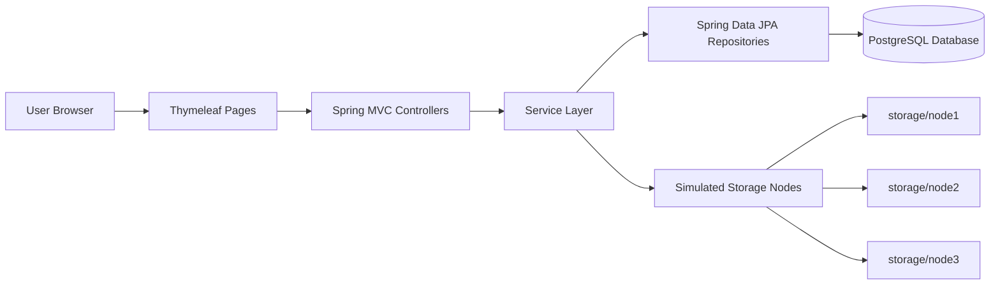
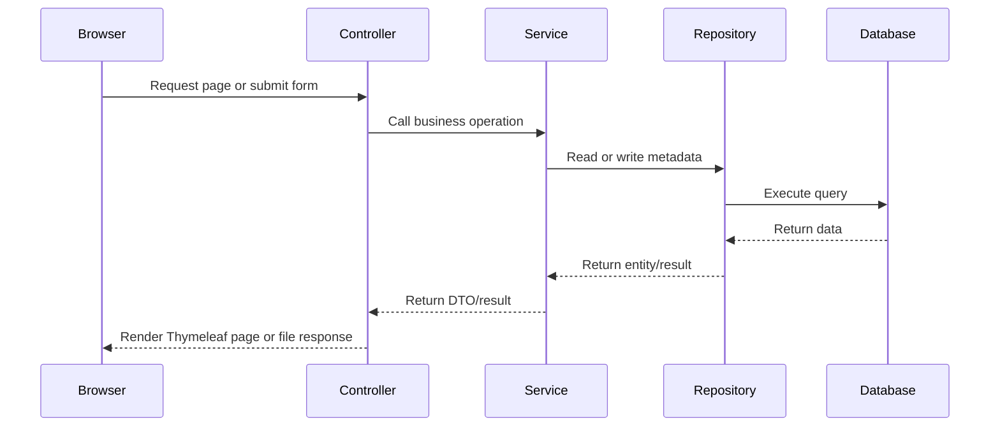
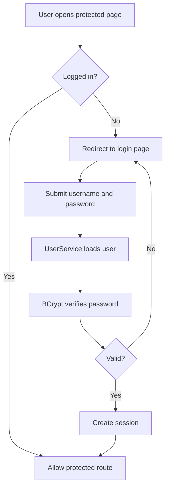
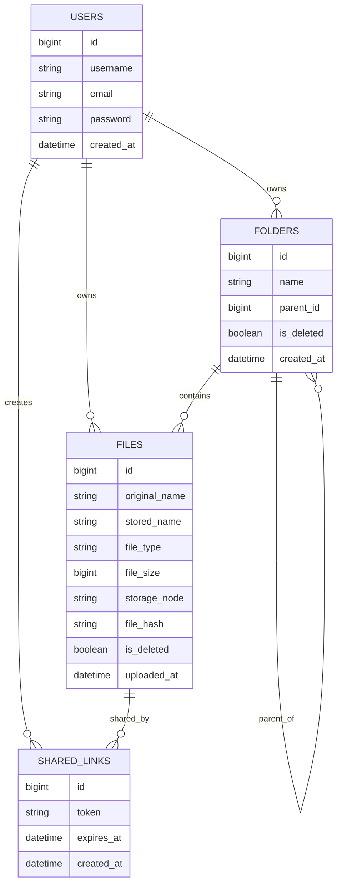
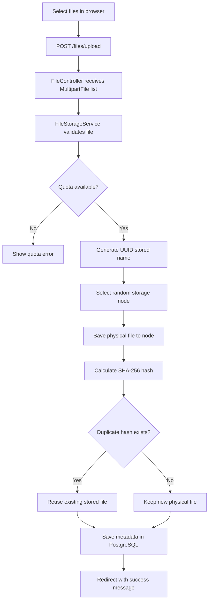
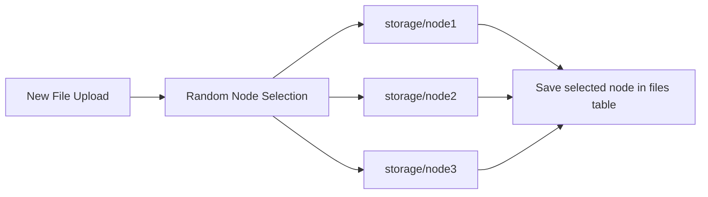
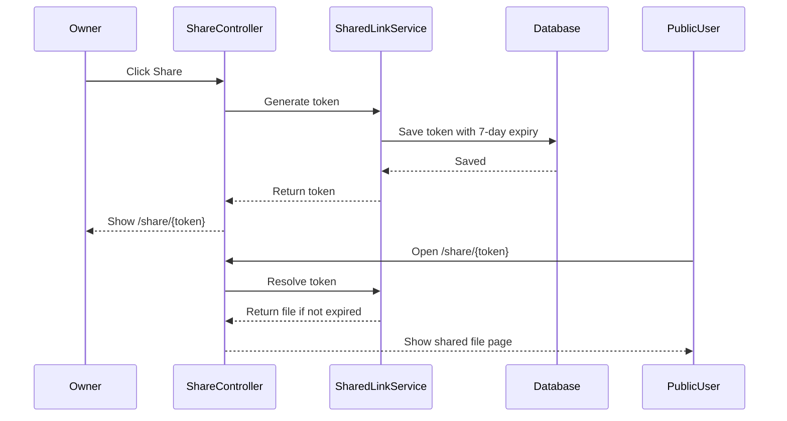

# CloudNest Thesis Report

> A guided, presentation-ready thesis document for CloudNest, a mini cloud storage platform built with Java 21, Spring Boot, PostgreSQL, Thymeleaf, and simulated distributed storage.

---

## Quick Project Snapshot

| Item | Details |
| --- | --- |
| Project name | CloudNest |
| Project type | Mini Google Drive style cloud storage system |
| Main language | Java 21 |
| Backend framework | Spring Boot 3.4.5 |
| UI approach | Server-rendered Thymeleaf templates |
| Database used in actual config | PostgreSQL |
| Storage model | Local simulated distributed nodes |
| Authentication | Spring Security session-based login |
| Main users | Registered users who upload, organize, share, and recover files |
| Key concepts demonstrated | MVC, JPA, security, file storage, metadata, sharing, deduplication, trash, dashboard analytics |

## How To Read This Thesis

This report is written in two layers:

- Read the main sections for the complete thesis.
- Open the expandable blocks when you want presentation notes, viva answers, or deeper explanation.

<details>
<summary><strong>Suggested Viva Flow</strong></summary>

1. Start with the problem: users need secure file storage and organization.
2. Explain the proposed solution: a Spring Boot based cloud storage system.
3. Show the architecture: Controller, Service, Repository, Entity, Database, Storage.
4. Walk through file upload: browser to controller, service, storage node, database.
5. Explain security: login, BCrypt, session, ownership check.
6. Highlight advanced concepts: simulated distributed storage, deduplication, share links, trash.
7. Close with limitations and future scope.

</details>

## Table Of Contents

| No. | Section |
| --- | --- |
| 1 | Introduction |
| 2 | Objectives |
| 3 | Existing Problem |
| 4 | Proposed System |
| 5 | Technology Stack |
| 6-13 | Technology choices and alternatives |
| 14-18 | Database, entities, repositories, services, controllers |
| 19-26 | Main system workflows |
| 27-32 | Frontend, JavaScript, Maven, Lombok, validation, exceptions |
| 33-39 | Security, testing, advantages, limitations, future scope, conclusion |

---

## Title

CloudNest: A Spring Boot Based Cloud File Storage and Sharing System with Simulated Distributed Storage

## Abstract

CloudNest is a web-based file storage system inspired by services such as Google Drive. The project allows users to register, log in, upload files, organize them into folders, preview and download files, move files and folders, generate public share links, use a trash/restore workflow, and view dashboard statistics about storage usage and file distribution. The system is implemented using Java 21, Spring Boot 3.4.5, Spring MVC, Spring Security, Spring Data JPA, Thymeleaf, PostgreSQL, Maven, Lombok, Bootstrap, custom CSS, and JavaScript.

The main purpose of the project is to demonstrate how a real cloud storage application can be designed using layered architecture and enterprise Java technologies. Although the storage nodes are simulated using local folders, the design introduces important distributed storage concepts such as storage node assignment, metadata tracking, deduplication using file hashes, user quotas, and separation between physical file storage and database metadata.

<details>
<summary><strong>In One Line</strong></summary>

CloudNest is a secure file manager where users can upload, organize, share, recover, and monitor files while the backend demonstrates real cloud-storage design concepts in a simplified local environment.

</details>

## 1. Introduction

Cloud storage systems are widely used because they allow users to store, access, organize, and share files from anywhere. A production cloud storage system involves many complex parts such as authentication, authorization, file upload handling, metadata management, distributed storage, link sharing, search, trash recovery, and scalable infrastructure.

CloudNest is a simplified educational implementation of these ideas. It does not attempt to compete with a production system, but it shows how the core concepts can be implemented in a clean and understandable way using modern Java web development tools.

The project follows the Model-View-Controller pattern. Controllers handle browser requests, services contain business logic, repositories communicate with the database, entities represent database tables, DTOs carry display data to the frontend, and Thymeleaf templates render the user interface.

## 2. Objectives

The objectives of CloudNest are:

1. To create a secure user-based file storage system.
2. To allow users to upload, download, preview, search, delete, restore, and permanently delete files.
3. To provide folder-based organization with nested folders.
4. To simulate distributed storage using multiple local storage nodes.
5. To track file metadata separately from physical file storage.
6. To generate public share links with expiration.
7. To display dashboard statistics such as total files, folders, storage usage, quota usage, file type distribution, and storage node distribution.
8. To demonstrate enterprise application architecture using Spring Boot.

## 3. Existing Problem

Many beginner file upload systems only save files in one folder and do not handle important real-world concerns such as:

- User authentication and access control.
- File ownership checks.
- Metadata storage.
- Folder hierarchy.
- Sharing through secure tokens.
- Deleted file recovery.
- File size quota.
- Duplicate file handling.
- Separation between controller logic and business logic.

CloudNest solves these problems at a project scale by building a complete file management workflow around a secure web application.

## 4. Proposed System

The proposed system is a browser-based cloud file manager. A user creates an account and logs in through a session-based authentication system. After login, the user can access a dashboard and file manager. Uploaded files are stored physically inside one of the configured storage node directories, while the file information is stored in the database.

The system currently uses three simulated storage nodes:

```text
storage/
  node1/
  node2/
  node3/
```

Each uploaded file receives a UUID-based stored name to avoid filename conflicts. The original filename is preserved in the database for display and download. The selected storage node is also stored in the database so the system knows where to retrieve the file later.

### System At A Glance



<details>
<summary><strong>Why this design is easy to explain</strong></summary>

The browser never directly accesses the database or storage folders. Every request passes through Spring MVC controllers and service classes. This keeps the system organized, secure, and easier to debug.

</details>

## 5. Technology Stack

| Area | Technology Used | Purpose |
| --- | --- | --- |
| Programming language | Java 21 | Main backend programming language |
| Backend framework | Spring Boot 3.4.5 | Application setup, dependency management, embedded server, auto-configuration |
| Web framework | Spring MVC | Request handling and MVC architecture |
| Security | Spring Security | Login, logout, session handling, route protection, password hashing |
| Password hashing | BCrypt | Secure password storage |
| Database access | Spring Data JPA and Hibernate | Entity mapping, repositories, queries, transactions |
| Database | PostgreSQL | Persistent storage for users, files, folders, and shared links |
| Template engine | Thymeleaf | Server-side dynamic HTML rendering |
| Frontend styling | Bootstrap 5.3, Bootstrap Icons, custom CSS | Responsive UI and visual design |
| Client scripting | JavaScript | Drag-and-drop upload UX, theme toggle, copy share link, modal behavior |
| Build tool | Maven | Dependency management and application packaging |
| Boilerplate reduction | Lombok | Auto-generates getters, setters, constructors, builders |
| Validation | Jakarta Bean Validation | Validates registration form input |
| File storage | Java NIO file APIs | Saves and reads uploaded files from disk |
| Compression | Java ZIP APIs | Downloads folders as ZIP files |

### Technology Decision Matrix

| Requirement | Selected Tool | Why It Fits |
| --- | --- | --- |
| Fast backend development | Spring Boot | Reduces configuration and starts with embedded Tomcat |
| Secure login | Spring Security | Handles sessions, protected routes, logout, CSRF, and password verification |
| Dynamic web pages | Thymeleaf | Works directly with Spring MVC model data |
| Persistent metadata | PostgreSQL | Reliable relational storage for users, files, folders, and links |
| File organization | JPA relationships | Maps users, files, folders, and links cleanly |
| Polished UI | Bootstrap plus custom CSS | Gives responsive layout with project-specific styling |
| Storage simulation | Local node folders | Demonstrates distributed storage concepts without cloud cost |

## 6. Why Java 21 Was Used

Java 21 was chosen because it is a modern long-term support version of Java. It provides strong performance, mature tooling, type safety, and excellent compatibility with Spring Boot. Java is widely used in enterprise systems, which makes it suitable for a project that demonstrates real backend application architecture.

How it works in the project:

- Java classes define controllers, services, entities, repositories, DTOs, and configuration.
- Java NIO is used for file operations.
- Java security libraries are used to calculate SHA-256 file hashes.
- Java time classes such as `LocalDateTime` are used for timestamps and share link expiration.

Other options:

- Python with Django or Flask could be used for faster prototyping.
- Node.js with Express or NestJS could be used for JavaScript-based development.
- C# with ASP.NET Core could be used for a similar enterprise-style architecture.
- PHP with Laravel could be used for a traditional web application.

Java was preferred because of its strong Spring ecosystem, reliability, and suitability for structured layered backend systems.

## 7. Why Spring Boot Was Used

Spring Boot was used as the main backend framework because it simplifies Java application development. It provides auto-configuration, embedded Tomcat, dependency management, and easy integration with security, databases, validation, and web templates.

How it works in the project:

- `CloudNestApplication.java` starts the application.
- `@SpringBootApplication` enables component scanning and auto-configuration.
- Spring detects classes annotated with `@Controller`, `@Service`, `@Repository`, and `@Configuration`.
- The embedded Tomcat server runs the web application on port `8080`.

Why it was chosen:

- It reduces manual configuration.
- It supports MVC applications very well.
- It integrates naturally with Spring Security and Spring Data JPA.
- It is industry-standard for Java backend development.

Other options:

- Jakarta EE could be used, but it requires more manual server configuration.
- Micronaut or Quarkus could be used for lighter cloud-native services.
- Plain Servlets could be used, but the code would become more complex.

Spring Boot was the best choice for this project because it balances simplicity, power, and educational value.

<details>
<summary><strong>Viva Answer: Why not plain Java?</strong></summary>

Plain Java can handle files, but it does not provide a complete web framework, dependency injection, routing, database integration, session management, or security. Spring Boot provides these features in a structured way, so the project can focus on cloud storage functionality instead of low-level web plumbing.

</details>

## 8. Why Spring MVC Was Used

Spring MVC was used to implement the web layer. The project is a server-rendered web application, so controllers return view names such as `dashboard`, `files`, `login`, and `register`.

How it works:

- `AuthController` handles login and registration pages.
- `DashboardController` prepares dashboard statistics.
- `FileController` handles file upload, download, preview, move, delete, and search.
- `FolderController` handles folder creation, deletion, movement, and ZIP download.
- `ShareController` handles public sharing links.
- `TrashController` handles deleted file/folder restoration and permanent deletion.

Why it was chosen:

- It fits naturally with Thymeleaf.
- It keeps request handling organized.
- It supports form submissions, redirects, flash messages, file upload, and response streaming.

Other options:

- A REST API with React, Angular, or Vue could be used.
- Spring WebFlux could be used for reactive applications.
- A full SPA architecture could be used, but it would add frontend complexity.

Spring MVC was chosen because CloudNest is a traditional web application where server-side rendering is sufficient and easier to maintain.

### MVC Request Flow



## 9. Why Thymeleaf Was Used

Thymeleaf was used as the server-side template engine. It allows Java controllers to send model data to HTML pages and render dynamic content.

How it works:

- Controllers add data to the `Model`.
- Thymeleaf templates use attributes such as `th:text`, `th:if`, `th:each`, `th:href`, and `th:action`.
- Reusable header and footer fragments are included in pages.
- Dynamic pages include dashboard statistics, file rows, folder cards, alerts, breadcrumbs, and share link displays.

Why it was chosen:

- It integrates directly with Spring MVC.
- It is beginner-friendly.
- It avoids the need for a separate frontend build system.
- It supports Spring Security extras for secure UI rendering.

Other options:

- React, Angular, or Vue could create a richer frontend.
- JSP could be used but is older and less preferred in modern Spring Boot.
- Freemarker or Mustache could be used as alternative template engines.

Thymeleaf was selected because the project needs dynamic HTML without the complexity of a separate frontend application.

## 10. Why Spring Security Was Used

Spring Security was used to protect user accounts and private files. Since CloudNest stores personal user files, authentication and authorization are essential.

How it works:

- Public routes include `/login`, `/register`, `/share/**`, static CSS/JS, and error pages.
- All other routes require login.
- The system uses a custom login page.
- Successful login redirects to `/dashboard`.
- Logout invalidates the session and removes the `JSESSIONID` cookie.
- `UserService` implements `UserDetailsService`, which Spring Security uses to load users from the database.
- Passwords are stored using BCrypt hashing instead of plain text.

Why session-based authentication was chosen:

- The project uses server-side rendered Thymeleaf pages.
- Browser sessions are simple and well-supported by Spring Security.
- It avoids the extra complexity of JWT token management.

Other options:

- JWT authentication could be used for REST APIs or mobile apps.
- OAuth2 login with Google or GitHub could be added.
- LDAP could be used in enterprise environments.

Session-based Spring Security was chosen because it is secure, simple, and suitable for this type of web application.

### Security Flow



## 11. Why BCrypt Was Used

BCrypt was used for password hashing. Passwords should never be stored in plain text. BCrypt automatically salts passwords and is intentionally slow, making brute-force attacks harder.

How it works:

- During registration, `UserService` calls `passwordEncoder.encode(password)`.
- The hashed password is saved in the `users` table.
- During login, Spring Security compares the entered password with the stored hash.

Other options:

- Argon2 is a strong modern password hashing algorithm.
- PBKDF2 is another acceptable password hashing method.
- SHA-256 alone should not be used for passwords because it is too fast and lacks password-specific protections unless combined with proper salting and stretching.

BCrypt was chosen because it is directly supported by Spring Security and is widely accepted for secure password storage.

## 12. Why PostgreSQL Was Used

The active project configuration uses PostgreSQL through the PostgreSQL JDBC driver and this datasource URL:

```properties
spring.datasource.url=jdbc:postgresql://localhost:5432/cloudnest_db
```

PostgreSQL stores structured application data such as users, files, folders, and shared links. The physical uploaded files are stored on disk, while PostgreSQL stores metadata.

Why it was chosen:

- It is reliable and open source.
- It supports relational data and constraints.
- It works well with Spring Data JPA and Hibernate.
- It is suitable for structured data such as users, folders, and file metadata.

How it works:

- JPA entities map Java classes to database tables.
- Repositories query and update the database.
- Hibernate creates or updates tables because `spring.jpa.hibernate.ddl-auto=update` is configured.
- The database keeps relationships between users, files, folders, and shared links.

Important note:

Some existing project documentation and `schema.sql` comments mention MySQL. However, the actual `pom.xml` and `application.properties` are configured for PostgreSQL. For the final project report, PostgreSQL should be treated as the implemented database, while MySQL can be mentioned as an alternative.

Other options:

- MySQL could also work well for this project.
- H2 could be used for testing or demos.
- MongoDB could be used for document-based metadata, but relational folder/user relationships are clearer in SQL.
- SQLite could be used for a lightweight local version.

PostgreSQL was chosen because it is robust, production-ready, and well-supported by Spring Boot.

<details>
<summary><strong>Important Documentation Note</strong></summary>

Some older project documentation and `schema.sql` comments mention MySQL. The actual running project configuration uses PostgreSQL through `org.postgresql:postgresql` and `jdbc:postgresql://localhost:5432/cloudnest_db`. Therefore, PostgreSQL should be treated as the implemented database in the final report.

</details>

## 13. Why Spring Data JPA and Hibernate Were Used

Spring Data JPA and Hibernate were used to simplify database access. Instead of writing SQL for every operation, the project defines repository interfaces and entity classes.

How it works:

- Entity classes such as `User`, `FileEntity`, `Folder`, and `SharedLink` represent tables.
- Repository interfaces extend `JpaRepository`.
- Spring Data automatically creates queries from method names like `findByUserAndIsDeletedFalseOrderByUploadedAtDesc`.
- Custom JPQL queries are used for search and dashboard statistics.
- `@Transactional` ensures related database operations are handled safely.

Why it was chosen:

- It reduces repetitive database code.
- It supports relationships between entities.
- It integrates with Spring Boot and PostgreSQL.
- It makes common CRUD operations simple.

Other options:

- JDBC Template could be used for more direct SQL control.
- MyBatis could be used for SQL-mapper style development.
- jOOQ could be used for type-safe SQL.
- Raw JDBC could be used, but it would require much more boilerplate.

Spring Data JPA was chosen because it is productive, readable, and suitable for the relational model of this project.

## 14. Database Design

The main tables are:

| Table | Purpose |
| --- | --- |
| `users` | Stores registered users and hashed passwords |
| `files` | Stores file metadata, owner, folder, storage node, hash, and delete status |
| `folders` | Stores folder hierarchy and ownership |
| `shared_links` | Stores public share tokens and expiration data |

Important relationships:

- One user can have many files.
- One user can have many folders.
- One folder can contain many files.
- One folder can contain many subfolders.
- A folder can have a parent folder, allowing nested folders.
- A shared link points to one file and one creator.

Soft delete fields:

- `FileEntity` has `isDeleted`.
- `Folder` has `isDeleted`.

This supports the trash feature without immediately removing records from the database.

### Entity Relationship Diagram



## 15. Entity Classes

### User

The `User` entity represents a registered user. It contains username, email, password, creation time, files, and folders.

Why it exists:

- To store account data.
- To own files and folders.
- To support authentication through Spring Security.

### FileEntity

The `FileEntity` entity represents file metadata. It is named `FileEntity` instead of `File` to avoid confusion with Java's file classes.

It stores:

- Original filename.
- UUID-based stored filename.
- MIME type.
- File size.
- Storage node.
- SHA-256 file hash.
- Owner user.
- Folder.
- Upload timestamp.
- Soft delete status.

Why it exists:

- Physical files are stored on disk, but the application needs metadata in the database.
- It allows fast listing, searching, sharing, and ownership checks.

### Folder

The `Folder` entity represents a folder created by a user.

Why it exists:

- To organize files.
- To support nested folders through a parent-child relationship.
- To support breadcrumbs and folder navigation.

### SharedLink

The `SharedLink` entity represents a public share link.

Why it exists:

- To allow public access to a file through a token.
- To expire links after a fixed time.
- To track who created the link.

## 16. Repository Layer

The repository layer communicates with the database.

Examples:

- `UserRepository` finds users by username or email.
- `FileRepository` searches files, counts files, calculates storage usage, groups files by node and type, and finds duplicate hashes.
- `FolderRepository` manages folder hierarchy and deleted folders.
- `SharedLinkRepository` finds share links by token and lists links created by users.

Why repositories were used:

- They separate database access from business logic.
- They make the service layer cleaner.
- They reduce SQL boilerplate.

Other options:

- Write all SQL manually using JDBC.
- Use stored procedures.
- Use a different ORM.

Repositories were chosen because they are the standard Spring Data approach and match the project architecture well.

## 17. Service Layer

The service layer contains business rules. This keeps controllers small and prevents database/file logic from being mixed with request handling.

### UserService

Responsibilities:

- Register new users.
- Check duplicate username and email.
- Encode passwords.
- Load users for Spring Security.
- Find the currently logged-in user.

### FileStorageService

Responsibilities:

- Validate uploads.
- Enforce storage quota.
- Generate UUID stored filenames.
- Select a storage node.
- Save uploaded files to disk.
- Calculate SHA-256 hashes.
- Reuse existing physical files when duplicate content is detected.
- Save file metadata.
- Download and preview files.
- Soft delete, restore, permanently delete, move, and search files.

### StorageNodeService

Responsibilities:

- Select a random storage node.
- Build the physical path for a file.

This service simulates distributed storage. In a real system, this would communicate with separate storage servers or object storage services.

### FolderService

Responsibilities:

- Create folders.
- Prevent duplicate folder names in the same location.
- List root folders and subfolders.
- Move folders.
- Soft delete and restore folders.
- Generate ZIP downloads for folders.
- Build breadcrumbs.

### SharedLinkService

Responsibilities:

- Generate UUID share tokens.
- Set 7-day link expiration.
- Resolve tokens to shared files.
- Reject expired links.

### Service Responsibility Map

| Service | Main Question It Answers |
| --- | --- |
| `UserService` | Who is the user and can they log in? |
| `FileStorageService` | How should files be stored, found, moved, deleted, and restored? |
| `StorageNodeService` | Which storage node should hold this file and where is it located? |
| `FolderService` | How are folders created, moved, listed, restored, and zipped? |
| `SharedLinkService` | Is this public share token valid and which file does it expose? |

## 18. Controller Layer

Controllers receive HTTP requests and return views or file responses.

| Controller | Main Responsibility |
| --- | --- |
| `AuthController` | Login, registration, root redirect |
| `DashboardController` | Dashboard statistics |
| `FileController` | File listing, upload, preview, download, search, move, delete |
| `FolderController` | Folder create, delete, move, ZIP download |
| `ShareController` | Generate and access public share links |
| `TrashController` | Trash page, restore, permanent delete |

Why controllers were used:

- They provide clear routing.
- They keep web request logic separate from services.
- They support MVC views and file response streaming.

## 19. File Upload Workflow

The file upload process works as follows:

1. The user selects or drags files into the upload form.
2. The browser sends a multipart request to `/files/upload`.
3. `FileController` receives the list of `MultipartFile` objects.
4. `FileStorageService` checks that the file is not empty.
5. The service checks whether the user has enough quota.
6. A UUID filename is generated to prevent physical filename conflicts.
7. `StorageNodeService` randomly selects a node such as `node1`.
8. The file is copied to the selected node directory using Java NIO.
9. SHA-256 hash is calculated for deduplication.
10. If an identical file already exists, the new physical copy is deleted and the existing stored file is reused.
11. File metadata is saved in PostgreSQL.
12. The user is redirected back to the file manager with a success or error message.

### Upload Workflow Diagram



<details>
<summary><strong>Simple Explanation For Presentation</strong></summary>

When a user uploads a file, CloudNest saves the actual file in one of the storage node folders and saves only the information about that file in PostgreSQL. This is similar to real cloud systems where metadata and file objects are managed separately.

</details>

## 20. File Download and Preview Workflow

For private file downloads:

1. The user requests `/files/download/{id}`.
2. The controller loads the current user.
3. `FileStorageService` checks whether the file exists and belongs to the user.
4. The system builds the path from the stored node and stored filename.
5. The file is returned as a `Resource` with download headers.

For preview:

1. The user requests `/files/preview/{id}`.
2. The system performs the same ownership check.
3. The file is returned with inline content disposition.
4. The browser previews supported formats such as images, text, audio, video, and PDF.

Why this design was chosen:

- It prevents users from accessing files they do not own.
- It keeps original filenames for user-friendly downloads.
- It separates physical storage names from user-facing names.

### Download Security Check

| Step | Why It Matters |
| --- | --- |
| Load file by ID | Confirms the requested file exists |
| Compare file owner with logged-in user | Prevents one user from downloading another user's file |
| Build path from storage node and stored name | Finds the physical file safely |
| Return original filename in response header | Gives users a friendly download name |

## 21. Folder Management

CloudNest supports root folders and nested folders. A folder can have a parent folder, which creates a tree structure.

How it works:

- A root folder has `parent = null`.
- A subfolder has a reference to another folder as its parent.
- Breadcrumbs are built by walking from the current folder back to its parent folders.
- Folder download uses `ZipOutputStream` to create a ZIP file recursively.

Why this approach was chosen:

- It maps naturally to a relational database.
- It supports common file manager behavior.
- It is easy to display in Thymeleaf.

Other options:

- Store folder paths as strings.
- Use a nested set model.
- Use a materialized path model.
- Use a graph database.

The self-referencing relational model was chosen because it is simple and fits the project requirements.

## 22. Simulated Distributed Storage

The project simulates distributed storage by placing files into multiple local directories.

How it works:

- `cloudnest.storage.node-count=3` defines the number of storage nodes.
- `AppConfig` creates `storage/node1`, `storage/node2`, and `storage/node3` during startup.
- `StorageNodeService` randomly selects one node for each upload.
- The selected node is saved in the `files` table.
- The dashboard displays file distribution across nodes.

Why it was used:

- It demonstrates distributed storage concepts without needing multiple servers.
- It makes the project easier to run locally.
- It allows dashboard visualization of file placement.

Other options:

- Amazon S3.
- Google Cloud Storage.
- Azure Blob Storage.
- MinIO self-hosted object storage.
- Multiple backend file servers.
- Database BLOB storage.

Local simulated nodes were chosen because this is an educational project and should run easily on one machine.

### Storage Node Selection



<details>
<summary><strong>Real-World Upgrade Path</strong></summary>

In production, the node selection algorithm would consider free space, server health, network latency, replication factor, and user location. CloudNest uses random selection because it is simple and clearly demonstrates the concept.

</details>

## 23. Deduplication

CloudNest includes basic data deduplication using SHA-256 hashes.

How it works:

- After upload, the system calculates a SHA-256 hash of the physical file.
- It searches for an existing `FileEntity` with the same hash.
- If a duplicate exists, the newly uploaded physical file is deleted.
- The new metadata entry points to the existing stored filename and storage node.
- During permanent deletion, the system checks how many records still reference the stored file before deleting it from disk.

Why it was used:

- It saves disk space when users upload identical files.
- It demonstrates a real cloud storage optimization.
- It separates logical file records from physical file objects.

Other options:

- No deduplication.
- Chunk-level deduplication.
- Content-addressed storage.
- Database-level unique hash constraints.
- Object storage versioning.

File-level SHA-256 deduplication was chosen because it is simple and effective for a university-level project.

### Deduplication Example

| Upload | File Content | SHA-256 Hash | Physical Storage Result |
| --- | --- | --- | --- |
| First upload | `report.pdf` | `abc123...` | Stored normally |
| Second upload | Same `report.pdf` | `abc123...` | New metadata reuses existing physical file |
| Third upload | Different file | `xyz789...` | Stored as a new physical file |

## 24. Trash and Soft Delete

The project uses soft delete for files and folders.

How it works:

- Delete does not immediately remove a file or folder from the database.
- The `isDeleted` flag is set to `true`.
- Normal file and folder lists only show records where `isDeleted = false`.
- The trash page shows deleted files and folders.
- Users can restore items or permanently delete them.

Why it was used:

- It protects users from accidental deletion.
- It matches behavior found in real cloud storage systems.
- It makes restore operations simple.

Other options:

- Immediate permanent deletion.
- Scheduled cleanup after 30 days.
- Archive table for deleted items.
- Event-based deletion logs.

Soft delete was chosen because it is simple, user-friendly, and realistic.

## 25. Share Link System

CloudNest supports public file sharing through UUID tokens.

How it works:

1. The owner clicks share.
2. `SharedLinkService` generates a UUID token.
3. A database record is saved with file, creator, token, and expiration.
4. The user receives a link like `/share/{token}`.
5. Public users can view the shared file page without logging in.
6. Download is available through `/share/download/{token}`.
7. Expired links are rejected.

Why UUID tokens were used:

- They are random and hard to guess.
- They are simple to generate.
- They avoid exposing file IDs directly.

Other options:

- Signed URLs.
- Password-protected links.
- Email-based sharing.
- Role-based sharing permissions.
- One-time download links.

UUID share links were chosen because they are simple and suitable for the project scope.

### Share Link Flow



## 26. Dashboard

The dashboard provides a summary of the user's storage activity.

It displays:

- Total files.
- Total folders.
- Storage used.
- Quota percentage.
- Recent uploads.
- Storage node distribution.
- File type distribution.

How it works:

- `DashboardController` collects counts and grouped data from `FileRepository`.
- `DashboardDto` carries prepared data to the template.
- Thymeleaf renders cards, progress bars, and tables.

Why it was used:

- It improves user experience.
- It visualizes the distributed storage concept.
- It makes the project easier to explain during presentation.

Other options:

- Use Chart.js for graphical charts.
- Create an admin dashboard.
- Add per-day upload trends.
- Add storage prediction and cleanup suggestions.

The current dashboard was chosen because it clearly presents the most important information without extra complexity.

### Dashboard Data Sources

| Dashboard Item | Source |
| --- | --- |
| Total files | `FileRepository.countByUserAndIsDeletedFalse` |
| Storage used | `FileRepository.sumFileSizeByUser` |
| Total folders | `FolderService.countByUser` |
| Recent uploads | `FileStorageService.getRecentFiles` |
| Node distribution | `FileRepository.countByStorageNode` |
| File type distribution | `FileRepository.countByFileType` |

## 27. Frontend Design

The frontend uses Thymeleaf templates, Bootstrap, Bootstrap Icons, custom CSS, Google Fonts, and JavaScript.

Main UI features:

- Login and registration pages.
- Dashboard page.
- File manager page.
- Trash page.
- Shared file page.
- Header and footer fragments.
- Responsive layout.
- Dark/light theme support.
- Drag-and-drop upload area.
- Modal dialogs for upload, folder creation, and moving items.
- Copy share link behavior.

Why Bootstrap was used:

- It provides a responsive grid and reusable UI components.
- It speeds up frontend development.
- It works well with server-rendered pages.

Why custom CSS was used:

- To give CloudNest a distinct identity.
- To create the dark glass-style UI.
- To style cards, buttons, tables, badges, upload zones, and animations.

Other options:

- Tailwind CSS.
- Material UI.
- Bulma.
- Plain CSS only.
- React with a component library.

Bootstrap plus custom CSS was chosen because it gives a polished UI with manageable complexity.

## 28. JavaScript Features

JavaScript is used only for browser-side enhancements.

Features:

- Toggle password visibility.
- Display selected upload filenames.
- Drag-and-drop file upload UX.
- Copy share link to clipboard.
- Auto-dismiss alerts.
- Open move modal and dynamically set form action.
- Store light/dark theme preference in local storage.

Why JavaScript was used:

- These actions improve usability without requiring a full frontend framework.
- The main application still works with server-side rendering.

Other options:

- Use React/Vue for all interactions.
- Use Alpine.js or HTMX for lightweight interactivity.
- Use no JavaScript and rely only on forms.

Plain JavaScript was chosen because the project only needs small interactive features.

## 29. Maven and Dependency Management

Maven is used as the build tool.

How it works:

- `pom.xml` defines project metadata.
- It declares dependencies such as Spring Boot starters, PostgreSQL driver, Lombok, and testing libraries.
- The Spring Boot Maven plugin packages the application as an executable JAR.

Why Maven was chosen:

- It is widely used in Java projects.
- It integrates well with Spring Boot.
- It works directly in IntelliJ IDEA and command line builds.

Other options:

- Gradle.
- Manual dependency management.

Maven was chosen because it is stable, familiar, and well-supported.

## 30. Lombok

Lombok reduces boilerplate code in entities and DTOs.

How it works:

- `@Getter` and `@Setter` generate accessor methods.
- `@NoArgsConstructor` and `@AllArgsConstructor` generate constructors.
- `@Builder` supports clean object creation.
- `@Builder.Default` preserves default values in builder-created objects.

Why it was used:

- It keeps entity and DTO classes shorter.
- It improves readability.
- It reduces repetitive code.

Other options:

- Manually write getters, setters, constructors, and builders.
- Use Java records for immutable DTOs.
- Use IDE-generated boilerplate.

Lombok was chosen because it is common in Spring Boot projects and keeps the code concise.

## 31. Validation

The project uses Jakarta Bean Validation for registration input.

How it works:

- DTO fields can use annotations like `@NotBlank`, `@Email`, and `@Size`.
- `AuthController` uses `@Valid` to trigger validation.
- `BindingResult` checks whether validation errors occurred.

Why it was used:

- It keeps validation rules close to the form DTO.
- It avoids manual validation code in controllers.
- It improves reliability of user input.

Other options:

- Manual validation in controllers.
- JavaScript-only validation.
- Custom validation framework.

Bean Validation was chosen because it is standard in Spring applications.

## 32. Exception Handling

The project uses a global exception handler.

How it works:

- `@ControllerAdvice` applies exception handling across controllers.
- `@ExceptionHandler` methods catch specific exceptions.
- User-friendly flash messages are shown instead of stack traces.

Why it was used:

- It centralizes error handling.
- It keeps controllers cleaner.
- It improves user experience.

Other options:

- Try-catch blocks in every controller.
- Custom error pages only.
- REST-style JSON error responses.

Global exception handling was chosen because it is clean and maintainable.

## 33. Security Considerations

Security features included:

- Passwords are hashed with BCrypt.
- Routes are protected using Spring Security.
- File downloads check ownership before serving files.
- Public share links use random UUID tokens.
- Share links expire after seven days.
- User-specific queries prevent users from seeing other users' files.
- Spring Security provides CSRF protection for forms by default.

Security limitations:

- Share links are public to anyone who has the token.
- There is no antivirus scanning for uploaded files.
- There is no file type allowlist.
- There is no rate limiting.
- The database password is currently written directly in `application.properties`, which should be replaced with environment variables for production.
- The local storage system is not encrypted.

### Security Checklist

| Security Point | Present In Project? | Notes |
| --- | --- | --- |
| Password hashing | Yes | BCrypt |
| Route protection | Yes | Spring Security |
| Session logout | Yes | Session invalidation and cookie deletion |
| File ownership check | Yes | Before private download/preview |
| CSRF protection | Yes | Spring Security default form protection |
| Share link expiration | Yes | 7 days |
| Environment-based secrets | Not yet | Recommended for production |
| Antivirus scanning | Not yet | Future scope |
| Rate limiting | Not yet | Future scope |

## 34. Testing

The project includes Spring Boot testing dependencies, but the inspected source tree does not show dedicated test classes.

Recommended tests:

- Unit tests for `UserService`.
- Unit tests for quota checking and deduplication.
- Integration tests for file upload and download.
- Security tests for protected routes.
- Repository tests for search and dashboard queries.
- Controller tests for login, registration, file pages, share links, and trash workflows.

Testing alternatives:

- JUnit 5 with Mockito for unit tests.
- Spring Boot Test for integration tests.
- Testcontainers for PostgreSQL integration testing.
- Selenium or Playwright for browser-level testing.

## 35. Advantages of the Project

CloudNest has the following advantages:

- Clear layered architecture.
- Secure login and password hashing.
- User-specific file ownership.
- Folder organization with nested folders.
- Simulated distributed storage.
- File deduplication using SHA-256.
- Trash and restore workflow.
- Public share links with expiration.
- Dashboard visualization.
- Responsive server-rendered UI.
- Beginner-friendly structure while still demonstrating enterprise concepts.

## 36. Limitations

The current system has some limitations:

- Storage nodes are simulated local folders, not real distributed servers.
- Files are stored on the same machine as the application.
- There is no replication between nodes.
- Random node selection does not consider free disk space or load.
- Folder permanent deletion currently has a known limitation where physical files inside folders may not be cleaned up with full deduplication checks.
- There is no admin panel.
- There is no email verification.
- There is no password reset.
- There is no file versioning.
- There is no collaborative sharing with specific users.
- There is no virus scanning.
- There are no dedicated automated tests in the inspected source tree.

<details>
<summary><strong>How To Explain Limitations Positively</strong></summary>

These limitations exist because CloudNest is designed as an educational prototype. The project focuses on demonstrating core cloud storage architecture locally. The same architecture can later be extended with real object storage, stronger security, replication, testing, and deployment automation.

</details>

## 37. Future Scope

Future improvements can include:

- Replace local storage nodes with Amazon S3, MinIO, or Google Cloud Storage.
- Add file replication across multiple nodes.
- Use load-aware node selection.
- Add user roles such as admin and normal user.
- Add email verification and password reset.
- Add file version history.
- Add sharing with selected users.
- Add password-protected share links.
- Add scheduled cleanup for trash.
- Add antivirus scanning.
- Add full-text search.
- Add upload progress bars.
- Add resumable uploads for large files.
- Add audit logs.
- Add automated tests.
- Move secrets to environment variables.
- Containerize using Docker.
- Deploy with PostgreSQL and object storage in the cloud.

### Future Scope Priority

| Priority | Improvement | Benefit |
| --- | --- | --- |
| High | Move database password to environment variables | Better security |
| High | Add automated tests | More reliable project |
| High | Replace local storage with MinIO or S3 | More realistic cloud storage |
| Medium | Add password reset and email verification | Better user account experience |
| Medium | Add file versioning | More complete cloud drive behavior |
| Medium | Add scheduled trash cleanup | Better storage management |
| Low | Add charts with Chart.js | More visual dashboard |
| Low | Add upload progress bars | Better upload experience |

## 38. Alternative Architecture

The project could also be implemented as a REST API with a separate frontend.

Possible alternative stack:

| Layer | Alternative |
| --- | --- |
| Backend | Spring Boot REST API |
| Frontend | React or Angular |
| Authentication | JWT or OAuth2 |
| Storage | Amazon S3 or MinIO |
| Database | PostgreSQL |
| Deployment | Docker and Kubernetes |

Why this was not used:

- It would increase complexity.
- It would require separate frontend build tooling.
- The current educational objective is better served by a single Spring Boot MVC application.

## 39. Conclusion

CloudNest successfully demonstrates the design and implementation of a secure cloud file storage system using modern Java technologies. The system includes user authentication, file upload and download, folder organization, search, trash recovery, public sharing, dashboard statistics, simulated distributed storage, and deduplication.

Spring Boot was chosen because it provides a strong foundation for web applications. Spring Security protects user data, Spring Data JPA simplifies database operations, Thymeleaf renders dynamic pages, PostgreSQL stores structured metadata, and Java NIO handles physical file storage. The use of simulated storage nodes helps explain distributed storage concepts without requiring complex infrastructure.

Overall, CloudNest is a complete academic project that connects theory with practical implementation. It is simple enough to understand, but broad enough to demonstrate important backend engineering concepts used in real cloud storage systems.
