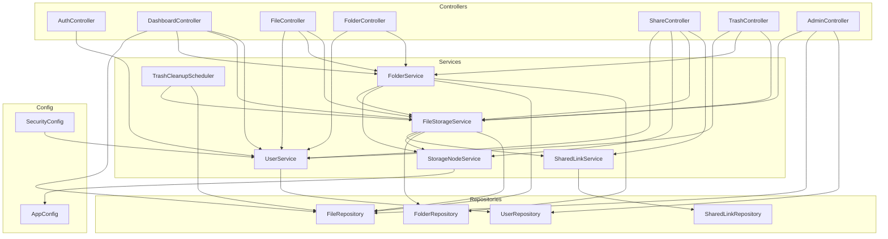
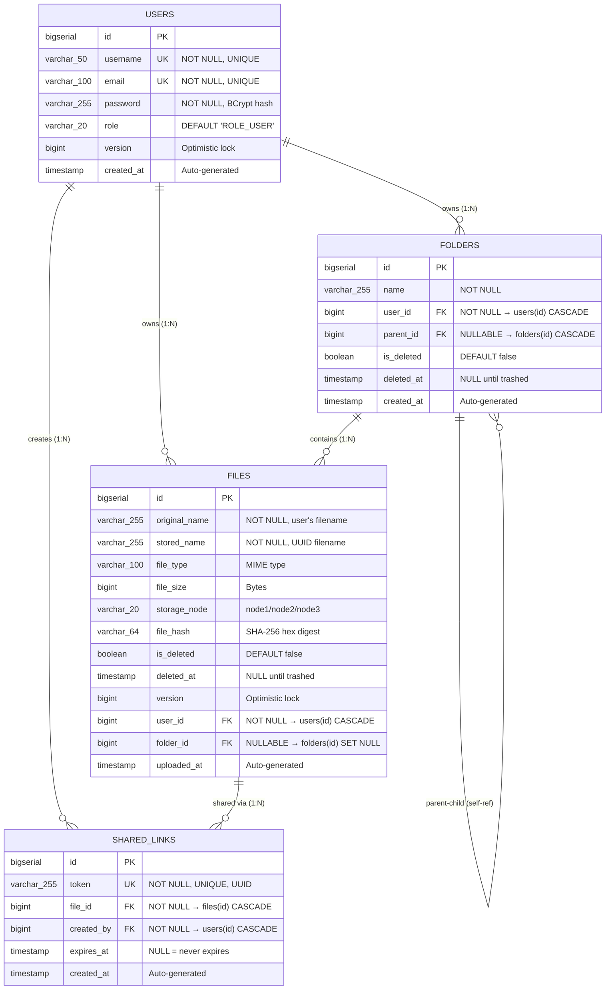
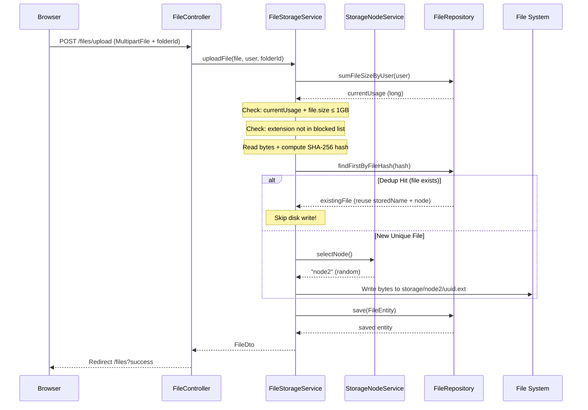
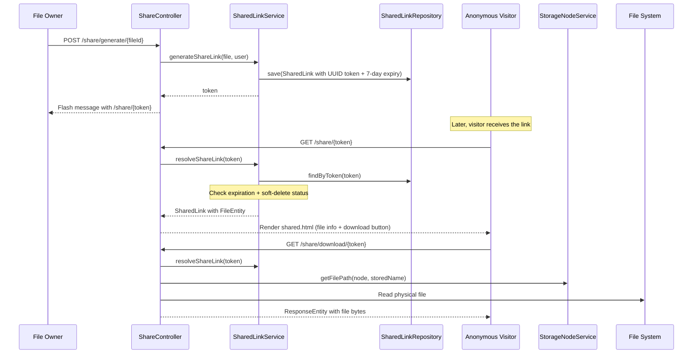
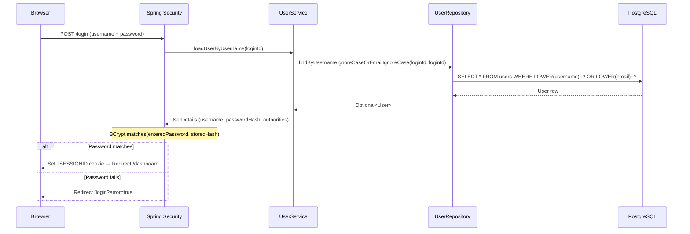

# Software Requirements Specification (SRS)

## Project: CloudNest — Enterprise Distributed Cloud Storage System

### Part 3 of 4: System Architecture & Data Models

---

## 4. System Architecture

### 4.1 Architectural Pattern: N-Tier Monolith (MVC)

CloudNest follows a strict **N-Tier Architecture** within a Spring Boot monolith, organized into the following layers:

```
┌─────────────────────────────────────────────────────────────────┐
│                     PRESENTATION LAYER                          │
│  ┌───────────────────────────────────────────────────────────┐  │
│  │ Thymeleaf Templates (.html) + Static Assets (CSS/JS)     │  │
│  │ 14 page templates · 2 fragment templates · 2 error pages │  │
│  └───────────────────────────────────────────────────────────┘  │
├─────────────────────────────────────────────────────────────────┤
│                     CONTROLLER LAYER                            │
│  ┌───────────────────────────────────────────────────────────┐  │
│  │ AuthController · DashboardController · FileController    │  │
│  │ FolderController · ShareController · TrashController     │  │
│  │ AdminController                                          │  │
│  │ GlobalExceptionHandler (@ControllerAdvice)               │  │
│  └──────────────────────┬────────────────────────────────────┘  │
│                         │ Calls (dependency injection)          │
├─────────────────────────▼───────────────────────────────────────┤
│                     SERVICE LAYER                               │
│  ┌───────────────────────────────────────────────────────────┐  │
│  │ UserService · FileStorageService · FolderService          │  │
│  │ SharedLinkService · StorageNodeService                    │  │
│  │ TrashCleanupScheduler (scheduled @Component)              │  │
│  └──────────────────────┬────────────────────────────────────┘  │
│                         │ Calls (Spring Data JPA + File I/O)    │
├─────────────────────────▼───────────────────────────────────────┤
│                     DATA ACCESS LAYER                           │
│  ┌───────────────────────────────────────────────────────────┐  │
│  │ UserRepository · FileRepository · FolderRepository        │  │
│  │ SharedLinkRepository                                      │  │
│  │ (extends JpaRepository — auto-implemented by Spring)      │  │
│  └──────────────────────┬────────────────────────────────────┘  │
│                         │ Hibernate ORM / JPA                   │
├─────────────────────────▼───────────────────────────────────────┤
│                     PERSISTENCE LAYER                           │
│  ┌────────────────────────┐  ┌────────────────────────────────┐ │
│  │ PostgreSQL Database    │  │ File System (storage/nodeX/)   │ │
│  │ 4 tables + 8 indexes  │  │ 3 simulated storage nodes      │ │
│  └────────────────────────┘  └────────────────────────────────┘ │
└─────────────────────────────────────────────────────────────────┘
```

### 4.2 Package Structure

```
com.cloudnest/
├── CloudNestApplication.java          # Entry point (@SpringBootApplication + @EnableScheduling)
├── config/
│   ├── AppConfig.java                 # Storage directory initialization, custom properties
│   └── DatabaseMigrationConfig.java   # Startup migration for null version fields
├── controller/
│   ├── AuthController.java            # Login, registration, root redirect
│   ├── DashboardController.java       # Dashboard + 6 enterprise visualization pages
│   ├── FileController.java            # File CRUD, search, preview, move
│   ├── FolderController.java          # Folder CRUD, ZIP download, move
│   ├── ShareController.java           # Share link generation, public view, download
│   ├── TrashController.java           # Trash view, restore, permanent delete
│   └── AdminController.java           # Admin dashboard, user management, file deletion
├── dto/
│   ├── UserRegistrationDto.java       # Registration form validation object
│   ├── DashboardDto.java              # Dashboard statistics aggregation
│   ├── FileDto.java                   # File display data + formatted size + icon class
│   └── FolderDto.java                 # Folder display data with counts
├── entity/
│   ├── User.java                      # users table mapping (id, username, email, password, role)
│   ├── FileEntity.java                # files table mapping (metadata, hash, node, soft-delete)
│   ├── Folder.java                    # folders table mapping (self-referencing hierarchy)
│   └── SharedLink.java               # shared_links table mapping (token, expiry)
├── exception/
│   ├── FileNotFoundException.java     # Custom RuntimeException for missing files
│   ├── StorageException.java          # Custom RuntimeException for I/O failures
│   └── GlobalExceptionHandler.java    # @ControllerAdvice — centralizes error handling
├── repository/
│   ├── UserRepository.java            # User CRUD + findByUsername/Email + existence checks
│   ├── FileRepository.java            # File CRUD + search + stats + dedup + admin queries
│   ├── FolderRepository.java          # Folder CRUD + hierarchy queries + duplicate checks
│   └── SharedLinkRepository.java      # SharedLink CRUD + token lookup + cascade delete
├── security/
│   └── SecurityConfig.java            # Spring Security filter chain, BCrypt, URL rules
├── service/
│   ├── UserService.java               # Registration + UserDetailsService implementation
│   ├── FileStorageService.java        # Upload, download, delete, search, dedup, quota
│   ├── FolderService.java             # Create, delete, restore, move, ZIP, breadcrumbs
│   ├── SharedLinkService.java         # Token generation, resolution, expiry check
│   ├── StorageNodeService.java        # Random node selection, file path resolution
│   └── TrashCleanupScheduler.java     # 30-day auto-purge cron job
└── util/
    └── FormatUtils.java               # Byte formatting utility (B/KB/MB/GB)
```

### 4.3 Dependency Injection Graph



> **Note on circular dependencies:** `FileStorageService` ↔ `FolderService` and `FileStorageService` ↔ `SharedLinkService` have circular references, resolved via `@Lazy` injection.

---

## 5. Data Model

### 5.1 Entity-Relationship Diagram



### 5.2 Database Table Specifications

#### 5.2.1 `users` Table

| Column       | Type           | Constraints                              | JPA Mapping                              |
| ------------ | -------------- | ---------------------------------------- | ---------------------------------------- |
| `id`         | `BIGSERIAL`    | `PRIMARY KEY`                            | `@Id @GeneratedValue(IDENTITY)`          |
| `username`   | `VARCHAR(50)`  | `NOT NULL`, `UNIQUE`                     | `@Column(nullable=false, unique=true)`   |
| `email`      | `VARCHAR(100)` | `NOT NULL`, `UNIQUE`                     | `@Column(nullable=false, unique=true)`   |
| `password`   | `VARCHAR(255)` | `NOT NULL`                               | `@Column(nullable=false)`                |
| `role`       | `VARCHAR(20)`  | `NOT NULL`, `DEFAULT 'ROLE_USER'`        | `@Column`, `@Builder.Default`            |
| `version`    | `BIGINT`       | `DEFAULT 0`                              | `@Version`                               |
| `created_at` | `TIMESTAMP`    | `DEFAULT CURRENT_TIMESTAMP`              | `@CreationTimestamp`                     |

**Relationships:**
- `OneToMany` → `FileEntity` (mapped by `user`, cascade `REMOVE`, orphan removal)
- `OneToMany` → `Folder` (mapped by `user`, cascade `REMOVE`, orphan removal)

#### 5.2.2 `folders` Table

| Column       | Type           | Constraints                              | JPA Mapping                                |
| ------------ | -------------- | ---------------------------------------- | ------------------------------------------ |
| `id`         | `BIGSERIAL`    | `PRIMARY KEY`                            | `@Id @GeneratedValue(IDENTITY)`            |
| `name`       | `VARCHAR(255)` | `NOT NULL`                               | `@Column(nullable=false, length=100)`      |
| `user_id`    | `BIGINT`       | `NOT NULL`, `FK → users(id) CASCADE`     | `@ManyToOne(LAZY) @JoinColumn("user_id")`  |
| `parent_id`  | `BIGINT`       | `FK → folders(id) CASCADE` (nullable)    | `@ManyToOne(LAZY) @JoinColumn("parent_id")`|
| `is_deleted` | `BOOLEAN`      | `DEFAULT false`                          | `@Column @Builder.Default`                 |
| `deleted_at` | `TIMESTAMP`    | nullable                                 | `@Column`                                  |
| `created_at` | `TIMESTAMP`    | `DEFAULT CURRENT_TIMESTAMP`              | `@CreationTimestamp`                       |

**Relationships:**
- `ManyToOne` → `User` (owner)
- `ManyToOne` → `Folder` (parent — self-referencing)
- `OneToMany` → `FileEntity` (files in folder, cascade `ALL`, orphan removal)
- `OneToMany` → `Folder` (sub-folders, cascade `ALL`, orphan removal)

**Self-Referencing Hierarchy:**
```
Root Folder (parent_id = NULL)
├── Subfolder A (parent_id = Root.id)
│   ├── Subfolder A1 (parent_id = A.id)
│   └── Subfolder A2 (parent_id = A.id)
└── Subfolder B (parent_id = Root.id)
```

#### 5.2.3 `files` Table

| Column          | Type           | Constraints                               | JPA Mapping                                     |
| --------------- | -------------- | ----------------------------------------- | ----------------------------------------------- |
| `id`            | `BIGSERIAL`    | `PRIMARY KEY`                             | `@Id @GeneratedValue(IDENTITY)`                 |
| `original_name` | `VARCHAR(255)` | `NOT NULL`                                | `@Column("original_name", nullable=false)`      |
| `stored_name`   | `VARCHAR(255)` | `NOT NULL`                                | `@Column("stored_name", nullable=false)`        |
| `file_type`     | `VARCHAR(100)` |                                           | `@Column("file_type")`                          |
| `file_size`     | `BIGINT`       |                                           | `@Column("file_size")`                          |
| `storage_node`  | `VARCHAR(20)`  |                                           | `@Column("storage_node")`                       |
| `file_hash`     | `VARCHAR(64)`  |                                           | `@Column("file_hash")` — SHA-256 hex            |
| `is_deleted`    | `BOOLEAN`      | `DEFAULT false`                           | `@Column @Builder.Default`                      |
| `deleted_at`    | `TIMESTAMP`    | nullable                                  | `@Column`                                       |
| `version`       | `BIGINT`       | `DEFAULT 0`                               | `@Version`                                      |
| `user_id`       | `BIGINT`       | `NOT NULL`, `FK → users(id) CASCADE`      | `@ManyToOne(LAZY) @JoinColumn("user_id")`       |
| `folder_id`     | `BIGINT`       | `FK → folders(id) SET NULL` (nullable)    | `@ManyToOne(LAZY) @JoinColumn("folder_id")`     |
| `uploaded_at`   | `TIMESTAMP`    | `DEFAULT CURRENT_TIMESTAMP`               | `@CreationTimestamp`                             |

**Deduplication Columns:**
- `file_hash`: 64-character SHA-256 hex digest of file contents. Used to detect duplicate content.
- `stored_name`: UUID-based physical filename. Multiple `FileEntity` records can share the same `stored_name` (deduplication).

#### 5.2.4 `shared_links` Table

| Column       | Type           | Constraints                              | JPA Mapping                                     |
| ------------ | -------------- | ---------------------------------------- | ----------------------------------------------- |
| `id`         | `BIGSERIAL`    | `PRIMARY KEY`                            | `@Id @GeneratedValue(IDENTITY)`                 |
| `token`      | `VARCHAR(255)` | `NOT NULL`, `UNIQUE`                     | `@Column(nullable=false, unique=true)`          |
| `file_id`    | `BIGINT`       | `NOT NULL`, `FK → files(id) CASCADE`     | `@ManyToOne(LAZY) @JoinColumn("file_id")`       |
| `created_by` | `BIGINT`       | `NOT NULL`, `FK → users(id) CASCADE`     | `@ManyToOne(LAZY) @JoinColumn("created_by")`    |
| `expires_at` | `TIMESTAMP`    | nullable (null = never expires)          | `@Column`                                       |
| `created_at` | `TIMESTAMP`    | `DEFAULT CURRENT_TIMESTAMP`              | `@CreationTimestamp`                             |

**Custom Methods:**
- `isExpired()`: Returns `true` if `expiresAt != null && LocalDateTime.now().isAfter(expiresAt)`

### 5.3 Performance Indexes

| Index Name                    | Table          | Column(s)      | Purpose                                      |
| ----------------------------- | -------------- | -------------- | --------------------------------------------- |
| `idx_files_user_id`           | `files`        | `user_id`      | Fast lookup of files by owner                  |
| `idx_files_folder_id`         | `files`        | `folder_id`    | Fast lookup of files within a folder           |
| `idx_files_file_hash`         | `files`        | `file_hash`    | Deduplication hash lookups                     |
| `idx_files_is_deleted`        | `files`        | `is_deleted`   | Efficient trash/active file filtering          |
| `idx_folders_user_id`         | `folders`      | `user_id`      | Fast lookup of folders by owner                |
| `idx_folders_parent_id`       | `folders`      | `parent_id`    | Hierarchy navigation queries                   |
| `idx_shared_links_file_id`    | `shared_links` | `file_id`      | Cascade deletion of links when file is deleted |
| `idx_shared_links_token`      | `shared_links` | `token`        | Token resolution for public share links        |

### 5.4 Optimistic Locking Strategy

Both `User` and `FileEntity` entities use **`@Version`** fields (type `Long`). Hibernate automatically:
1. Includes `WHERE version = ?` in UPDATE statements.
2. Increments the version on each successful update.
3. Throws `OptimisticLockException` if a concurrent update is detected.

**Migration note:** `DatabaseMigrationConfig` runs at startup to set `version = 0` for any existing rows with `NULL` version values, preventing `NullPointerException` during saves.

---

## 6. API Endpoint Catalog

### 6.1 Authentication Endpoints

| Method | URL                 | Auth Required | Controller                | Description                    |
| ------ | ------------------- | ------------- | ------------------------- | ------------------------------ |
| `GET`  | `/`                 | No*           | `AuthController`          | Redirect to `/dashboard`       |
| `GET`  | `/login`            | No            | `AuthController`          | Show login page                |
| `POST` | `/login`            | No            | Spring Security           | Process login form             |
| `GET`  | `/register`         | No            | `AuthController`          | Show registration form         |
| `POST` | `/register`         | No            | `AuthController`          | Process registration form      |
| `POST` | `/logout`           | Yes           | Spring Security           | Logout and invalidate session  |

*Redirects to `/login` if not authenticated.

### 6.2 Dashboard & Visualization Endpoints

| Method | URL                 | Auth Required | Controller                | Description                       |
| ------ | ------------------- | ------------- | ------------------------- | --------------------------------- |
| `GET`  | `/dashboard`        | Yes           | `DashboardController`     | Main user dashboard               |
| `GET`  | `/nodes`            | Yes           | `DashboardController`     | Storage node topology             |
| `GET`  | `/deduplication`    | Yes           | `DashboardController`     | Deduplication center              |
| `GET`  | `/replication`      | Yes           | `DashboardController`     | Cross-node replication view       |
| `GET`  | `/network`          | Yes           | `DashboardController`     | Network activity dashboard        |
| `GET`  | `/analytics`        | Yes           | `DashboardController`     | Enterprise analytics              |
| `GET`  | `/monitoring`       | Yes           | `DashboardController`     | System health monitoring          |

### 6.3 File Management Endpoints

| Method | URL                        | Auth Required | Controller         | Description                       |
| ------ | -------------------------- | ------------- | ------------------ | --------------------------------- |
| `GET`  | `/files`                   | Yes           | `FileController`   | List root files & folders         |
| `GET`  | `/files?folderId={id}`     | Yes           | `FileController`   | List files in specific folder     |
| `POST` | `/files/upload`            | Yes           | `FileController`   | Upload files (multi-file)         |
| `GET`  | `/files/download/{id}`     | Yes           | `FileController`   | Download a file                   |
| `GET`  | `/files/preview/{id}`      | Yes           | `FileController`   | Preview a file in browser         |
| `POST` | `/files/delete/{id}`       | Yes           | `FileController`   | Soft delete a file                |
| `POST` | `/files/move/{id}`         | Yes           | `FileController`   | Move file to another folder       |
| `GET`  | `/files/search?query={q}`  | Yes           | `FileController`   | Search files by name/type         |

### 6.4 Folder Management Endpoints

| Method | URL                        | Auth Required | Controller          | Description                       |
| ------ | -------------------------- | ------------- | ------------------- | --------------------------------- |
| `POST` | `/folders/create`          | Yes           | `FolderController`  | Create a new folder               |
| `POST` | `/folders/delete/{id}`     | Yes           | `FolderController`  | Soft delete folder (recursive)    |
| `GET`  | `/folders/download/{id}`   | Yes           | `FolderController`  | Download folder as ZIP            |
| `POST` | `/folders/move/{id}`       | Yes           | `FolderController`  | Move folder to another location   |

### 6.5 Sharing Endpoints

| Method | URL                           | Auth Required | Controller        | Description                       |
| ------ | ----------------------------- | ------------- | ----------------- | --------------------------------- |
| `POST` | `/share/generate/{fileId}`    | Yes           | `ShareController` | Generate a share link             |
| `GET`  | `/share/{token}`              | **No**        | `ShareController` | View shared file info             |
| `GET`  | `/share/download/{token}`     | **No**        | `ShareController` | Download shared file              |

### 6.6 Trash Endpoints

| Method | URL                           | Auth Required | Controller        | Description                       |
| ------ | ----------------------------- | ------------- | ----------------- | --------------------------------- |
| `GET`  | `/trash`                      | Yes           | `TrashController` | View recycle bin                  |
| `POST` | `/trash/restore/file/{id}`    | Yes           | `TrashController` | Restore file from trash           |
| `POST` | `/trash/delete/file/{id}`     | Yes           | `TrashController` | Permanently delete file           |
| `POST` | `/trash/restore/folder/{id}`  | Yes           | `TrashController` | Restore folder from trash         |
| `POST` | `/trash/delete/folder/{id}`   | Yes           | `TrashController` | Permanently delete folder         |

### 6.7 Admin Endpoints

| Method | URL                              | Auth Required    | Controller        | Description                    |
| ------ | -------------------------------- | ---------------- | ----------------- | ------------------------------ |
| `GET`  | `/admin/dashboard`               | `ROLE_ADMIN`     | `AdminController` | Admin control panel            |
| `POST` | `/admin/users/toggle-role/{id}`  | `ROLE_ADMIN`     | `AdminController` | Toggle user role               |
| `POST` | `/admin/files/delete/{id}`       | `ROLE_ADMIN`     | `AdminController` | Admin delete any file          |

### 6.8 Actuator Endpoints

| Method | URL                  | Auth Required | Description                          |
| ------ | -------------------- | ------------- | ------------------------------------ |
| `GET`  | `/actuator/health`   | No            | Application health status            |
| `GET`  | `/actuator/info`     | No            | Application info                     |

---

## 7. Frontend Architecture

### 7.1 Template Inventory

| Template File          | URL Route(s)              | Purpose                                     |
| ---------------------- | ------------------------- | ------------------------------------------- |
| `login.html`           | `/login`                  | User login form with 3D WebGL background    |
| `register.html`        | `/register`               | User registration form with validation      |
| `dashboard.html`       | `/dashboard`              | Main dashboard with charts and statistics   |
| `files.html`           | `/files`, `/files/search` | File browser with upload, search, navigation|
| `trash.html`           | `/trash`                  | Recycle bin with restore/delete options      |
| `shared.html`          | `/share/{token}`          | Public shared file view                     |
| `admin.html`           | `/admin/dashboard`        | Administrative control panel                |
| `nodes.html`           | `/nodes`                  | Storage node topology visualization         |
| `deduplication.html`   | `/deduplication`          | SHA-256 deduplication center                |
| `replication.html`     | `/replication`            | Cross-node replication animation            |
| `network.html`         | `/network`                | Network activity dashboard                  |
| `analytics.html`       | `/analytics`              | Enterprise storage analytics                |
| `monitoring.html`      | `/monitoring`             | System health and JVM monitoring            |
| `error.html`           | (fallback)                | Generic error page                          |
| `error/404.html`       | (auto)                    | 404 Not Found page                          |
| `error/500.html`       | (auto)                    | 500 Server Error page                       |

### 7.2 Fragment Templates (Reusable Components)

| Fragment File    | Purpose                                                              |
| ---------------- | -------------------------------------------------------------------- |
| `header.html`    | Navigation sidebar, top bar, user info, theme toggle, page navigation|
| `footer.html`    | Common footer, copyright information                                 |

### 7.3 Static Assets

| File                    | Size    | Purpose                                                      |
| ----------------------- | ------- | ------------------------------------------------------------ |
| `css/design-system.css` | 71.3 KB | Complete design system: variables, components, layouts, responsive breakpoints |
| `css/animations.css`    | 14.9 KB | Keyframe animations, transitions, micro-interactions         |
| `css/style.css`         | 337 B   | Additional custom overrides                                  |
| `js/app.js`             | 29.1 KB | Core application logic: drag-drop, modals, theme toggle, search, file operations |
| `js/gsap-animations.js` | 24.3 KB | GSAP-powered page entrance and scroll animations             |
| `js/webgl-scene.js`     | 37.6 KB | Three.js WebGL 3D animated background for auth pages         |
| `images/logo.svg`       | 87.7 KB | CloudNest logo (SVG vector)                                  |

### 7.4 UI Feature Map

| Feature                    | Implementation                                                      |
| -------------------------- | ------------------------------------------------------------------- |
| Drag-and-Drop Upload       | JavaScript event listeners (`dragover`, `drop`) in `app.js`         |
| Dark/Light Theme Toggle    | CSS custom properties (`--cn-*`) + JavaScript toggle in `app.js`    |
| File Type Icons            | `FileDto.getFileIconClass()` returns Bootstrap Icon CSS class names |
| Human-Readable File Sizes  | `FileDto.getFormattedSize()` + `FormatUtils.formatBytes()`          |
| Breadcrumb Navigation      | Thymeleaf `th:each` loop rendering `FolderDto` breadcrumb chain    |
| Responsive Sidebar         | CSS media queries in `design-system.css`                             |
| 3D Background (Auth pages) | Three.js scene in `webgl-scene.js`                                  |
| Page Animations            | GSAP library via `gsap-animations.js`                               |
| Lucide Icons               | CDN-loaded, initialized with `lucide.createIcons()`                 |
| Flash Messages             | Spring MVC `RedirectAttributes` → Thymeleaf conditional rendering  |

---

## 8. Request Flow Diagrams

### 8.1 File Upload Flow



### 8.2 File Sharing & Download Flow



### 8.3 Login Authentication Flow



---

*End of Part 3. Continue to **Part 4: Non-Functional Requirements & Appendices** for security, performance, testing, and deployment specifications.*
