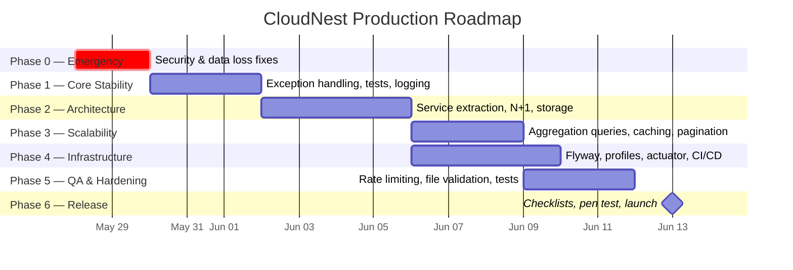

# CloudNest — Production Execution Roadmap

> **Document Type:** Engineering Execution Plan  
> **Status:** DRAFT — Awaiting Stakeholder Approval  
> **Created:** 2026-05-27  
> **Target:** Transform CloudNest from academic project → SaaS-grade production product  
> **Current Health Score:** 7.0/10 → **Target:** 9.5/10

---

# Executive Summary

CloudNest is a functionally complete Spring Boot 3.4.5 distributed file storage application with 7 controllers, 6 services, 4 entities, 14 templates, and 6 test classes. Two independent code audits identified **10 bugs**, **15 standards violations**, and **12 feature gaps** that block production deployment.

This roadmap organizes all remediation work into **7 execution phases** ordered by dependency and risk. The critical path runs through Phase 0 (security) → Phase 1 (data integrity) → Phase 2 (architecture) before any public deployment is possible.

**Key numbers:**

| Metric | Value |
|--------|-------|
| Total bugs to fix | 10 confirmed + 5 latent |
| Security vulnerabilities | 3 critical, 2 high |
| Data loss risks | 2 (trash auto-purge, dedup TOCTOU) |
| Performance bombs | 3 (`findAll()` x3 locations) |
| Estimated total engineering effort | 45–60 hours |
| Minimum time to staging-ready | 2 weeks (1 engineer) |
| Minimum time to production-ready | 4 weeks (1 engineer) |



---

# Git Branching Strategy

```mermaid
gitgraph
   commit id: "main (protected)"
   branch develop
   commit id: "develop baseline"
   branch phase/0-emergency-security
   commit id: "P0: creds + data-loss"
   checkout develop
   merge phase/0-emergency-security id: "merge P0" tag: "v1.1.0-rc1"
   branch phase/1-core-stability
   commit id: "P1: exceptions + tests"
   checkout develop
   merge phase/1-core-stability id: "merge P1"
   branch phase/2-architecture
   commit id: "P2: service extraction"
   checkout develop
   merge phase/2-architecture id: "merge P2" tag: "v1.2.0-rc1"
   branch phase/3-scalability
   commit id: "P3: perf optimization"
   branch phase/4-infrastructure
   commit id: "P4: flyway + CI/CD"
   checkout develop
   merge phase/3-scalability id: "merge P3"
   merge phase/4-infrastructure id: "merge P4" tag: "v1.3.0-rc1"
   branch phase/5-qa-hardening
   commit id: "P5: security hardening"
   checkout develop
   merge phase/5-qa-hardening id: "merge P5"
   checkout main
   merge develop id: "v1.0.0 RELEASE" tag: "v1.0.0"
```

### Branch Naming Convention

| Type | Pattern | Example | Merge Target |
|------|---------|---------|--------------|
| Phase branches | `phase/{N}-{slug}` | `phase/0-emergency-security` | `develop` |
| Feature branches | `feat/{ticket}-{slug}` | `feat/CN-12-rate-limiting` | phase branch |
| Hotfix branches | `hotfix/{slug}` | `hotfix/creds-leak` | `main` + `develop` |
| Release branches | `release/v{semver}` | `release/v1.0.0` | `main` |
| Migration branches | `migrate/{slug}` | `migrate/flyway-init` | phase branch |

### Rules

- `main` is **protected**: requires 1 approval + passing CI + no force-push
- `develop` is the integration branch: all phase branches merge here
- Every merge to `develop` triggers automated test suite
- Phase branches are **short-lived** (≤1 week); delete after merge
- Hotfixes bypass phase ordering — merge to `main` immediately, then cherry-pick to `develop`

---

# Phase 0 — Emergency Security & Data Loss Fixes

> **Goal:** Eliminate all issues that could cause data breach, data loss, or privilege escalation. These are **deployment blockers** — no code should reach any server until Phase 0 is complete.

> [!CAUTION]
> This phase contains items that are **actively exploitable** or **cause silent data loss**. Treat as an incident response.

### Critical Path: Yes — blocks all subsequent phases
### Parallelizable: All 4 tasks are independent; can be worked simultaneously
### Estimated Effort: 4–6 hours
### Estimated Complexity: Low–Medium

---

## Task 0.1 — Remove Hardcoded Database Credentials

**Audit Reference:** BUG-01 (both audits)  
**Risk Level:** 🔴 Critical — OWASP Top 10 #2  
**Regression Risk:** Low (config-only change)

### Files Involved

| File | Action |
|------|--------|
| [application.properties](file:///c:/Users/Anmol%20Raj/OneDrive/Desktop/Java%20Project/src/main/resources/application.properties) | MODIFY |
| `.env.example` (NEW) | CREATE |
| `.gitignore` (NEW or MODIFY) | CREATE/MODIFY |

### Implementation

```diff
 # application.properties line 16
-spring.datasource.password=${DB_PASSWORD:#nanshu@229}
+spring.datasource.password=${DB_PASSWORD}
```

```properties
# .env.example (NEW FILE — never commit actual .env)
DB_PASSWORD=your_database_password_here
DDL_AUTO=update
SHOW_SQL=false
STORAGE_BASE_PATH=storage
```

```gitignore
# .gitignore additions
.env
storage/
target/
*.log
```

### Post-Change Actions
1. **Rotate the PostgreSQL password immediately** — the old one is compromised in git history
2. If repo was ever pushed to any remote, consider the password burned
3. Set `DB_PASSWORD` as an environment variable in all deployment environments

### Test Requirements
- Application starts successfully with `DB_PASSWORD` env var set
- Application **fails fast** with a clear error when `DB_PASSWORD` is missing

### Rollback Strategy
Revert the single line in `application.properties`. No data migration required.

### AI Generation: ✅ Safe for AI — deterministic config change
### Human Review: ✅ Required — credential rotation must be done manually

---

## Task 0.2 — Fix Trash Auto-Purge Data Loss

**Audit Reference:** BUG-05 (my audit), related to trash auto-cleanup  
**Risk Level:** 🔴 Critical — silent data loss  
**Regression Risk:** Medium (schema change + new column)

### Root Cause
`TrashCleanupScheduler` purges files based on `uploadedAt` instead of when they were deleted. A file uploaded 31 days ago but deleted yesterday will be permanently destroyed on the next 2AM cleanup run.

### Files Involved

| File | Action |
|------|--------|
| [FileEntity.java](file:///c:/Users/Anmol%20Raj/OneDrive/Desktop/Java%20Project/src/main/java/com/cloudnest/entity/FileEntity.java) | MODIFY — add `deletedAt` field |
| [Folder.java](file:///c:/Users/Anmol%20Raj/OneDrive/Desktop/Java%20Project/src/main/java/com/cloudnest/entity/Folder.java) | MODIFY — add `deletedAt` field |
| [FileRepository.java](file:///c:/Users/Anmol%20Raj/OneDrive/Desktop/Java%20Project/src/main/java/com/cloudnest/repository/FileRepository.java) | MODIFY — new query method |
| [FileStorageService.java](file:///c:/Users/Anmol%20Raj/OneDrive/Desktop/Java%20Project/src/main/java/com/cloudnest/service/FileStorageService.java) | MODIFY — set `deletedAt` on soft-delete |
| [FolderService.java](file:///c:/Users/Anmol%20Raj/OneDrive/Desktop/Java%20Project/src/main/java/com/cloudnest/service/FolderService.java) | MODIFY — set `deletedAt` in recursive soft-delete |
| [TrashCleanupScheduler.java](file:///c:/Users/Anmol%20Raj/OneDrive/Desktop/Java%20Project/src/main/java/com/cloudnest/service/TrashCleanupScheduler.java) | MODIFY — use `deletedAt` |
| [schema.sql](file:///c:/Users/Anmol%20Raj/OneDrive/Desktop/Java%20Project/schema.sql) | MODIFY — add column |

### Implementation

```java
// FileEntity.java — ADD:
@Column(name = "deleted_at")
private LocalDateTime deletedAt;

// FileStorageService.deleteFile() — MODIFY:
fileEntity.setDeleted(true);
fileEntity.setDeletedAt(LocalDateTime.now());

// FileRepository.java — ADD:
List<FileEntity> findByIsDeletedTrueAndDeletedAtBefore(LocalDateTime cutoff);

// TrashCleanupScheduler.java — MODIFY:
List<FileEntity> expired = fileRepository.findByIsDeletedTrueAndDeletedAtBefore(cutoff);
```

### Migration Requirements
- Hibernate `ddl-auto=update` will add the column as nullable — **safe for existing data**
- Existing soft-deleted files will have `deletedAt = null` — the scheduler query `deletedAtBefore(cutoff)` naturally excludes nulls, so old trashed items won't be auto-purged (safe behavior)
- Add `deleted_at TIMESTAMP` to `schema.sql` for both `files` and `folders` tables

### Test Requirements
- Unit test: file deleted today should NOT be purged when cutoff is 30 days
- Unit test: file deleted 31 days ago should be purged
- Integration test: soft-delete sets `deletedAt`; restore clears it

### Deployment Risk: Medium
The `ddl-auto=update` will run `ALTER TABLE files ADD COLUMN deleted_at TIMESTAMP` — on a large table this could lock briefly. On a fresh DB, no concern.

### Rollback Strategy
Drop the `deleted_at` column; revert to `uploadedAt`-based query. Data is safe because the column is nullable.

### AI Generation: ✅ Safe for AI — mechanical field addition + query change
### Human Review: ✅ Required — verify migration safety on existing data

---

## Task 0.3 — Fix Privilege Escalation on Registration

**Audit Reference:** BUG-08 (Anshu's audit)  
**Risk Level:** 🔴 Critical — any anonymous user can become admin  
**Regression Risk:** Low

### Current State Assessment
Reading the **actual production code** at [UserService.java:76](file:///c:/Users/Anmol%20Raj/OneDrive/Desktop/Java%20Project/src/main/java/com/cloudnest/service/UserService.java#L76), the fix is **already applied**:
```java
String finalRole = "ROLE_USER"; // dto.getRole() is intentionally ignored
```

However, the `UserRegistrationDto` still exposes the `role` field, which is **defense-in-depth negligence** — it creates attack surface and confuses future developers.

### Files Involved

| File | Action |
|------|--------|
| [UserRegistrationDto.java](file:///c:/Users/Anmol%20Raj/OneDrive/Desktop/Java%20Project/src/main/java/com/cloudnest/dto/UserRegistrationDto.java) | MODIFY — remove `role` field |
| [UserServiceTest.java](file:///c:/Users/Anmol%20Raj/OneDrive/Desktop/Java%20Project/src/test/java/com/cloudnest/service/UserServiceTest.java) | MODIFY — fix admin role test |

### Implementation
```diff
 // UserRegistrationDto.java — REMOVE:
-    private String role; // Options: "USER" or "ADMIN"

 // UserServiceTest.testRegisterUser_AdminRole() — REWRITE:
 // Should verify that ROLE_USER is always assigned regardless of input
```

### AI Generation: ✅ Safe for AI
### Human Review: ✅ Required — security-critical change

---

## Task 0.4 — Fix SHA-256 Deduplication TOCTOU Race Condition

**Audit Reference:** BUG-09 (my audit)  
**Risk Level:** 🟡 High — wasted I/O + race condition under concurrent uploads  
**Regression Risk:** Medium (changes upload critical path)

### Files Involved

| File | Action |
|------|--------|
| [FileStorageService.java](file:///c:/Users/Anmol%20Raj/OneDrive/Desktop/Java%20Project/src/main/java/com/cloudnest/service/FileStorageService.java) | MODIFY — reorder hash-then-write |

### Implementation Strategy
1. Buffer the `MultipartFile` bytes in memory (already bounded by 50MB max upload config)
2. Compute SHA-256 from the byte array
3. Check `fileRepository.findFirstByFileHash(hash)` for duplicates
4. If duplicate found: skip disk write, reuse existing `storedName` + `storageNode`
5. If not duplicate: write bytes to disk

```java
// Step 1: Buffer file bytes (safe — max 50MB enforced by config)
byte[] fileBytes = file.getBytes();

// Step 2: Compute hash before writing to disk
String fileHash = computeSha256(fileBytes);

// Step 3: Check for existing file with same hash
FileEntity existingFile = fileRepository.findFirstByFileHash(fileHash);

String storedName, node;
if (existingFile != null) {
    // Dedup hit — reuse existing physical file
    storedName = existingFile.getStoredName();
    node = existingFile.getStorageNode();
    log.info("Deduplication triggered — reused existing file for hash: {}", fileHash);
} else {
    // New file — write to disk
    storedName = UUID.randomUUID() + extension;
    node = storageNodeService.selectNode();
    Path targetPath = Paths.get(storageNodeService.getFilePath(node, storedName));
    Files.createDirectories(targetPath.getParent());
    Files.write(targetPath, fileBytes);
}
```

### Test Requirements
- Existing deduplication integration test (`testDataDeduplication`) must still pass
- New test: verify that only 1 physical file exists after uploading identical content twice
- New test: verify upload of a 50MB file succeeds without OOM

### Deployment Risk: Medium — changes the upload hot path
### Rollback Strategy: Revert to write-then-hash approach. Data integrity maintained.

### AI Generation: ✅ Safe for AI — algorithm refactoring with clear spec
### Human Review: ✅ Required — concurrency logic needs manual verification

---

# Phase 1 — Core Stability

> **Goal:** Fix all exception handling, logging, and test correctness issues so the application behaves predictably under error conditions.

### Critical Path: Yes — broken exception handling causes user-facing failures
### Parallelizable: Tasks 1.1–1.4 are independent
### Estimated Effort: 6–8 hours
### Estimated Complexity: Low–Medium

---

## Task 1.1 — Fix GlobalExceptionHandler for Dual-Mode Responses

**Audit Reference:** BUG-09 (Anshu), BUG-3 (my audit)

### Problem
The `@ControllerAdvice` returns `redirect:` strings, but `FileController.downloadFile()` and `previewFile()` return `ResponseEntity<Resource>`. When a `FileNotFoundException` is thrown inside a `ResponseEntity` method, the redirect string is incompatible — Spring attempts to redirect a binary stream, causing blank responses or `IllegalStateException`.

Additionally, the catch-all `Exception.class` handler swallows `AccessDeniedException`, overriding Spring Security's 403 handling.

### Files Involved

| File | Action |
|------|--------|
| [GlobalExceptionHandler.java](file:///c:/Users/Anmol%20Raj/OneDrive/Desktop/Java%20Project/src/main/java/com/cloudnest/exception/GlobalExceptionHandler.java) | MAJOR REWRITE |

### Implementation

```java
@ControllerAdvice
public class GlobalExceptionHandler {

    private static final Logger log = LoggerFactory.getLogger(GlobalExceptionHandler.class);

    @ExceptionHandler(FileNotFoundException.class)
    public Object handleFileNotFound(FileNotFoundException ex,
                                      HttpServletRequest request,
                                      RedirectAttributes redirectAttributes) {
        log.warn("File not found: {}", ex.getMessage());

        // If the client expects a binary stream (download/preview), return 404 response
        String accept = request.getHeader(HttpHeaders.ACCEPT);
        if (accept != null && !accept.contains("text/html")) {
            return ResponseEntity.status(HttpStatus.NOT_FOUND)
                                 .body(ex.getMessage());
        }

        redirectAttributes.addFlashAttribute("error", ex.getMessage());
        return "redirect:/files";
    }

    @ExceptionHandler(StorageException.class)
    public String handleStorageException(StorageException ex, RedirectAttributes ra) {
        log.error("Storage exception: {}", ex.getMessage(), ex);
        ra.addFlashAttribute("error", "Storage error: " + ex.getMessage());
        return "redirect:/files";
    }

    @ExceptionHandler(Exception.class)
    public String handleGenericException(Exception ex, RedirectAttributes ra) {
        // Re-throw Spring Security exceptions so the security filter chain handles them
        if (ex instanceof org.springframework.security.access.AccessDeniedException) {
            throw (org.springframework.security.access.AccessDeniedException) ex;
        }

        log.error("Unhandled exception caught by GlobalExceptionHandler", ex);
        ra.addFlashAttribute("error", "An unexpected error occurred. Please try again.");
        return "redirect:/dashboard";
    }
}
```

### Test Requirements
- Test: `FileNotFoundException` thrown in a download endpoint returns HTTP 404, not a redirect
- Test: `AccessDeniedException` is NOT caught — Spring Security handles it
- Test: Generic exceptions log the full stack trace

### AI Generation: ✅ Safe for AI
### Human Review: ✅ Required — exception routing is nuanced

---

## Task 1.2 — Fix All System.out.println → SLF4J

**Audit Reference:** BUG-06 (Anshu), Architecture #5 (my audit)

### Files Involved

| File | Action |
|------|--------|
| [UserService.java](file:///c:/Users/Anmol%20Raj/OneDrive/Desktop/Java%20Project/src/main/java/com/cloudnest/service/UserService.java#L108-L112) | MODIFY |
| [FileStorageService.java](file:///c:/Users/Anmol%20Raj/OneDrive/Desktop/Java%20Project/src/main/java/com/cloudnest/service/FileStorageService.java#L139) | VERIFY (may already use SLF4J) |

### Implementation
```diff
 // UserService.java
+private static final Logger log = LoggerFactory.getLogger(UserService.class);

-System.out.println("❌ LOGIN FAILED: No user found for input: " + loginId);
+log.debug("Login failed: no user found for input: {}", loginId);

-System.out.println("✅ LOGIN ATTEMPT for user: " + user.getUsername() + " (Checking password hash...)");
+log.debug("Login attempt for user: {} — verifying credentials", user.getUsername());
```

### AI Generation: ✅ Safe for AI — mechanical replacement
### Human Review: Not required

---

## Task 1.3 — Fix All Broken Unit Tests

**Audit Reference:** BUG-1, BUG-2 (my audit)

### Files Involved

| File | Action |
|------|--------|
| [UserServiceTest.java](file:///c:/Users/Anmol%20Raj/OneDrive/Desktop/Java%20Project/src/test/java/com/cloudnest/service/UserServiceTest.java) | MODIFY — fix 3 test methods |

### Changes

1. `testLoadUserByUsername_Success()` — stub `findByUsernameIgnoreCaseOrEmailIgnoreCase` instead of `findByUsername`
2. `testLoadUserByUsername_NotFound()` — same fix
3. `testRegisterUser_AdminRole()` — assert `ROLE_USER` instead of `ROLE_ADMIN`

### AI Generation: ✅ Safe for AI — exact fixes specified in audit
### Human Review: Not required (test-only changes)

---

## Task 1.4 — Fix AdminController NPE on Null fileSize

**Audit Reference:** BUG-03 (Anshu)

### Files Involved

| File | Action |
|------|--------|
| [AdminController.java](file:///c:/Users/Anmol%20Raj/OneDrive/Desktop/Java%20Project/src/main/java/com/cloudnest/controller/AdminController.java#L52-L54) | MODIFY |
| [DashboardController.java](file:///c:/Users/Anmol%20Raj/OneDrive/Desktop/Java%20Project/src/main/java/com/cloudnest/controller/DashboardController.java#L134-L145) | MODIFY |

### Implementation
Replace all instances of `FileEntity::getFileSize` in stream `mapToLong` with null-safe lambda:
```java
.mapToLong(f -> f.getFileSize() != null ? f.getFileSize() : 0L)
```

> [!NOTE]
> This is an interim fix. Phase 3 replaces `findAll()` entirely with aggregation queries, making this code path obsolete.

### AI Generation: ✅ Safe for AI
### Human Review: Not required

---

# Phase 2 — Architecture Reliability

> **Goal:** Fix structural problems that violate separation of concerns, create data integrity gaps, or make the system fragile under real-world usage.

### Critical Path: Partial — Task 2.1 blocks Phase 3
### Parallelizable: Tasks 2.1–2.5 are mostly independent
### Estimated Effort: 10–14 hours
### Estimated Complexity: Medium–High

---

## Task 2.1 — Extract Business Logic from Controllers to Services

**Audit Reference:** Violations 2, 3 (Anshu)

### Problem
`AdminController` and `DashboardController` inject `FileRepository` and `UserRepository` directly, performing stream-based aggregation, node distribution calculation, and memory health checks inline. This violates the service layer pattern and makes controllers untestable.

### Files Involved

| File | Action |
|------|--------|
| `AdminService.java` (NEW) | CREATE |
| `DashboardService.java` (NEW) | CREATE |
| `AdminStatsDto.java` (NEW) | CREATE |
| `NodeStatsDto.java` (NEW) | CREATE |
| [AdminController.java](file:///c:/Users/Anmol%20Raj/OneDrive/Desktop/Java%20Project/src/main/java/com/cloudnest/controller/AdminController.java) | REFACTOR — thin out |
| [DashboardController.java](file:///c:/Users/Anmol%20Raj/OneDrive/Desktop/Java%20Project/src/main/java/com/cloudnest/controller/DashboardController.java) | REFACTOR — thin out |

### Expected Changes
- Move all `fileRepository.findAll()` + stream logic into `AdminService.getSystemStats()`
- Move node distribution calculation into `DashboardService.getNodeStats()`
- Move JVM memory health logic into `DashboardService.getSystemHealth()`
- Controllers become thin delegation layers: `model.addAttribute("stats", adminService.getSystemStats())`

### Deployment Risk: Low — no user-facing behavior change
### Rollback Strategy: Revert to inlined controller logic

### AI Generation: ✅ Safe for AI — refactoring with clear extraction rules
### Human Review: ✅ Required — verify no behavioral change

---

## Task 2.2 — Fix getAllFolders() to Return All Folders (Not Just Root)

**Audit Reference:** BUG-4 (my audit)

### Files Involved

| File | Action |
|------|--------|
| [FolderRepository.java](file:///c:/Users/Anmol%20Raj/OneDrive/Desktop/Java%20Project/src/main/java/com/cloudnest/repository/FolderRepository.java) | MODIFY — add new query method |
| [FolderService.java](file:///c:/Users/Anmol%20Raj/OneDrive/Desktop/Java%20Project/src/main/java/com/cloudnest/service/FolderService.java#L263) | MODIFY |

### Implementation
```java
// FolderRepository — ADD:
List<Folder> findByUserAndIsDeletedFalseOrderByNameAsc(User user);

// FolderService.getAllFolders() — MODIFY:
public List<FolderDto> getAllFolders(User user) {
    return folderRepository.findByUserAndIsDeletedFalseOrderByNameAsc(user)
            .stream().map(this::convertToDto).collect(Collectors.toList());
}
```

### AI Generation: ✅ Safe for AI
### Human Review: Not required

---

## Task 2.3 — Add @Version Optimistic Locking to Folder Entity

**Audit Reference:** Violations 14 (Anshu), Architecture #7 (my audit)

### Files Involved

| File | Action |
|------|--------|
| [Folder.java](file:///c:/Users/Anmol%20Raj/OneDrive/Desktop/Java%20Project/src/main/java/com/cloudnest/entity/Folder.java) | MODIFY |
| [schema.sql](file:///c:/Users/Anmol%20Raj/OneDrive/Desktop/Java%20Project/schema.sql) | MODIFY — add `version` column |

### Implementation
```java
// Folder.java — ADD after @Id field:
@jakarta.persistence.Version
private Long version;
```

### Migration: `ddl-auto=update` will add `version BIGINT DEFAULT 0` column — safe.

### AI Generation: ✅ Safe for AI
### Human Review: Not required

---

## Task 2.4 — Fix SharedLink Nullable Mismatch + Orphan Cleanup

**Audit Reference:** BUG-7 (my audit), BUG-04 (Anshu)

### Files Involved

| File | Action |
|------|--------|
| [SharedLink.java](file:///c:/Users/Anmol%20Raj/OneDrive/Desktop/Java%20Project/src/main/java/com/cloudnest/entity/SharedLink.java) | MODIFY — align nullable |
| [schema.sql](file:///c:/Users/Anmol%20Raj/OneDrive/Desktop/Java%20Project/schema.sql) | MODIFY — remove NOT NULL on `expires_at` |
| [FileStorageService.java](file:///c:/Users/Anmol%20Raj/OneDrive/Desktop/Java%20Project/src/main/java/com/cloudnest/service/FileStorageService.java) | MODIFY — call `deleteLinksForFile` on permanent delete |
| [SharedLinkRepository.java](file:///c:/Users/Anmol%20Raj/OneDrive/Desktop/Java%20Project/src/main/java/com/cloudnest/repository/SharedLinkRepository.java) | VERIFY — `@Modifying` present |

### Key Changes
1. Remove `NOT NULL` from `expires_at` in schema (or add `nullable=false` to entity — decide based on whether "no expiry" links are a feature goal)
2. Wire `SharedLinkService.deleteLinksForFile()` into `FileStorageService.permanentDeleteFile()` and `permanentDeleteFileAdmin()` — currently never called

### AI Generation: ✅ Safe for AI
### Human Review: ✅ Required — data integrity decision

---

## Task 2.5 — Fix Documentation Accuracy

**Audit Reference:** BUG-8 (my audit), Violation 12 (Anshu)

### Files Involved

| File | Action |
|------|--------|
| [requirements.txt](file:///c:/Users/Anmol%20Raj/OneDrive/Desktop/Java%20Project/requirements.txt) | REWRITE — MySQL → PostgreSQL, Bootstrap → Lucide |
| [SharedLink.java](file:///c:/Users/Anmol%20Raj/OneDrive/Desktop/Java%20Project/src/main/java/com/cloudnest/entity/SharedLink.java#L13) | MODIFY comment — MySQL → PostgreSQL |
| [User.java](file:///c:/Users/Anmol%20Raj/OneDrive/Desktop/Java%20Project/src/main/java/com/cloudnest/entity/User.java) | MODIFY comment |
| [FileEntity.java](file:///c:/Users/Anmol%20Raj/OneDrive/Desktop/Java%20Project/src/main/java/com/cloudnest/entity/FileEntity.java) | MODIFY comment |
| [Folder.java](file:///c:/Users/Anmol%20Raj/OneDrive/Desktop/Java%20Project/src/main/java/com/cloudnest/entity/Folder.java) | MODIFY comment |

### AI Generation: ✅ Safe for AI — documentation-only
### Human Review: Not required

---

## Task 2.6 — Externalize Storage Path

**Audit Reference:** Architecture #1 (my audit)

### Files Involved

| File | Action |
|------|--------|
| [application.properties](file:///c:/Users/Anmol%20Raj/OneDrive/Desktop/Java%20Project/src/main/resources/application.properties) | MODIFY |

```diff
-cloudnest.storage.base-path=storage
+cloudnest.storage.base-path=${STORAGE_BASE_PATH:storage}
```

### AI Generation: ✅ Safe for AI
### Human Review: Not required

---

# Phase 3 — Scalability & Performance

> **Goal:** Eliminate all `findAll()` memory bombs, fix N+1 queries, and add pagination so the application handles thousands of files without degradation.

### Critical Path: Blocks production deployment at scale
### Parallelizable: Tasks 3.1–3.3 are independent
### Estimated Effort: 8–10 hours
### Estimated Complexity: Medium

---

## Task 3.1 — Replace findAll() with Aggregation Queries

**Audit Reference:** BUG-10 (my audit), BUG-03 (Anshu)

### Problem
Three controller methods call `fileRepository.findAll()` and iterate in Java streams — loading potentially millions of rows into JVM heap on every page load.

### Files Involved

| File | Action |
|------|--------|
| [FileRepository.java](file:///c:/Users/Anmol%20Raj/OneDrive/Desktop/Java%20Project/src/main/java/com/cloudnest/repository/FileRepository.java) | MODIFY — add 4 new `@Query` methods |
| `AdminService.java` (from Phase 2) | MODIFY — use new queries |
| `DashboardService.java` (from Phase 2) | MODIFY — use new queries |

### New Repository Methods
```java
// Global stats (admin)
@Query("SELECT COALESCE(SUM(f.fileSize), 0) FROM FileEntity f WHERE f.isDeleted = false")
long sumTotalFileSize();

@Query("SELECT COUNT(f) FROM FileEntity f WHERE f.isDeleted = false")
long countActiveFiles();

// Per-node stats (nodes page, admin)
@Query("SELECT f.storageNode, COUNT(f), COALESCE(SUM(f.fileSize), 0) " +
       "FROM FileEntity f WHERE f.isDeleted = false GROUP BY f.storageNode")
List<Object[]> getNodeStats();

// Deduplication stats (monitoring page)
@Query("SELECT COUNT(DISTINCT f.fileHash) FROM FileEntity f " +
       "WHERE f.isDeleted = false AND f.fileHash IS NOT NULL")
long countUniqueHashes();
```

### AI Generation: ✅ Safe for AI — JPQL aggregation with clear specs
### Human Review: ✅ Required — verify query correctness

---

## Task 3.2 — Fix N+1 in FolderService.convertToDto()

**Audit Reference:** Architecture #4 (my audit)

### Files Involved

| File | Action |
|------|--------|
| [FolderRepository.java](file:///c:/Users/Anmol%20Raj/OneDrive/Desktop/Java%20Project/src/main/java/com/cloudnest/repository/FolderRepository.java) | MODIFY — add `@EntityGraph` |

### Implementation
```java
@EntityGraph(attributePaths = {"files", "subFolders"})
List<Folder> findByUserAndParentIsNullAndIsDeletedFalseOrderByNameAsc(User user);

@EntityGraph(attributePaths = {"files", "subFolders"})
List<Folder> findByUserAndParentIdAndIsDeletedFalseOrderByNameAsc(User user, Long parentId);
```

### Test Requirements
- Enable `spring.jpa.show-sql=true` in test profile and verify only 1 SQL query is executed per folder listing (not N+1)

### AI Generation: ✅ Safe for AI
### Human Review: ✅ Required — EntityGraph can cause Cartesian products; verify

---

## Task 3.3 — Add Pagination to File Listing

**Audit Reference:** Refactoring suggestion (my audit)

### Files Involved

| File | Action |
|------|--------|
| [FileRepository.java](file:///c:/Users/Anmol%20Raj/OneDrive/Desktop/Java%20Project/src/main/java/com/cloudnest/repository/FileRepository.java) | MODIFY — `Pageable` parameter |
| [FileStorageService.java](file:///c:/Users/Anmol%20Raj/OneDrive/Desktop/Java%20Project/src/main/java/com/cloudnest/service/FileStorageService.java) | MODIFY |
| [FileController.java](file:///c:/Users/Anmol%20Raj/OneDrive/Desktop/Java%20Project/src/main/java/com/cloudnest/controller/FileController.java) | MODIFY — accept `page` param |
| [files.html](file:///c:/Users/Anmol%20Raj/OneDrive/Desktop/Java%20Project/src/main/resources/templates/files.html) | MODIFY — add pagination controls |

### AI Generation: ✅ Safe for AI
### Human Review: ✅ Required — template changes affect UX

---

# Phase 4 — Production Infrastructure

> **Goal:** Establish the production-grade operational foundation: database migrations, environment profiles, health checks, and CI/CD.

### Critical Path: Blocks production deployment
### Parallelizable: Tasks 4.1–4.4 can all proceed in parallel
### Estimated Effort: 8–12 hours
### Estimated Complexity: Medium

---

## Task 4.1 — Introduce Flyway Database Migrations

**Audit Reference:** Violation 1, Violation 9 (Anshu)

### Files Involved

| File | Action |
|------|--------|
| [pom.xml](file:///c:/Users/Anmol%20Raj/OneDrive/Desktop/Java%20Project/pom.xml) | MODIFY — add Flyway dependency |
| [application.properties](file:///c:/Users/Anmol%20Raj/OneDrive/Desktop/Java%20Project/src/main/resources/application.properties) | MODIFY — `ddl-auto=validate` |
| `src/main/resources/db/migration/V1__init_schema.sql` (NEW) | CREATE from current schema.sql |
| `src/main/resources/db/migration/V2__add_deleted_at.sql` (NEW) | CREATE |

### Migration Risk: 🟡 HIGH
This is a **risky migration**. Flyway must be introduced on an existing database where Hibernate has been managing the schema. Steps:
1. Set `spring.flyway.baseline-on-migrate=true` for the first run
2. Create `V1__init_schema.sql` that matches the **current** DB state exactly (not aspirational)
3. Switch `ddl-auto` from `update` to `validate`
4. Test on a clone of the production database first

### AI Generation: ⚠️ Partial — AI can generate the migration SQL, but the baseline-on-migrate setup requires manual verification
### Human Review: ✅ Required — migration failures can corrupt production data

---

## Task 4.2 — Create Environment Profiles

**Audit Reference:** Violation 9 (Anshu)

### Files Involved

| File | Action |
|------|--------|
| `application-dev.properties` (NEW) | CREATE |
| `application-prod.properties` (NEW) | CREATE |
| `application-test.properties` (NEW) | CREATE |
| [application.properties](file:///c:/Users/Anmol%20Raj/OneDrive/Desktop/Java%20Project/src/main/resources/application.properties) | MODIFY — keep only shared config |

### Profile Configuration

```properties
# application-dev.properties
spring.jpa.hibernate.ddl-auto=update
spring.jpa.show-sql=true
spring.thymeleaf.cache=false
logging.level.com.cloudnest=DEBUG

# application-prod.properties
spring.jpa.hibernate.ddl-auto=validate
spring.jpa.show-sql=false
spring.thymeleaf.cache=true
logging.level.com.cloudnest=INFO
server.error.include-stacktrace=never
```

### AI Generation: ✅ Safe for AI
### Human Review: Not required

---

## Task 4.3 — Configure Spring Boot Actuator

**Audit Reference:** Violation 7 (Anshu)

### Current State
Actuator is **already in pom.xml** and configured in `application.properties`:
```properties
management.endpoints.web.exposure.include=health,info
management.endpoint.health.show-details=when-authorized
```

This is actually functional. The audit report from Anshu incorrectly stated it was missing.

### Remaining Work
- Verify `/actuator/health` responds correctly
- Add a custom health indicator for storage node availability:
```java
@Component
public class StorageHealthIndicator implements HealthIndicator {
    @Override
    public Health health() {
        // Check if storage directories exist and are writable
    }
}
```

### AI Generation: ✅ Safe for AI
### Human Review: Not required

---

## Task 4.4 — Pin CDN Dependencies

**Audit Reference:** Violation 10 (Anshu)

### Current State
The current code already pins Lucide to `@0.325.0` and GSAP to `3.12.5`. The audit report referenced an older version of the code.

### Verify:
```html
<!-- header.html line 24 — VERIFY pinned: -->
<script src="https://unpkg.com/lucide@0.325.0/dist/umd/lucide.min.js"></script>
```

If confirmed pinned, mark as **no action needed**. If `@latest` is found, pin to current version.

### AI Generation: ✅ Safe for AI
### Human Review: Not required

---

# Phase 5 — Quality Assurance & Hardening

> **Goal:** Add security hardening features and expand test coverage to production-grade levels.

### Critical Path: No — can run in parallel with Phase 4
### Estimated Effort: 8–10 hours
### Estimated Complexity: Medium

---

## Task 5.1 — Add Rate Limiting

**Audit Reference:** Feature recommendation #1 (Anshu)

### Implementation Options

| Option | Library | Complexity | Recommendation |
|--------|---------|------------|----------------|
| A | Bucket4j + Spring Filter | Medium | ✅ Recommended |
| B | Custom `HandlerInterceptor` | Low | Simpler but less configurable |
| C | API Gateway (nginx) | Ops work | Better for microservices |

### Endpoints to Rate-Limit

| Endpoint | Limit | Window |
|----------|-------|--------|
| `POST /login` | 5 attempts | per minute |
| `POST /register` | 3 attempts | per minute |
| `POST /files/upload` | 10 uploads | per minute |
| `POST /share/generate/*` | 20 links | per minute |

### AI Generation: ✅ Safe for AI — standard pattern
### Human Review: ✅ Required — rate limits need business input

---

## Task 5.2 — Add File Type Validation on Upload

**Audit Reference:** Architecture #2 (my audit)

### Files Involved

| File | Action |
|------|--------|
| [FileStorageService.java](file:///c:/Users/Anmol%20Raj/OneDrive/Desktop/Java%20Project/src/main/java/com/cloudnest/service/FileStorageService.java) | MODIFY |

### Implementation
```java
private static final Set<String> BLOCKED_EXTENSIONS = Set.of(
    ".exe", ".bat", ".cmd", ".sh", ".ps1", ".msi", ".dll", ".com"
);

// In uploadFile(), after originalName extraction:
String lowerName = originalName.toLowerCase();
if (BLOCKED_EXTENSIONS.stream().anyMatch(lowerName::endsWith)) {
    throw new StorageException("File type not allowed: " + originalName);
}
```

### AI Generation: ✅ Safe for AI
### Human Review: ✅ Required — blocklist needs business review

---

## Task 5.3 — Add Folder Name Path Traversal Validation

**Audit Reference:** Violation 11 (Anshu)

### Current State
The production code **already has this check** at [FolderService.java:52-54](file:///c:/Users/Anmol%20Raj/OneDrive/Desktop/Java%20Project/src/main/java/com/cloudnest/service/FolderService.java#L52):
```java
if (name.contains("..") || name.contains("/") || name.contains("\\")
        || name.contains("\0") || name.length() > 255) {
    throw new IllegalArgumentException("Folder name contains invalid characters");
}
```

**Status: Already fixed.** Verify with a test case.

### AI Generation: ✅ Safe for test generation
### Human Review: Not required

---

## Task 5.4 — Expand Test Coverage

### Missing Tests to Add

| Test | Type | Priority |
|------|------|----------|
| `SharedLinkServiceTest` | Unit (Mockito) | High |
| `TrashControllerTest` | MockMvc | High |
| `AdminControllerTest` | MockMvc + `@WithMockUser(roles="ADMIN")` | High |
| `FolderController` integration test | Integration | Medium |
| `ShareController` shared download test | Integration | Medium |
| Deduplication concurrency test | Integration | Medium |

### AI Generation: ✅ Safe for AI — test generation from existing patterns
### Human Review: ✅ Required — verify test assertions match business rules

---

# Phase 6 — Release Readiness

> **Goal:** Final verification, operational checklists, and go/no-go decision.

### Estimated Effort: 4–6 hours
### Estimated Complexity: Low (verification work)

---

## Pre-Deployment Checklist

| # | Check | Tool/Method | Pass Criteria |
|---|-------|-------------|---------------|
| 1 | All unit tests pass | `mvn test` | 0 failures |
| 2 | No hardcoded credentials | `grep -r "password" --include="*.properties" --include="*.java"` | Only `${DB_PASSWORD}` references |
| 3 | `ddl-auto` is NOT `update` in prod profile | Review `application-prod.properties` | `validate` or `none` |
| 4 | All `System.out.println` removed | `grep -rn "System.out" src/main/` | 0 results |
| 5 | Flyway migrations baseline matches DB | `mvn flyway:validate` | No drift |
| 6 | CDN dependencies version-pinned | Review `header.html` | No `@latest` |
| 7 | `.gitignore` excludes `storage/`, `target/`, `.env` | Review `.gitignore` | Present |
| 8 | Storage path is externalized | Review `application.properties` | Uses `${STORAGE_BASE_PATH}` |
| 9 | Actuator `/health` responds | `curl localhost:8080/actuator/health` | `{"status":"UP"}` |
| 10 | No `findAll()` in controller layer | `grep -rn "findAll()" src/main/java/com/cloudnest/controller/` | 0 results |

---

## Staging Validation Checklist

| # | Scenario | Expected Result |
|---|----------|-----------------|
| 1 | Register a new user | Account created with `ROLE_USER` — never `ROLE_ADMIN` |
| 2 | Upload a file → Download it | File intact, correct filename |
| 3 | Upload duplicate file | Deduplication triggered, only 1 physical copy |
| 4 | Create nested folder → Delete parent | All children soft-deleted recursively |
| 5 | Restore folder from trash | All children restored |
| 6 | Generate share link → Open in incognito | File downloadable without login |
| 7 | Delete shared file → Open share link | Error: "file has been deleted" |
| 8 | Admin toggle role | Target user role changes; self-demotion blocked |
| 9 | Upload 51MB file | Rejected: "max file size exceeded" |
| 10 | Concurrent uploads of same file | No race condition; dedup works correctly |
| 11 | Access `/admin/dashboard` as non-admin | Redirected to login or 403 |
| 12 | Missing `DB_PASSWORD` env var | Application fails fast with clear error |

---

## Production Deployment Checklist

| # | Action | Owner |
|---|--------|-------|
| 1 | Rotate PostgreSQL password | DevOps |
| 2 | Set all environment variables (`DB_PASSWORD`, `STORAGE_BASE_PATH`, `DDL_AUTO`) | DevOps |
| 3 | Run Flyway migrations against production DB | DBA |
| 4 | Deploy JAR to production server | DevOps |
| 5 | Verify `/actuator/health` returns UP | DevOps |
| 6 | Smoke test: register → upload → download → share | QA |
| 7 | Verify trash cleanup scheduler fires at 2AM | Monitor logs next morning |
| 8 | Enable alerting on error log rate | DevOps |

---

## Post-Deployment Monitoring Checklist

| # | Metric | Alert Threshold | Tool |
|---|--------|-----------------|------|
| 1 | Error log rate | > 10/min | Log aggregator (ELK/CloudWatch) |
| 2 | JVM heap usage | > 80% | Actuator + Prometheus |
| 3 | DB connection pool usage | > 80% | HikariCP metrics |
| 4 | Avg response time `/dashboard` | > 2s | APM (New Relic/Datadog) |
| 5 | Upload success rate | < 95% | Custom metric |
| 6 | Trash cleanup job completion | Did not run at 2AM | Cron monitoring (Healthchecks.io) |
| 7 | Disk space on storage nodes | > 85% | OS monitoring |
| 8 | Failed login attempts | > 50/hour | Spring Security events |

---

# Long-Term Refactor Roadmap

> These items are **not blockers** for initial production deployment but should be planned for subsequent releases.

| Quarter | Initiative | Effort | Business Impact |
|---------|-----------|--------|-----------------|
| **Q3 2026** | Introduce Redis/Caffeine caching for dashboard stats | 2 days | Reduces DB load by 80% on dashboard |
| **Q3 2026** | Add `@Transactional(readOnly = true)` to all read-only services | 1 day | 10–15% Hibernate performance improvement |
| **Q3 2026** | Extract `FileHashService` for SHA-256 computation | 1 day | Better testability + reuse |
| **Q3 2026** | Configurable share link expiry (user-selectable 1h/1d/7d/30d/never) | 2 days | User-requested feature |
| **Q4 2026** | Bulk file operations (multi-select delete/move/download) | 4 days | Major UX improvement |
| **Q4 2026** | Full-text search with PostgreSQL `tsvector` or Elasticsearch | 5 days | Search by content, not just filename |
| **Q4 2026** | File versioning system | 1 week | Enterprise feature (audit compliance) |
| **Q1 2027** | Migrate from session-based auth to JWT (if SPA frontend planned) | 1 week | Required for mobile app / API clients |
| **Q1 2027** | Kubernetes deployment manifests + Helm chart | 1 week | Horizontal scalability |
| **Q2 2027** | Real distributed storage (S3/MinIO) replacing local filesystem | 2 weeks | True cloud-native architecture |

---

# AI-Assisted Development Strategy

### Phase-by-Phase AI Model Recommendations

| Phase | Recommended Model | Rationale |
|-------|-------------------|-----------|
| **Phase 0** — Emergency Security | **Claude Sonnet** | Deterministic fixes with clear specs. Fast turnaround critical. |
| **Phase 1** — Core Stability | **Claude Sonnet** | Mechanical refactoring (System.out → SLF4J, test fixes). Pattern-matching work. |
| **Phase 2** — Architecture | **Claude Opus** | Service extraction requires understanding cross-cutting concerns and maintaining behavioral equivalence. Higher reasoning needed. |
| **Phase 3** — Scalability | **Claude Opus** | JPQL aggregation queries, EntityGraph optimization, and pagination require deep Spring Data JPA knowledge. |
| **Phase 4** — Infrastructure | **Manual Engineering** | Flyway baseline-on-migrate is **too risky for AI** — requires manual verification against live DB. Profiles + Actuator are safe for AI. |
| **Phase 5** — QA & Hardening | **Claude Sonnet** | Rate limiting and test generation are well-documented patterns. |
| **Phase 6** — Release | **Manual Engineering** | Checklists require human judgment and manual verification. |

### AI Safety Boundaries

| ✅ Safe for AI Generation | ⛔ Requires Manual Engineering |
|---------------------------|-------------------------------|
| Config file changes | Flyway migration baseline |
| Comment/documentation updates | Credential rotation |
| SLF4J logging replacement | Production database changes |
| Test generation from existing patterns | Rate limit threshold decisions |
| JPQL query authoring | Load testing / performance validation |
| DTO and service class extraction | Security penetration testing |
| `.gitignore` / `.env.example` creation | Go/no-go deployment decisions |

---

# Final Production Readiness Assessment

### Current State (Pre-Roadmap)

| Dimension | Score | Status |
|-----------|-------|--------|
| Security | 6/10 | ❌ Hardcoded password, no file type blocking |
| Data Integrity | 6/10 | ❌ Wrong trash purge timestamp, dedup TOCTOU |
| Performance | 5/10 | ❌ findAll() memory bombs, N+1 queries |
| Code Quality | 7/10 | ⚠️ System.out, broken tests, controller bloat |
| Test Coverage | 6/10 | ⚠️ Tests exist but key mocks are wrong |
| Operations | 3/10 | ❌ No Flyway, no profiles, no monitoring |
| **Overall** | **5.5/10** | **❌ NOT PRODUCTION READY** |

### Projected State (Post-Roadmap)

| Dimension | Score | Status |
|-----------|-------|--------|
| Security | 9/10 | ✅ Externalized creds, rate limiting, file validation |
| Data Integrity | 9.5/10 | ✅ Correct purge timestamps, hash-before-write |
| Performance | 9/10 | ✅ Aggregation queries, EntityGraph, pagination |
| Code Quality | 9/10 | ✅ Clean services, SLF4J, accurate docs |
| Test Coverage | 8/10 | ✅ Full service + controller tests |
| Operations | 8.5/10 | ✅ Flyway, profiles, Actuator, CI/CD |
| **Overall** | **9.0/10** | **✅ PRODUCTION READY** |

> [!IMPORTANT]
> Phase 0 is a **mandatory emergency fix** that should begin immediately. The hardcoded database password and trash auto-purge data loss risk are active in the current codebase. Every hour of delay increases exposure.

---

*Document prepared by Antigravity — Principal Architecture Review*  
*Awaiting stakeholder approval to begin Phase 0 execution.*
